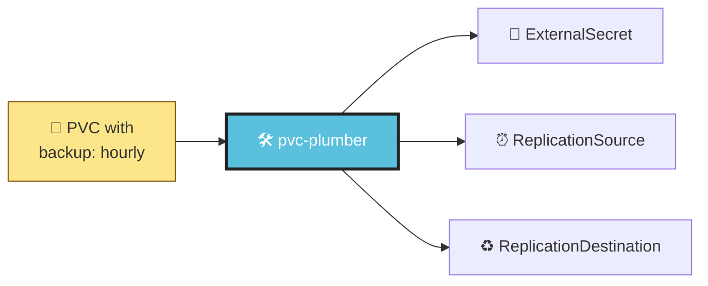
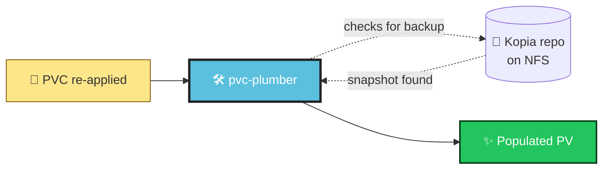
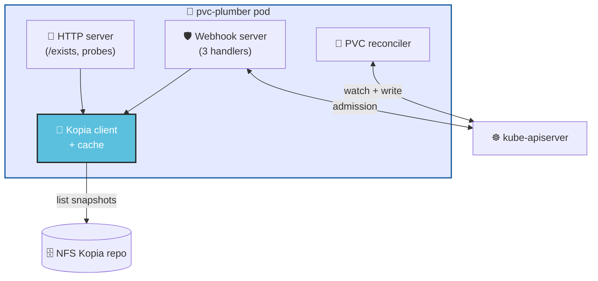

# pvc-plumber

[](https://github.com/mitchross/pvc-plumber/actions/workflows/build.yaml)
[](https://github.com/mitchross/pvc-plumber/actions/workflows/release.yaml)

**One label. Full backup lifecycle. Automatic restore on re-create.**

pvc-plumber is a Kubernetes operator that takes care of the entire PVC backup story in a homelab cluster. You stick `backup: hourly` (or `daily`) on a PersistentVolumeClaim, and the operator does *everything else* — creates the per-PVC kopia password, schedules the backups, sets up the restore target, and (the killer feature) **if you delete and recreate that PVC later, the new one comes up populated from the last backup automatically.** No manual restore command. No copy-paste from a runbook.

Two diagrams below — *the day-1 setup* and *the day-2 magic*.

**Day 1: you label a PVC. Three companion resources land.**


```mermaid
graph LR
    USER[👤 PVC with<br/>backup: hourly]
    OP[🛠️ pvc-plumber]
    SECRET[🔑 ExternalSecret]
    SCHED[⏰ ReplicationSource]
    REST[♻️ ReplicationDestination]

    USER --> OP
    OP --> SECRET
    OP --> SCHED
    OP --> REST

    style OP fill:#5bc0de,stroke:#222,stroke-width:3px,color:#fff
    style USER fill:#fde68a,stroke:#7a4d00
```

*One label in, three resources out. The ExternalSecret holds the per-PVC kopia password; the ReplicationSource is the backup schedule; the ReplicationDestination is the restore target (yes, created up-front — see day 2).*

**Day 2: you delete and re-apply the same PVC. New PV comes up populated.**


```mermaid
graph LR
    REBUILD[👤 PVC re-applied]
    OP[🛠️ pvc-plumber]
    KOPIA[(💾 Kopia repo<br/>on NFS)]
    POP[✨ Populated PV]

    REBUILD --> OP
    OP -. "checks for backup" .-> KOPIA
    KOPIA -. "snapshot found" .-> OP
    OP --> POP

    style OP fill:#5bc0de,stroke:#222,stroke-width:3px,color:#fff
    style POP fill:#22c55e,stroke:#0b3d1b,stroke-width:2px,color:#fff
    style REBUILD fill:#fde68a,stroke:#7a4d00
```

*The killer feature in four nodes. The admission webhook checks Kopia for an existing backup; if there's one, it injects `dataSourceRef` and Longhorn populates the new PV from the snapshot before binding. Apps come back up with their data.*

> **`v2.0.0` is a major breaking release.** Before v2, pvc-plumber was a small HTTP service that Kyverno called from generate/mutate policies. From v2 onward it's a full operator (controller + admission webhooks). If you're upgrading from any 1.x tag, read [`CHANGELOG.md`](CHANGELOG.md) and [`MIGRATION-v1-to-v2.md`](MIGRATION-v1-to-v2.md) first — the deployment surface changed substantially.
>
> The legacy HTTP `/exists` API is preserved unchanged; setting `OPERATOR_MODE=false` runs the v2 image as a drop-in v1 replacement during a staged rollout.

---

## Why this exists

Three pain points in the v1 (Kyverno-based) setup pushed us to rewrite:

1. **Kyverno is a general-purpose policy engine and the PVC-restore use case has sharp edges.** Getting `background`, `synchronize`, `mutateExistingOnPolicyUpdate` set wrong has caused cluster incidents. The settings are subtle and the failure modes are silent.
2. **Webhook deadlock risk is real.** On 2026-04-08, Kyverno crashed mid-PVC-create with `failurePolicy: Fail` set on a generate policy. The cluster wedged — controllers couldn't create their own PVCs to come back up. That was a Tuesday morning we don't want to repeat. The v2 operator's namespaceSelector exclusion list was designed in response.
3. **Orphan cleanup was a bash CronJob.** Kyverno's `ClusterCleanupPolicy` was supposed to handle reaping leftover ExternalSecret/ReplicationSource/ReplicationDestination resources, but it's silently broken on Kyverno 1.17.x and 1.18.x (confirmed during a drill on 2026-04-30). Running `kubectl get` + `kubectl delete` in a loop from a CronJob is a code smell. The v2 reconciler does it itself.

The v2 operator folds all that into one binary: `controller-runtime` reconciler + three admission webhooks + the same Kopia client we already had. Same backups, fewer moving parts.

---

## How it works (high level)

Here's how that operator is wired internally — it's one Go binary with four cooperating subsystems.


```mermaid
graph TB
    subgraph POD["🐳 pvc-plumber pod"]
        HTTP["📡 HTTP server<br/>(/exists, probes)"]
        WH["🛡️ Webhook server<br/>(3 handlers)"]
        REC["🔁 PVC reconciler"]
        KC["💾 Kopia client<br/>+ cache"]
    end
    NFS[("🗄️ NFS Kopia repo")]
    APIS["☸️ kube-apiserver"]

    HTTP --> KC
    WH --> KC
    KC -- "list snapshots" --> NFS
    REC <-- "watch + write" --> APIS
    WH <-- "admission" --> APIS

    style POD fill:#e3eaff,stroke:#1d5fa7,stroke-width:2px
    style KC fill:#5bc0de,stroke:#222,stroke-width:2px,color:#fff
```

*Four subsystems in one process, sharing one Kopia connection and one cache. The HTTP server and the webhook server both ask the same Kopia client; they get consistent answers at the same moment because they're literally the same instance.*

The PVC reconciler watches every PersistentVolumeClaim in the cluster. When it sees one with `backup: hourly` (or `daily`), it makes sure the companion resources exist:

| Resource | What it does | When it's created |
|---|---|---|
| `ExternalSecret` | Renders a per-PVC kopia password Secret via your existing ClusterSecretStore | Immediately, on first reconcile |
| `ReplicationDestination` | The restore target. Future PVCs with the same name use this as their `dataSourceRef` | Immediately (must exist before the PVC binds) |
| `ReplicationSource` | The backup schedule. Cron minute is `sha256(ns/pvc) % 60` so PVCs don't all fire at once | After the PVC is **Bound** *and* at least 2 hours old |

The 2-hour wait is deliberate — it stops us from backing up a half-restored volume mid-restore. There's a [whole section on it in the reconciler doc](docs/reconciler.md#the-2h-bound-and-aged-grace-period) if you want the war story.

When the PVC gets deleted (or unlabeled, or moved into a system namespace, or labeled `backup-exempt: "true"`), the reconciler reaps the three companion resources by label. No orphan-reaper CronJob needed.

The three admission webhooks each have a different job:

- **`/mutate-v1-pvc`** — when a backup-labeled PVC is created and Kopia already has snapshots for that namespace+name, inject `dataSourceRef` so Longhorn populates the new PV from the snapshot. **This is the killer feature.**
- **`/validate-v1-pvc`** — fail-closed safety net. If Kopia can't tell us whether a backup exists (network blip, NFS unreachable, etc.), deny the PVC create rather than risk admitting an empty volume over restorable data.
- **`/mutate-batch-v1-job`** — VolSync mover Jobs need `/repository` mounted from NFS to reach the Kopia repo. We inject the volume + per-container mount transparently. Replaces what used to be a Kyverno NFS-inject policy.

For the full architectural deep dive, including sequence diagrams of the create + restore paths, see **[`docs/architecture.md`](docs/architecture.md)**.

---

## Quick start

The simplest possible thing: a backup-labeled PVC.

```yaml
apiVersion: v1
kind: PersistentVolumeClaim
metadata:
  name: data
  namespace: paperless
  labels:
    backup: hourly        # ← that's it. that's the contract.
spec:
  accessModes: [ReadWriteOnce]
  resources: { requests: { storage: 10Gi } }
  storageClassName: longhorn
```

*That label is the only thing you need to know as a user. Everything else — secret, schedule, restore target, cleanup — is the operator's job.*

Once the operator is installed in your cluster, applying this PVC will:

1. Pass through the admission webhooks (which check Kopia and either inject `dataSourceRef` for restore, or admit unchanged for a fresh PVC).
2. Trigger the reconciler to create `volsync-data` (ExternalSecret) and `data-backup` (ReplicationDestination) in the `paperless` namespace.
3. After the PVC binds and is 2 hours old, the reconciler creates `data-backup` (ReplicationSource) — the actual backup schedule starts ticking.

Two opt-out escape hatches if you need them, both with required audit-trail annotations:

```yaml
# I know there's a backup, but I want a fresh PVC anyway:
metadata:
  labels: { backup: hourly }
  annotations:
    volsync.backup/skip-restore: "true"
    volsync.backup/skip-restore-reason: "test-data, will repopulate via fixture"

# Don't ever back this PVC up:
metadata:
  labels:
    backup-exempt: "true"
  annotations:
    storage.vanillax.dev/backup-exempt-reason: "cache"   # one of: cache, scratch, external-source, media-on-nas, database-native, test
```

*Both opt-outs are denied by the validating webhook unless their reason annotation is present and non-empty. Silent opt-out is the actual foot-gun the audit trail exists to prevent.*

For the operator-side install (RBAC, cert-manager Certificate, webhook configurations, Deployment), see [`MIGRATION-v1-to-v2.md`](MIGRATION-v1-to-v2.md) — the prerequisites are the install instructions.

---

## Documentation

The deeper docs are for when you want to understand *how* it works (or you're prepping a YouTube-style demo):

| Doc | What it covers | When to read |
|---|---|---|
| **[`docs/architecture.md`](docs/architecture.md)** | The whole operator — four-part binary, PVC create + restore sequence diagrams, all three webhooks, the reconciler loop, the cleanup reaper, key design decisions, anti-features | Start here if you want the big picture |
| **[`docs/admission-webhooks.md`](docs/admission-webhooks.md)** | Webhook protocol primer, `Handle()` walkthrough for each of the three handlers, fail-closed/fail-open invariants, TLS lifecycle, namespaceSelector deadlock prevention | When you want to understand the admission side |
| **[`docs/reconciler.md`](docs/reconciler.md)** | controller-runtime primer, reconcile decision tree, Get-or-Create rationale, the SHA256 schedule formula, the 2h grace period, the cleanup reaper | When you want to understand the controller side |
| **[`docs/restore-decision-flow.md`](docs/restore-decision-flow.md)** | The underlying restore/fresh/unknown tri-state contract — same in v1 and v2 | If you're integrating with the legacy `/exists` HTTP endpoint |
| **[`MIGRATION-v1-to-v2.md`](MIGRATION-v1-to-v2.md)** | Step-by-step v1.x → 2.x migration with three rollout paths, rollback steps, and the verification checklist | When you're upgrading an existing v1 cluster |
| **[`CHANGELOG.md`](CHANGELOG.md)** | Version-by-version change list, with v2.1's SHA256 schedule and `backup-exempt` label additions tracked under `[Unreleased]` | When you're picking a version to bump to |

---

## Key features

- **Operator + HTTP service in one binary.** `OPERATOR_MODE=true` runs the full operator (manager + 3 webhooks + reconciler + HTTP). `OPERATOR_MODE=false` runs HTTP-only as a drop-in v1 replacement.
- **Kopia and S3 backends.** Kopia (filesystem on NFS) is what the v2 operator uses; S3 is preserved for the legacy v1 HTTP path.
- **Tri-state restore decisions.** `restore` when a backup exists, `fresh` when authoritatively no backup, `unknown` when we genuinely can't tell. The webhook denies on `unknown` — false admits over restorable data are the worst outcome.
- **In-memory cache with pre-warm.** On startup, one `kopia snapshot list --all` populates the cache. Admission requests hit the cache; the periodic re-warm replaces the cache contents so deleted backups stop returning stale `exists=true`.
- **Leader election.** Recommended deployment is `replicas: 2` with a `coordination.k8s.io/leases` lock. The non-leader still serves admission webhooks (admission is stateless).
- **Health checks.** `/healthz` and `/readyz` for liveness and readiness. The readiness probe also confirms the Kopia repository path is still reachable.
- **Prometheus metrics.** `/metrics` exposes per-decision counters (`pvc_plumber_backup_check_total{decision="restore"}` etc.) and request error counts.

---

## Running the binary directly (HTTP-only mode)

For local testing, smoke-checking a backend, or running pvc-plumber outside Kubernetes (e.g., as a v1-style HTTP service that another cluster's policies call), you can run the binary in HTTP-only mode with `OPERATOR_MODE=false` (or just unset). The full operator surface (manager + webhooks + reconciler) requires Kubernetes; HTTP-only doesn't.

### Operating mode summary

| `OPERATOR_MODE` | What runs | When to use |
|---|---|---|
| `true` | HTTP `/exists` server **plus** controller-runtime manager + 3 admission webhooks + PVC reconciler | Production v2 deployment in-cluster. Requires cert-manager, External Secrets Operator, RBAC, and webhook configurations — see [`MIGRATION-v1-to-v2.md`](MIGRATION-v1-to-v2.md). |
| `false` (or unset) | HTTP `/exists` server only — no manager, no webhooks | Drop-in v1 replacement during cutover; local smoke tests; non-Kubernetes hosts. |

### S3 Backend (Default)

```bash
docker run -p 8080:8080 \
  -e OPERATOR_MODE=false \
  -e S3_ENDPOINT=minio.example.com:9000 \
  -e S3_BUCKET=volsync-backup \
  -e S3_ACCESS_KEY=your-access-key \
  -e S3_SECRET_KEY=your-secret-key \
  -e S3_SECURE=false \
  ghcr.io/mitchross/pvc-plumber:2.0.0
```

### Kopia Filesystem Backend

```bash
docker run -p 8080:8080 \
  -e OPERATOR_MODE=false \
  -e BACKEND_TYPE=kopia-fs \
  -e KOPIA_REPOSITORY_PATH=/repository \
  -e KOPIA_PASSWORD=your-repository-password \
  -v /path/to/nfs/repo:/repository:ro \
  ghcr.io/mitchross/pvc-plumber:2.0.0
```

### v1 (legacy) image

If you're not ready to bump to `2.0.0` yet, the last stable v1 release
remains available:

```bash
docker run -p 8080:8080 \
  -e BACKEND_TYPE=kopia-fs \
  -e KOPIA_REPOSITORY_PATH=/repository \
  -e KOPIA_PASSWORD=your-repository-password \
  -v /path/to/nfs/repo:/repository:ro \
  ghcr.io/mitchross/pvc-plumber:1.7.0
```

## API Documentation

For the full boxes-and-arrows version of the restore/fresh/unknown flow, see
[`docs/restore-decision-flow.md`](docs/restore-decision-flow.md).

## Image Tags

Use immutable semver tags such as `1.5.1` for cluster deployments. Release builds publish `1.5.1`, `1.5`, `1`, and `latest`; main-branch builds publish only `main` and `sha-*` snapshot tags.

### GET /exists/{namespace}/{pvc-name}

Check whether a PVC should restore from backup, start fresh, or be blocked because backup truth is unknown.

**Request:**
```bash
curl http://localhost:8080/exists/karakeep/data-pvc
```

**Response (backup exists):**
```json
{
  "exists": true,
  "decision": "restore",
  "authoritative": true,
  "namespace": "karakeep",
  "pvc": "data-pvc",
  "backend": "kopia-fs",
  "source": "data-pvc-backup@karakeep:/data"
}
```

**Response (no backup):**
```json
{
  "exists": false,
  "decision": "fresh",
  "authoritative": true,
  "namespace": "karakeep",
  "pvc": "data-pvc",
  "backend": "kopia-fs",
  "source": "data-pvc-backup@karakeep:/data"
}
```

**Response (unknown/error, HTTP 503):**
```json
{
  "exists": false,
  "decision": "unknown",
  "authoritative": false,
  "namespace": "karakeep",
  "pvc": "data-pvc",
  "backend": "kopia-fs",
  "source": "data-pvc-backup@karakeep:/data",
  "error": "failed to list snapshots: exit status 1"
}
```

Admission policy should treat only authoritative responses as safe:

| `decision` | `authoritative` | HTTP | Meaning |
|------------|------------------|------|---------|
| `restore` | `true` | 200 | A backup exists; mutate the PVC with `dataSourceRef` |
| `fresh` | `true` | 200 | The check succeeded and no backup exists; create an empty PVC |
| `unknown` | `false` | 503 | The check failed or was not trustworthy; deny PVC creation |

### GET /healthz

Liveness probe endpoint.

**Response:**
```json
{
  "status": "ok"
}
```

### GET /readyz

Readiness probe endpoint.

**Response:**
```json
{
  "status": "ok"
}
```

### GET /metrics

Prometheus metrics endpoint.

**Response:**
```
# HELP pvc_plumber_requests_total Total number of backup check requests
# TYPE pvc_plumber_requests_total counter
pvc_plumber_requests_total 42
# HELP pvc_plumber_requests_errors_total Total number of failed backup check requests
# TYPE pvc_plumber_requests_errors_total counter
pvc_plumber_requests_errors_total 0
# HELP pvc_plumber_backup_check_total Total number of backup check results by backend and decision
# TYPE pvc_plumber_backup_check_total counter
pvc_plumber_backup_check_total{backend="kopia-fs",decision="restore"} 17
pvc_plumber_backup_check_total{backend="kopia-fs",decision="fresh"} 3
pvc_plumber_backup_check_total{backend="kopia-fs",decision="unknown"} 0
# HELP pvcplumber_exists_singleflight_dedup_total Total number of /exists requests whose result was shared from an in-flight identical lookup (singleflight follower)
# TYPE pvcplumber_exists_singleflight_dedup_total counter
pvcplumber_exists_singleflight_dedup_total 0
```

## Configuration

All configuration is done via environment variables.

### Common Settings

| Variable | Required | Default | Description |
|----------|----------|---------|-------------|
| `BACKEND_TYPE` | No | `s3` | Backend type: `s3` or `kopia-fs` |
| `HTTP_TIMEOUT` | No | `3s` | Per-request backend timeout for `/exists` checks (e.g., `5s`, `500ms`) |
| `CACHE_TTL` | No | `60s` | Cache TTL for backup existence checks (e.g., `30s`, `2m`) |
| `PORT` | No | `8080` | HTTP server port |
| `LOG_LEVEL` | No | `info` | Log level: `debug`, `info`, `warn`, `error` |

### S3 Backend Settings

Required when `BACKEND_TYPE=s3` (or not set):

| Variable | Required | Default | Description |
|----------|----------|---------|-------------|
| `S3_ENDPOINT` | Yes | - | S3 endpoint (e.g., `minio.minio.svc:9000`) |
| `S3_BUCKET` | Yes | - | S3 bucket name (e.g., `volsync-backup`) |
| `S3_ACCESS_KEY` | Yes | - | S3 access key ID |
| `S3_SECRET_KEY` | Yes | - | S3 secret access key |
| `S3_SECURE` | No | `false` | Use HTTPS for S3 connection |

### Kopia Backend Settings

Required when `BACKEND_TYPE=kopia-fs`:

| Variable | Required | Default | Description |
|----------|----------|---------|-------------|
| `KOPIA_REPOSITORY_PATH` | No | `/repository` | Path to Kopia repository (must exist) |
| `KOPIA_PASSWORD` | Yes | - | Repository password (from secret) |

**Note:** The Kopia filesystem backend requires the `kopia` binary to be available in the container and the repository path to be mounted (typically via NFS). The password is used to decrypt the repository - this is the same password used when the repository was created by VolSync.

## Kubernetes Deployment Examples

### S3 Backend Deployment

```yaml
apiVersion: apps/v1
kind: Deployment
metadata:
  name: pvc-plumber
  namespace: kube-system
spec:
  replicas: 2
  selector:
    matchLabels:
      app: pvc-plumber
  template:
    metadata:
      labels:
        app: pvc-plumber
    spec:
      containers:
      - name: pvc-plumber
        image: ghcr.io/mitchross/pvc-plumber:1.5.1
        ports:
        - containerPort: 8080
          name: http
        env:
        - name: BACKEND_TYPE
          value: "s3"
        - name: S3_ENDPOINT
          value: "minio.minio.svc.cluster.local:9000"
        - name: S3_BUCKET
          value: "volsync-backup"
        - name: S3_ACCESS_KEY
          valueFrom:
            secretKeyRef:
              name: pvc-plumber-s3
              key: access-key
        - name: S3_SECRET_KEY
          valueFrom:
            secretKeyRef:
              name: pvc-plumber-s3
              key: secret-key
        - name: S3_SECURE
          value: "false"
        livenessProbe:
          httpGet:
            path: /healthz
            port: http
          initialDelaySeconds: 5
          periodSeconds: 10
        readinessProbe:
          httpGet:
            path: /readyz
            port: http
          initialDelaySeconds: 5
          periodSeconds: 5
        resources:
          requests:
            cpu: 10m
            memory: 16Mi
          limits:
            cpu: 100m
            memory: 32Mi
        securityContext:
          allowPrivilegeEscalation: false
          readOnlyRootFilesystem: true
          runAsNonRoot: true
          runAsUser: 65532
          capabilities:
            drop:
            - ALL
```

### Kopia Filesystem Backend Deployment

```yaml
apiVersion: apps/v1
kind: Deployment
metadata:
  name: pvc-plumber
  namespace: kube-system
spec:
  replicas: 1  # Single replica recommended for NFS
  selector:
    matchLabels:
      app: pvc-plumber
  template:
    metadata:
      labels:
        app: pvc-plumber
    spec:
      containers:
      - name: pvc-plumber
        image: ghcr.io/mitchross/pvc-plumber:1.5.1  # Must include kopia binary
        ports:
        - containerPort: 8080
          name: http
        env:
        - name: BACKEND_TYPE
          value: "kopia-fs"
        - name: KOPIA_REPOSITORY_PATH
          value: "/repository"
        - name: KOPIA_PASSWORD
          valueFrom:
            secretKeyRef:
              name: volsync-kopia-secret
              key: KOPIA_PASSWORD
        - name: LOG_LEVEL
          value: "info"
        volumeMounts:
        - name: repository
          mountPath: /repository
          readOnly: true
        livenessProbe:
          httpGet:
            path: /healthz
            port: http
          initialDelaySeconds: 10
          periodSeconds: 10
        readinessProbe:
          httpGet:
            path: /readyz
            port: http
          initialDelaySeconds: 10
          periodSeconds: 5
        resources:
          requests:
            cpu: 10m
            memory: 32Mi
          limits:
            cpu: 100m
            memory: 64Mi
        securityContext:
          allowPrivilegeEscalation: false
          runAsNonRoot: true
          runAsUser: 568      # Match VolSync mover UID
          runAsGroup: 568
          capabilities:
            drop:
            - ALL
      volumes:
      - name: repository
        nfs:
          server: 192.168.10.133
          path: /mnt/BigTank/k8s/volsync-kopia-nfs
---
apiVersion: v1
kind: Service
metadata:
  name: pvc-plumber
  namespace: kube-system
spec:
  selector:
    app: pvc-plumber
  ports:
  - port: 8080
    targetPort: http
    name: http
```

## Kyverno Integration Example

### Recommended: Fail-Closed (Validate + Mutate)

Use a validate rule to **deny PVC creation** if pvc-plumber is unreachable. This prevents data loss during disaster recovery — apps wait until pvc-plumber is healthy before creating PVCs.

```yaml
apiVersion: kyverno.io/v1
kind: ClusterPolicy
metadata:
  name: restore-pvc-from-backup
spec:
  background: false
  validationFailureAction: Enforce
  rules:
    # Rule 0: Gate PVC creation on pvc-plumber availability (FAIL-CLOSED)
    - name: require-pvc-plumber-available
      match:
        any:
          - resources:
              kinds:
                - PersistentVolumeClaim
              operations:
                - CREATE
              selector:
                matchExpressions:
                  - key: backup
                    operator: In
                    values: ["hourly", "daily"]
      context:
        - name: plumberHealth
          apiCall:
            method: GET
            service:
              url: "http://pvc-plumber.volsync-system.svc.cluster.local/readyz"
      validate:
        failureAction: Enforce
        message: >-
          PVC Plumber is not available. Backup-labeled PVCs cannot be created
          until PVC Plumber is healthy.
        deny:
          conditions:
            all:
              - key: "{{ plumberHealth.status || 'unavailable' }}"
                operator: NotEquals
                value: "ok"

    # Rule 1: Deny unknown per-PVC backup truth
    - name: require-authoritative-backup-decision
      match:
        any:
          - resources:
              kinds:
                - PersistentVolumeClaim
              operations:
                - CREATE
              selector:
                matchExpressions:
                  - key: backup
                    operator: In
                    values: ["hourly", "daily"]
      context:
        - name: backupCheck
          apiCall:
            method: GET
            service:
              url: "http://pvc-plumber.volsync-system.svc.cluster.local/exists/{{request.object.metadata.namespace}}/{{request.object.metadata.name}}"
      validate:
        failureAction: Enforce
        message: >-
          PVC Plumber could not make an authoritative restore/fresh decision.
        deny:
          conditions:
            any:
              - key: "{{ backupCheck.authoritative || false }}"
                operator: Equals
                value: false
              - key: "{{ backupCheck.decision || 'unknown' }}"
                operator: Equals
                value: "unknown"
              - key: "{{ backupCheck.error || '' }}"
                operator: NotEquals
                value: ""

    # Rule 2: Add dataSourceRef only for authoritative restore decisions
    - name: check-and-restore-backup
      match:
        any:
          - resources:
              kinds:
                - PersistentVolumeClaim
              operations:
                - CREATE
              selector:
                matchExpressions:
                  - key: backup
                    operator: In
                    values: ["hourly", "daily"]
      context:
        - name: backupCheck
          apiCall:
            method: GET
            service:
              url: "http://pvc-plumber.volsync-system.svc.cluster.local/exists/{{request.object.metadata.namespace}}/{{request.object.metadata.name}}"
      preconditions:
        all:
          - key: "{{ backupCheck.authoritative || false }}"
            operator: Equals
            value: true
          - key: "{{ backupCheck.decision || 'unknown' }}"
            operator: Equals
            value: "restore"
          - key: "{{ backupCheck.exists || false }}"
            operator: Equals
            value: true
      mutate:
        patchStrategicMerge:
          spec:
            dataSourceRef:
              kind: ReplicationDestination
              apiGroup: volsync.backube
              name: "{{request.object.metadata.name}}-backup"
```

## Architecture

The service is composed of four main components:

1. **Config Module** (`internal/config`): Loads and validates environment variables, supports backend-specific configuration
2. **Backend Interface** (`internal/backend`): Defines the common tri-state `CheckResult` type
3. **S3 Client** (`internal/s3`): Uses minio-go for authenticated S3 requests
4. **Kopia Client** (`internal/kopia`): Wraps the kopia CLI for snapshot queries
5. **Cache Layer** (`internal/cache`): In-memory TTL cache with startup pre-warm. Pre-warm runs `kopia snapshot list --all --json` once to populate all known sources. Cache misses are wrapped in a singleflight group (keyed by `namespace/pvc`) so concurrent identical lookups share one underlying backend query rather than each spawning a separate Kopia call
6. **HTTP Handlers** (`internal/handler`): Exposes REST API endpoints

### Backend Details

**S3 Backend:**
- Uses [minio-go](https://github.com/minio/minio-go) library
- Performs ListObjects with prefix `{namespace}/{pvc}/`
- Supports AWS Signature Version 4 authentication

**Kopia Backend:**
- Shells out to `kopia` CLI binary
- Connects to repository at startup: `kopia repository connect filesystem --path /repository`
- Pre-warms cache: `kopia snapshot list --all --json` scans all snapshots in one call
- Per-request checks are served from cache (sub-millisecond). Cache misses fall back to `kopia snapshot list "{pvc}-backup@{namespace}" --json`
- Cache TTL is configurable (default 60s)

## Local Development

### Prerequisites

- Go 1.25 or later
- Docker (optional, for building images)
- Make (optional, for using Makefile targets)
- kopia binary (for testing kopia-fs backend)

### Build and Run

```bash
# Install dependencies
go mod download

# Run tests
make test

# Build binary
make build

# Run with S3 backend
BACKEND_TYPE=s3 \
S3_ENDPOINT=localhost:9000 \
S3_BUCKET=test-bucket \
S3_ACCESS_KEY=minioadmin \
S3_SECRET_KEY=minioadmin \
./pvc-plumber

# Run with Kopia backend
BACKEND_TYPE=kopia-fs \
KOPIA_REPOSITORY_PATH=/path/to/repo \
KOPIA_PASSWORD=your-repository-password \
./pvc-plumber
```

### Run Tests

```bash
# Run all tests
make test

# Run tests with coverage
make test-coverage
open coverage.html
```

## Troubleshooting

### Check logs

```bash
# Kubernetes
kubectl logs -n kube-system deployment/pvc-plumber

# Enable debug logging
LOG_LEVEL=debug ./pvc-plumber
```

### Test endpoint manually

```bash
# Health check
curl http://localhost:8080/healthz

# Check if backup exists
curl http://localhost:8080/exists/my-namespace/my-pvc
```

### Common Issues

**S3 Backend:**

| Issue | Solution |
|-------|----------|
| "S3_ENDPOINT is required" | Set all required S3 env vars |
| "Access Denied" | Verify credentials and bucket permissions |
| Timeout errors | Increase `HTTP_TIMEOUT`, check network |

**Kopia Backend:**

| Issue | Solution |
|-------|----------|
| "KOPIA_REPOSITORY_PATH does not exist" | Verify NFS mount is available |
| "failed to connect to kopia repository" | Check repository path and permissions |
| "kopia: command not found" | Ensure kopia binary is in container |

## Security

- Runs as non-root user (UID 568, matching VolSync mover)
- Read-only root filesystem compatible
- No privilege escalation
- Minimal attack surface (Alpine base image)
- Store credentials in Kubernetes secrets

## Contributing

Contributions are welcome! Please feel free to submit a Pull Request.

## License

This project is open source and available under the MIT License.

## Support

For issues and questions, please open an issue on GitHub: https://github.com/mitchross/pvc-plumber/issues
