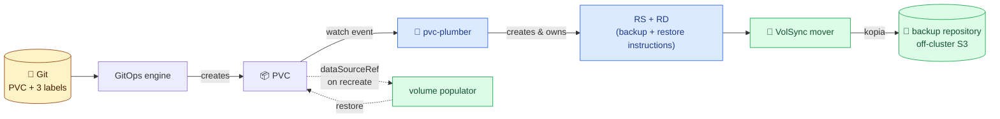
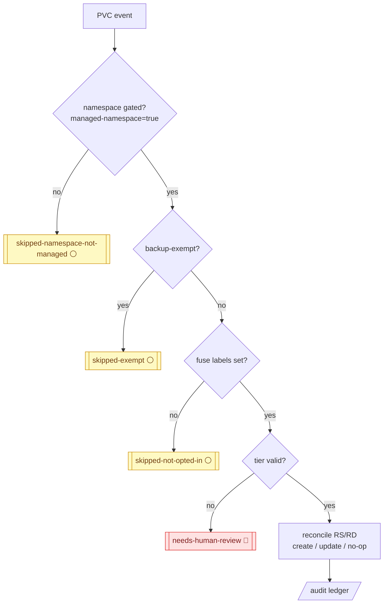

# pvc-plumber 🚰

[](https://github.com/mitchross/pvc-plumber/actions/workflows/build.yaml)
[](https://github.com/mitchross/pvc-plumber/actions/workflows/release.yaml)

> **Label a PVC. Get a backed-up, restore-proven volume.**
> Even if the whole cluster is destroyed, your apps come back **with their
> data** — automatically.

> **How to read this page:** it starts in plain English and gets more
> technical as you scroll. Stop wherever the depth matches what you came for.

---

## What the hell is a pvc-plumber?

You probably got here from a demo of automated backup/restore. Here's the
plain-English version of what this thing actually is.

**The setup.** In Kubernetes, an app's persistent disk is called a **PVC**
(PersistentVolumeClaim). Disks fail, clusters get rebuilt, humans fat-finger
deletes — so every disk that matters needs (a) a backup somewhere safe and
(b) a way to come back *with its data* when it's recreated.

**The problem.** The standard tool for this ([VolSync](https://volsync.readthedocs.io/))
is great, but it needs ~80 lines of YAML *per disk* — a backup config, a
restore config, credentials — that you hand-write and maintain forever. At
30 disks that's ~2,400 lines of copy-paste that silently rots. And if you
forget one line (`dataSourceRef`) on one disk, that disk comes back **empty**
after a disaster, and you find out when it's too late.

**The fix.** pvc-plumber is a Kubernetes **operator** — a small robot that
runs inside your cluster, watches for disks, and does the plumbing for you.
You put three labels on a disk; the robot writes and maintains all the
backup/restore YAML, forever, and keeps a public ledger of what's protected.

The entire system, as if/else statements:

```text
when a PVC appears (new app, rebuild, or "oops, re-deployed"):
    if a backup exists for it          →  it restores, then the app starts
    else                               →  it starts empty, backups begin

when a backup is due:
    if the backup server is reachable  →  snapshot → encrypt → dedup → store
    else                               →  refuse and retry (never write garbage)

when a PVC is labeled backup-exempt:
    skip it forever, on purpose, with a written reason

when anything is ambiguous:
    do nothing and flag a human
```

**"Operator," for dummies.** A Kubernetes operator is just a program with a
loop: *watch the cluster → compare what exists to what should exist → fix
the difference → repeat.* Your GitOps engine does this for apps;
pvc-plumber does it for backup plumbing. It never touches your data — it
only manages the *instructions* that tell VolSync what to back up and where
to restore from.

### Glossary (60 seconds)

| Word | Plain English |
|---|---|
| **PVC** | your app's persistent disk |
| **Operator** | a robot in the cluster that maintains things by watching and reconciling |
| **VolSync** | the tool that actually copies disk data to/from a backup repository |
| **ReplicationSource (RS)** | VolSync's "back this disk up on this schedule" instruction |
| **ReplicationDestination (RD)** | VolSync's "here's how to restore this disk" instruction — think **D for Disaster recovery** |
| **Kopia** | the backup engine — encrypts, dedupes, stores snapshots |
| **`dataSourceRef`** | one line on the PVC that means "fill me from my backup when I'm created" |
| **`/audit`** | the operator's read-only ledger: one verdict per PVC |

---

## The entire per-volume API

```yaml
metadata:
  labels:
    pvc-plumber.io/enabled: "true"
    pvc-plumber.io/manage-volsync: "true"
    pvc-plumber.io/tier: "daily"          # hourly | daily | weekly | manual
spec:
  dataSourceRef:                          # ← restores automatically on recreate
    apiGroup: volsync.backube
    kind: ReplicationDestination
    name: <pvc-name>-dst
```

Plus one label on the namespace (`pvc-plumber.io/managed-namespace: "true"`)
so a whole namespace must opt in before any of its disks can. That's it.

---

## Battle-tested 🏆

This isn't a demo project. The reference deployment
([talos-argocd-proxmox](https://github.com/mitchross/talos-argocd-proxmox))
runs ~90 GitOps applications, and its cluster has been **fully destroyed and
rebuilt three times** with pvc-plumber owning the restore path:

| Event | Result |
|---|---|
| Planned full-cluster nuke (2026-06-02) | 24/24 managed PVCs restored; 24/24 post-restore backups successful |
| **Unplanned** rebuild during a storage-engine meltdown (2026-06-12) | 25/25 restored despite node crashes and a host reboot |
| Planned rebuild onto a different storage engine (2026-06-13) | 24/24 restored **unattended in ~75 minutes**, zero manual steps |

During a full 24-volume restore wave the operator itself used **~1 millicore
of CPU and 15Mi of memory** — it decides and wires; VolSync and Kopia move
the bytes. A scheduled restore canary re-proves the
delete → recreate → populate → byte-verify loop continuously between
disasters.

---

## How it works


```mermaid
flowchart LR
    Git[("📂 Git<br/>PVC + 3 labels")] --> Argo[GitOps engine]
    Argo -->|creates| PVC[📦 PVC]
    PVC -->|watch event| PP["🚰 pvc-plumber"]
    PP -->|creates & owns| RSRD["RS + RD<br/>(backup + restore instructions)"]
    RSRD --> VS[🚚 VolSync mover]
    VS -->|kopia| S3[("💾 backup repository<br/>off-cluster S3")]
    PVC -.->|dataSourceRef<br/>on recreate| POP[volume populator]
    POP -.->|restore| PVC

    classDef own fill:#dbeafe,stroke:#2563eb,color:#1e3a8a;
    classDef data fill:#dcfce7,stroke:#16a34a,color:#14532d;
    classDef git fill:#fef3c7,stroke:#92400e,color:#451a03;
    class PP,RSRD own;
    class VS,S3,POP data;
    class Git git;
```

Delete the whole cluster: GitOps recreates the PVCs, each PVC's
`dataSourceRef` triggers a restore from the repository, apps start on their
own data, and the operator re-wires the backup objects — all unattended.
Day-zero install and day-N disaster recovery are the same code path.

## How it decides

Every PVC in the cluster gets an explicit verdict, recorded in the read-only
`/audit` endpoint — managed, skipped, exempt, or *flagged for a human*:


```mermaid
flowchart TD
    A[PVC event] --> Q1{namespace gated?\nmanaged-namespace=true}
    Q1 -->|no| S1[["skipped-namespace-not-managed ⚪"]]
    Q1 -->|yes| Q2{backup-exempt?}
    Q2 -->|yes| S2[["skipped-exempt ⚪"]]
    Q2 -->|no| Q3{fuse labels set?}
    Q3 -->|no| S3[["skipped-not-opted-in ⚪"]]
    Q3 -->|yes| Q4{tier valid?}
    Q4 -->|no| S4[["needs-human-review 🛑"]]
    Q4 -->|yes| PLAN[reconcile RS/RD\ncreate / update / no-op]
    PLAN --> AUDIT[/audit ledger/]

    classDef skip fill:#fef9c3,stroke:#ca8a04,color:#713f12;
    classDef stop fill:#fee2e2,stroke:#dc2626,color:#7f1d1d;
    class S1,S2,S3 skip;
    class S4 stop;
```

Deliberate non-backup is first-class: `backup-exempt: "true"` plus a
required reason annotation gives disposable data an explicit, auditable
decision instead of a silent gap.

## Ownership rules

- The operator writes **only** RS/RD labeled
  `app.kubernetes.io/managed-by: pvc-plumber`.
- Pre-existing hand-written RS/RD are audit-only — never patched.
- Ambiguity (mixed ownership, invalid tier, malformed exemption) parks the
  PVC in `needs-human-review` — the operator stops and tells you.

## What it deliberately does NOT do

- **Move bytes** — VolSync + your repository engine (Kopia, restic) do that.
- **Inject `dataSourceRef`** — Git owns the restore pointer; the operator
  audits its presence but never mutates your PVC spec.
- **Gate admission** — pvc-plumber is a permissive reconciler: if the operator is
  down, apps deploy normally and the worst case is a late backup. (See the
  [safety model](docs/safety-model.md) for why fail-closed admission was
  deliberately rejected.)
- **Back up databases** — database-native backup (e.g. CNPG/Barman) is
  SQL-aware and better; keep it.

## `/audit` — the truth endpoint

```bash
kubectl get --raw "/api/v1/namespaces/pvc-plumber/services/pvc-plumber-metrics:audit-http/proxy/audit"
```

One row per PVC: `action` (`already-matches`, `would-create`, `skipped-*`,
`needs-human-review`…), ownership classification, staleness. "Is this volume
protected, and would it restore?" has a queryable answer. See
[docs/audit-api.md](docs/audit-api.md).

## Documentation

- [Operator workflow](docs/operator-workflow.md) — the reconcile loop, with diagrams
- [Safety model](docs/safety-model.md) — write gates, blast radius, why permissive
- [`/audit` API](docs/audit-api.md) — schema + verdict semantics
- Reference deployment: [storage architecture + operations](https://github.com/mitchross/talos-argocd-proxmox/blob/main/docs/storage-architecture.md) · [disaster recovery runbook](https://github.com/mitchross/talos-argocd-proxmox/blob/main/docs/disaster-recovery.md)
