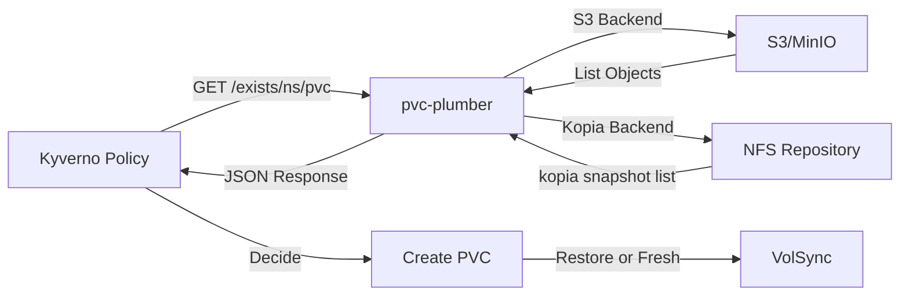

# pvc-plumber

[](https://github.com/mitchross/pvc-plumber/actions/workflows/build.yaml)
[](https://github.com/mitchross/pvc-plumber/actions/workflows/release.yaml)

Lightweight K8s service that checks if PVC backups exist. Supports S3 and Kopia filesystem backends. Enables zero-touch disaster recovery with Kyverno + VolSync.

## Overview

**pvc-plumber** is a microservice designed to run in Kubernetes clusters to determine if a Persistent Volume Claim (PVC) should restore from backup or start fresh. It's intended to be called by Kyverno policies during PVC creation.

### Supported Backends

| Backend | Description | Use Case |
|---------|-------------|----------|
| `s3` | S3/MinIO object storage | VolSync Restic backups to S3 |
| `kopia-fs` | Kopia filesystem repository | VolSync Kopia backups on NFS |

### How It Works


```mermaid
graph LR
    A[Kyverno Policy] -->|GET /exists/ns/pvc| B[pvc-plumber]
    B -->|S3 Backend| C[S3/MinIO]
    B -->|Kopia Backend| D[NFS Repository]
    C -->|List Objects| B
    D -->|kopia snapshot list| B
    B -->|JSON Response| A
    A -->|Decide| E[Create PVC]
    E -->|Restore or Fresh| F[VolSync]
```

When a PVC is created:
1. Kyverno intercepts the creation
2. Calls pvc-plumber to check if backup exists
3. pvc-plumber queries the configured backend:
   - **S3**: Lists objects at `{namespace}/{pvc-name}/`
   - **Kopia**: Lists snapshots for source `{pvc-name}-backup@{namespace}`
4. Returns a tri-state decision: `restore`, `fresh`, or `unknown`
5. Kyverno restores, creates fresh, or denies PVC creation when backup truth is unknown

### Key Features

- **Multiple backends**: S3/MinIO and Kopia filesystem support
- **Tri-state restore decisions**: `restore` when a backup exists, `fresh` when an authoritative check found none, and `unknown` for backend/query errors
- **Cache with pre-warm**: On startup, scans all kopia snapshots in one call and caches authoritative results. Cache misses fall back to a per-PVC backend query
- **Fail-closed safety contract**: `/exists` returns HTTP 503 for unknown backup truth so admission policy can deny PVC creation instead of letting apps initialize empty state
- **Lightweight**: Alpine-based image with kopia included
- **Backwards compatible**: Defaults to S3 backend
- **Graceful shutdown**: Handles SIGTERM/SIGINT properly
- **Structured logging**: JSON logs with configurable levels
- **Health checks**: `/healthz` and `/readyz` endpoints for Kubernetes probes
- **Prometheus metrics**: `/metrics` endpoint for monitoring

## Quick Start

### S3 Backend (Default)

```bash
docker run -p 8080:8080 \
  -e S3_ENDPOINT=minio.example.com:9000 \
  -e S3_BUCKET=volsync-backup \
  -e S3_ACCESS_KEY=your-access-key \
  -e S3_SECRET_KEY=your-secret-key \
  -e S3_SECURE=false \
  ghcr.io/mitchross/pvc-plumber:1.5.0
```

### Kopia Filesystem Backend

```bash
docker run -p 8080:8080 \
  -e BACKEND_TYPE=kopia-fs \
  -e KOPIA_REPOSITORY_PATH=/repository \
  -e KOPIA_PASSWORD=your-repository-password \
  -v /path/to/nfs/repo:/repository:ro \
  ghcr.io/mitchross/pvc-plumber:1.5.0
```

## API Documentation

For the full boxes-and-arrows version of the restore/fresh/unknown flow, see
[`docs/restore-decision-flow.md`](docs/restore-decision-flow.md).

### GET /exists/{namespace}/{pvc-name}

Check whether a PVC should restore from backup, start fresh, or be blocked because backup truth is unknown.

**Request:**
```bash
curl http://localhost:8080/exists/karakeep/data-pvc
```

**Response (backup exists):**
```json
{
  "exists": true,
  "decision": "restore",
  "authoritative": true,
  "namespace": "karakeep",
  "pvc": "data-pvc",
  "backend": "kopia-fs",
  "source": "data-pvc-backup@karakeep:/data"
}
```

**Response (no backup):**
```json
{
  "exists": false,
  "decision": "fresh",
  "authoritative": true,
  "namespace": "karakeep",
  "pvc": "data-pvc",
  "backend": "kopia-fs",
  "source": "data-pvc-backup@karakeep:/data"
}
```

**Response (unknown/error, HTTP 503):**
```json
{
  "exists": false,
  "decision": "unknown",
  "authoritative": false,
  "namespace": "karakeep",
  "pvc": "data-pvc",
  "backend": "kopia-fs",
  "source": "data-pvc-backup@karakeep:/data",
  "error": "failed to list snapshots: exit status 1"
}
```

Admission policy should treat only authoritative responses as safe:

| `decision` | `authoritative` | HTTP | Meaning |
|------------|------------------|------|---------|
| `restore` | `true` | 200 | A backup exists; mutate the PVC with `dataSourceRef` |
| `fresh` | `true` | 200 | The check succeeded and no backup exists; create an empty PVC |
| `unknown` | `false` | 503 | The check failed or was not trustworthy; deny PVC creation |

### GET /healthz

Liveness probe endpoint.

**Response:**
```json
{
  "status": "ok"
}
```

### GET /readyz

Readiness probe endpoint.

**Response:**
```json
{
  "status": "ok"
}
```

### GET /metrics

Prometheus metrics endpoint.

**Response:**
```
# HELP pvc_plumber_requests_total Total number of backup check requests
# TYPE pvc_plumber_requests_total counter
pvc_plumber_requests_total 42
# HELP pvc_plumber_requests_errors_total Total number of failed backup check requests
# TYPE pvc_plumber_requests_errors_total counter
pvc_plumber_requests_errors_total 0
# HELP pvc_plumber_backup_check_total Total number of backup check results by backend and decision
# TYPE pvc_plumber_backup_check_total counter
pvc_plumber_backup_check_total{backend="kopia-fs",decision="restore"} 17
pvc_plumber_backup_check_total{backend="kopia-fs",decision="fresh"} 3
pvc_plumber_backup_check_total{backend="kopia-fs",decision="unknown"} 0
```

## Configuration

All configuration is done via environment variables.

### Common Settings

| Variable | Required | Default | Description |
|----------|----------|---------|-------------|
| `BACKEND_TYPE` | No | `s3` | Backend type: `s3` or `kopia-fs` |
| `HTTP_TIMEOUT` | No | `3s` | Per-request backend timeout for `/exists` checks (e.g., `5s`, `500ms`) |
| `CACHE_TTL` | No | `60s` | Cache TTL for backup existence checks (e.g., `30s`, `2m`) |
| `PORT` | No | `8080` | HTTP server port |
| `LOG_LEVEL` | No | `info` | Log level: `debug`, `info`, `warn`, `error` |

### S3 Backend Settings

Required when `BACKEND_TYPE=s3` (or not set):

| Variable | Required | Default | Description |
|----------|----------|---------|-------------|
| `S3_ENDPOINT` | Yes | - | S3 endpoint (e.g., `minio.minio.svc:9000`) |
| `S3_BUCKET` | Yes | - | S3 bucket name (e.g., `volsync-backup`) |
| `S3_ACCESS_KEY` | Yes | - | S3 access key ID |
| `S3_SECRET_KEY` | Yes | - | S3 secret access key |
| `S3_SECURE` | No | `false` | Use HTTPS for S3 connection |

### Kopia Backend Settings

Required when `BACKEND_TYPE=kopia-fs`:

| Variable | Required | Default | Description |
|----------|----------|---------|-------------|
| `KOPIA_REPOSITORY_PATH` | No | `/repository` | Path to Kopia repository (must exist) |
| `KOPIA_PASSWORD` | Yes | - | Repository password (from secret) |

**Note:** The Kopia filesystem backend requires the `kopia` binary to be available in the container and the repository path to be mounted (typically via NFS). The password is used to decrypt the repository - this is the same password used when the repository was created by VolSync.

## Kubernetes Deployment Examples

### S3 Backend Deployment

```yaml
apiVersion: apps/v1
kind: Deployment
metadata:
  name: pvc-plumber
  namespace: kube-system
spec:
  replicas: 2
  selector:
    matchLabels:
      app: pvc-plumber
  template:
    metadata:
      labels:
        app: pvc-plumber
    spec:
      containers:
      - name: pvc-plumber
        image: ghcr.io/mitchross/pvc-plumber:1.5.0
        ports:
        - containerPort: 8080
          name: http
        env:
        - name: BACKEND_TYPE
          value: "s3"
        - name: S3_ENDPOINT
          value: "minio.minio.svc.cluster.local:9000"
        - name: S3_BUCKET
          value: "volsync-backup"
        - name: S3_ACCESS_KEY
          valueFrom:
            secretKeyRef:
              name: pvc-plumber-s3
              key: access-key
        - name: S3_SECRET_KEY
          valueFrom:
            secretKeyRef:
              name: pvc-plumber-s3
              key: secret-key
        - name: S3_SECURE
          value: "false"
        livenessProbe:
          httpGet:
            path: /healthz
            port: http
          initialDelaySeconds: 5
          periodSeconds: 10
        readinessProbe:
          httpGet:
            path: /readyz
            port: http
          initialDelaySeconds: 5
          periodSeconds: 5
        resources:
          requests:
            cpu: 10m
            memory: 16Mi
          limits:
            cpu: 100m
            memory: 32Mi
        securityContext:
          allowPrivilegeEscalation: false
          readOnlyRootFilesystem: true
          runAsNonRoot: true
          runAsUser: 65532
          capabilities:
            drop:
            - ALL
```

### Kopia Filesystem Backend Deployment

```yaml
apiVersion: apps/v1
kind: Deployment
metadata:
  name: pvc-plumber
  namespace: kube-system
spec:
  replicas: 1  # Single replica recommended for NFS
  selector:
    matchLabels:
      app: pvc-plumber
  template:
    metadata:
      labels:
        app: pvc-plumber
    spec:
      containers:
      - name: pvc-plumber
        image: ghcr.io/mitchross/pvc-plumber:1.5.0  # Must include kopia binary
        ports:
        - containerPort: 8080
          name: http
        env:
        - name: BACKEND_TYPE
          value: "kopia-fs"
        - name: KOPIA_REPOSITORY_PATH
          value: "/repository"
        - name: KOPIA_PASSWORD
          valueFrom:
            secretKeyRef:
              name: volsync-kopia-secret
              key: KOPIA_PASSWORD
        - name: LOG_LEVEL
          value: "info"
        volumeMounts:
        - name: repository
          mountPath: /repository
          readOnly: true
        livenessProbe:
          httpGet:
            path: /healthz
            port: http
          initialDelaySeconds: 10
          periodSeconds: 10
        readinessProbe:
          httpGet:
            path: /readyz
            port: http
          initialDelaySeconds: 10
          periodSeconds: 5
        resources:
          requests:
            cpu: 10m
            memory: 32Mi
          limits:
            cpu: 100m
            memory: 64Mi
        securityContext:
          allowPrivilegeEscalation: false
          runAsNonRoot: true
          runAsUser: 568      # Match VolSync mover UID
          runAsGroup: 568
          capabilities:
            drop:
            - ALL
      volumes:
      - name: repository
        nfs:
          server: 192.168.10.133
          path: /mnt/BigTank/k8s/volsync-kopia-nfs
---
apiVersion: v1
kind: Service
metadata:
  name: pvc-plumber
  namespace: kube-system
spec:
  selector:
    app: pvc-plumber
  ports:
  - port: 8080
    targetPort: http
    name: http
```

## Kyverno Integration Example

### Recommended: Fail-Closed (Validate + Mutate)

Use a validate rule to **deny PVC creation** if pvc-plumber is unreachable. This prevents data loss during disaster recovery — apps wait until pvc-plumber is healthy before creating PVCs.

```yaml
apiVersion: kyverno.io/v1
kind: ClusterPolicy
metadata:
  name: restore-pvc-from-backup
spec:
  background: false
  validationFailureAction: Enforce
  rules:
    # Rule 0: Gate PVC creation on pvc-plumber availability (FAIL-CLOSED)
    - name: require-pvc-plumber-available
      match:
        any:
          - resources:
              kinds:
                - PersistentVolumeClaim
              operations:
                - CREATE
              selector:
                matchExpressions:
                  - key: backup
                    operator: In
                    values: ["hourly", "daily"]
      context:
        - name: plumberHealth
          apiCall:
            method: GET
            service:
              url: "http://pvc-plumber.volsync-system.svc.cluster.local/readyz"
      validate:
        failureAction: Enforce
        message: >-
          PVC Plumber is not available. Backup-labeled PVCs cannot be created
          until PVC Plumber is healthy.
        deny:
          conditions:
            all:
              - key: "{{ plumberHealth.status || 'unavailable' }}"
                operator: NotEquals
                value: "ok"

    # Rule 1: Deny unknown per-PVC backup truth
    - name: require-authoritative-backup-decision
      match:
        any:
          - resources:
              kinds:
                - PersistentVolumeClaim
              operations:
                - CREATE
              selector:
                matchExpressions:
                  - key: backup
                    operator: In
                    values: ["hourly", "daily"]
      context:
        - name: backupCheck
          apiCall:
            method: GET
            service:
              url: "http://pvc-plumber.volsync-system.svc.cluster.local/exists/{{request.object.metadata.namespace}}/{{request.object.metadata.name}}"
      validate:
        failureAction: Enforce
        message: >-
          PVC Plumber could not make an authoritative restore/fresh decision.
        deny:
          conditions:
            any:
              - key: "{{ backupCheck.authoritative || false }}"
                operator: Equals
                value: false
              - key: "{{ backupCheck.decision || 'unknown' }}"
                operator: Equals
                value: "unknown"
              - key: "{{ backupCheck.error || '' }}"
                operator: NotEquals
                value: ""

    # Rule 2: Add dataSourceRef only for authoritative restore decisions
    - name: check-and-restore-backup
      match:
        any:
          - resources:
              kinds:
                - PersistentVolumeClaim
              operations:
                - CREATE
              selector:
                matchExpressions:
                  - key: backup
                    operator: In
                    values: ["hourly", "daily"]
      context:
        - name: backupCheck
          apiCall:
            method: GET
            service:
              url: "http://pvc-plumber.volsync-system.svc.cluster.local/exists/{{request.object.metadata.namespace}}/{{request.object.metadata.name}}"
      preconditions:
        all:
          - key: "{{ backupCheck.authoritative || false }}"
            operator: Equals
            value: true
          - key: "{{ backupCheck.decision || 'unknown' }}"
            operator: Equals
            value: "restore"
          - key: "{{ backupCheck.exists || false }}"
            operator: Equals
            value: true
      mutate:
        patchStrategicMerge:
          spec:
            dataSourceRef:
              kind: ReplicationDestination
              apiGroup: volsync.backube
              name: "{{request.object.metadata.name}}-backup"
```

## Architecture

The service is composed of four main components:

1. **Config Module** (`internal/config`): Loads and validates environment variables, supports backend-specific configuration
2. **Backend Interface** (`internal/backend`): Defines the common tri-state `CheckResult` type
3. **S3 Client** (`internal/s3`): Uses minio-go for authenticated S3 requests
4. **Kopia Client** (`internal/kopia`): Wraps the kopia CLI for snapshot queries
5. **Cache Layer** (`internal/cache`): In-memory TTL cache with startup pre-warm. Pre-warm runs `kopia snapshot list --all --json` once to populate all known sources
6. **HTTP Handlers** (`internal/handler`): Exposes REST API endpoints

### Backend Details

**S3 Backend:**
- Uses [minio-go](https://github.com/minio/minio-go) library
- Performs ListObjects with prefix `{namespace}/{pvc}/`
- Supports AWS Signature Version 4 authentication

**Kopia Backend:**
- Shells out to `kopia` CLI binary
- Connects to repository at startup: `kopia repository connect filesystem --path /repository`
- Pre-warms cache: `kopia snapshot list --all --json` scans all snapshots in one call
- Per-request checks are served from cache (sub-millisecond). Cache misses fall back to `kopia snapshot list "{pvc}-backup@{namespace}" --json`
- Cache TTL is configurable (default 60s)

## Local Development

### Prerequisites

- Go 1.24 or later
- Docker (optional, for building images)
- Make (optional, for using Makefile targets)
- kopia binary (for testing kopia-fs backend)

### Build and Run

```bash
# Install dependencies
go mod download

# Run tests
make test

# Build binary
make build

# Run with S3 backend
BACKEND_TYPE=s3 \
S3_ENDPOINT=localhost:9000 \
S3_BUCKET=test-bucket \
S3_ACCESS_KEY=minioadmin \
S3_SECRET_KEY=minioadmin \
./pvc-plumber

# Run with Kopia backend
BACKEND_TYPE=kopia-fs \
KOPIA_REPOSITORY_PATH=/path/to/repo \
KOPIA_PASSWORD=your-repository-password \
./pvc-plumber
```

### Run Tests

```bash
# Run all tests
make test

# Run tests with coverage
make test-coverage
open coverage.html
```

## Troubleshooting

### Check logs

```bash
# Kubernetes
kubectl logs -n kube-system deployment/pvc-plumber

# Enable debug logging
LOG_LEVEL=debug ./pvc-plumber
```

### Test endpoint manually

```bash
# Health check
curl http://localhost:8080/healthz

# Check if backup exists
curl http://localhost:8080/exists/my-namespace/my-pvc
```

### Common Issues

**S3 Backend:**

| Issue | Solution |
|-------|----------|
| "S3_ENDPOINT is required" | Set all required S3 env vars |
| "Access Denied" | Verify credentials and bucket permissions |
| Timeout errors | Increase `HTTP_TIMEOUT`, check network |

**Kopia Backend:**

| Issue | Solution |
|-------|----------|
| "KOPIA_REPOSITORY_PATH does not exist" | Verify NFS mount is available |
| "failed to connect to kopia repository" | Check repository path and permissions |
| "kopia: command not found" | Ensure kopia binary is in container |

## Security

- Runs as non-root user (UID 568, matching VolSync mover)
- Read-only root filesystem compatible
- No privilege escalation
- Minimal attack surface (Alpine base image)
- Store credentials in Kubernetes secrets

## Contributing

Contributions are welcome! Please feel free to submit a Pull Request.

## License

This project is open source and available under the MIT License.

## Support

For issues and questions, please open an issue on GitHub: https://github.com/mitchross/pvc-plumber/issues
