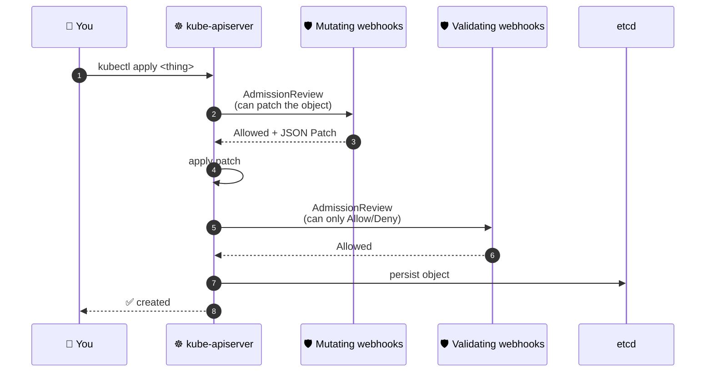
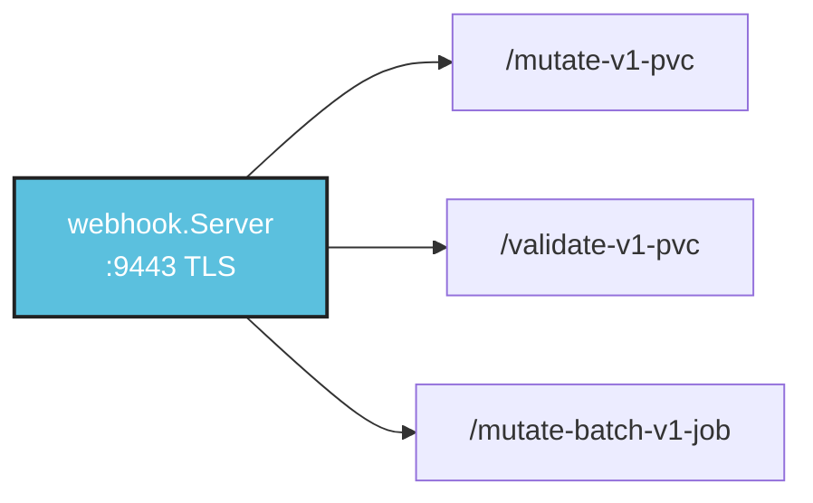
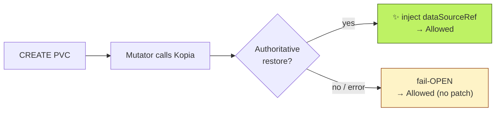
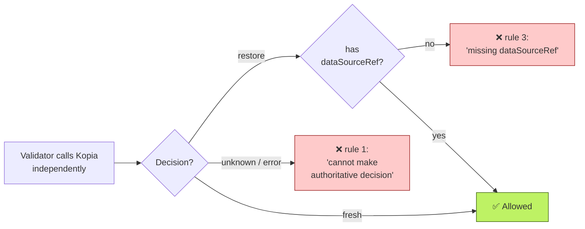
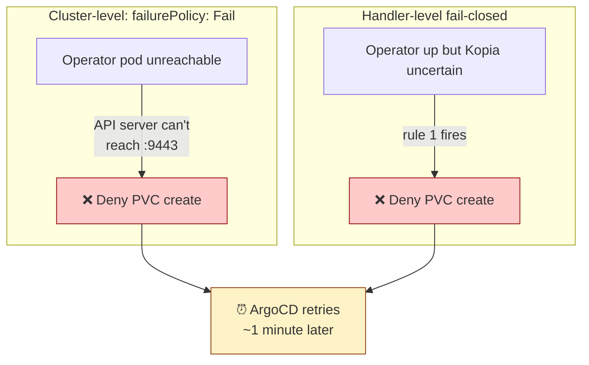
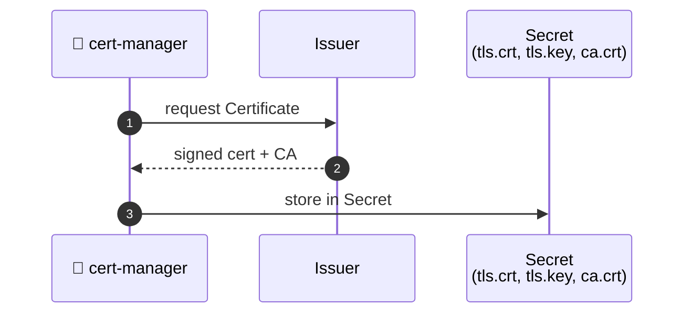
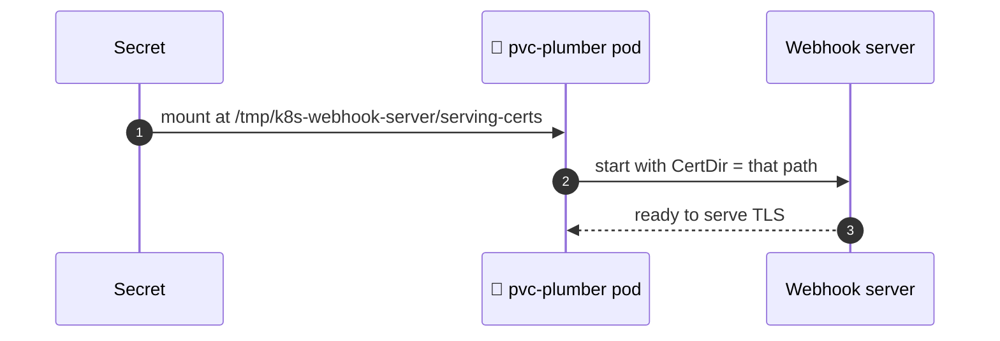
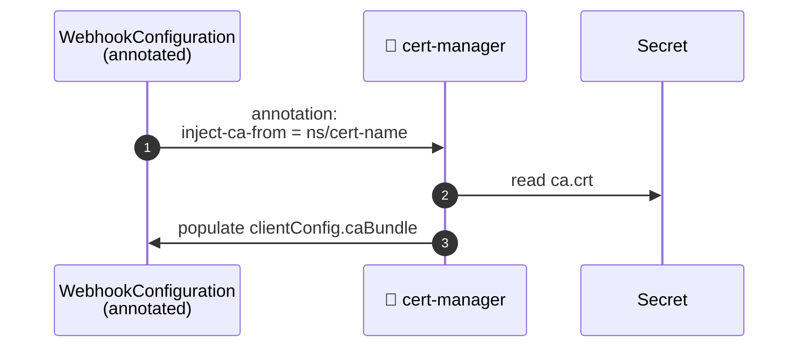

> [!WARNING]
> Historical document.
> This file is preserved for context only and is not the current runbook.
> Start with: [project README](../../../README.md) and [v4 vs v5](../../v4-vs-v5.md).

# Admission Webhooks Deep Dive

> **TL;DR for presenters** *(grab any of these if asked "how do the webhooks actually work?")*
>
> 1. **Three handlers, three jobs.** PVC mutator (inject `dataSourceRef` for restore), PVC validator (deny unsafe creates), Job mutator (inject the NFS volume into VolSync mover pods).
> 2. **Two failure modes per webhook.** The cluster-side `failurePolicy` decides what happens if the operator pod is unreachable. The handler-side mode decides what happens if Kopia is unreachable while the operator is up. Both have to be set deliberately.
> 3. **The mutator and validator both call Kopia.** That's not a redundancy bug — it's the cross-check that catches transient errors. Rule 3 ("decision=restore but no `dataSourceRef`") fires exactly when the mutator's call returned non-authoritative and the validator's succeeded.
> 4. **TLS comes from cert-manager.** A `Certificate` resource creates a Secret mounted at `/tmp/k8s-webhook-server/serving-certs`; cert-manager auto-injects the CA bundle into the webhook configurations via annotation. We never touch certs ourselves.
> 5. **The 9-namespace exclusion list is load-bearing.** Get it wrong and you can deadlock the cluster on bootstrap. Ask any homelab operator about their 2026-04-08.

## Contents

- [How Kubernetes admission webhooks work (very brief)](#how-kubernetes-admission-webhooks-work-very-brief)
- [How the operator registers handlers](#how-the-operator-registers-handlers)
- [Handler 1 — PVCMutator (`/mutate-v1-pvc`)](#handler-1--pvcmutator-mutate-v1-pvc)
- [Handler 2 — PVCValidator (`/validate-v1-pvc`)](#handler-2--pvcvalidator-validate-v1-pvc)
- [Handler 3 — JobMutator (`/mutate-batch-v1-job`)](#handler-3--jobmutator-mutate-batch-v1-job)
- [Why two webhook configurations in cluster manifests](#why-two-webhook-configurations-in-cluster-manifests)
- [TLS lifecycle](#tls-lifecycle)
- [The namespaceSelector deadlock-prevention pattern](#the-namespaceselector-deadlock-prevention-pattern)

---

## How Kubernetes admission webhooks work (very brief)

When you `kubectl apply` something, Kubernetes doesn't just persist it. The API server first checks every registered admission webhook to ask "should this be allowed? should it be modified first?".



*Mutating webhooks run first and can modify the object. Validating webhooks run after, on the post-mutation shape, and can only say yes or no. If any validating webhook denies, nothing gets persisted.*

Each webhook config tells the API server:
- **Where** to send the request (a Service inside the cluster, with a TLS cert).
- **What** to send it on (e.g. "every CREATE for `core/v1/PersistentVolumeClaim`").
- **What to do if the webhook server is unreachable**: `failurePolicy: Fail` denies the request; `failurePolicy: Ignore` admits it.
- **Which objects to gate beyond the basic rule**: `namespaceSelector` and `objectSelector`.

If you want to dig into the protocol itself, the [upstream Dynamic Admission Control docs](https://kubernetes.io/docs/reference/access-authn-authz/extensible-admission-controllers/) are the source of truth. For pvc-plumber, the cluster-side configurations live in the consuming GitOps repo (`infrastructure/controllers/pvc-plumber/webhooks.yaml` in `talos-argocd-proxmox`). The handlers themselves are right here in `internal/webhook/`.

---

## How the operator registers handlers

The controller-runtime `Manager`'s webhook server is one HTTPS listener (`:9443`) that routes by path. Registration happens during `runManager()`:



*One TLS listener, three path-routed handlers. The two PVC handlers share the cached Kopia client; the Job handler is wired with `NFSServer`/`NFSPath` strings (it doesn't need Kopia, just the coordinates of the NFS export).*

```go
// cmd/operator/main.go (abridged)
mgr, _ := ctrl.NewManager(ctrl.GetConfigOrDie(), manager.Options{
    Scheme: scheme,
    WebhookServer: webhook.NewServer(webhook.Options{
        Port:    webhookPort,            // 9443
        CertDir: webhookCertDir,         // /tmp/k8s-webhook-server/serving-certs
    }),
    LeaderElection:   enableLeaderElection,
    LeaderElectionID: leaderElectionID,
})

decoder := admission.NewDecoder(mgr.GetScheme())
hookSrv := mgr.GetWebhookServer()
hookSrv.Register("/mutate-v1-pvc", &webhook.Admission{
    Handler: &pvcwebhook.PVCMutator{
        Decoder:          decoder,
        Kopia:            bundle.cached,    // ← shared with HTTP server
        SystemNamespaces: sysNs,
    },
})
hookSrv.Register("/validate-v1-pvc", &webhook.Admission{
    Handler: &pvcwebhook.PVCValidator{
        Decoder:          decoder,
        Kopia:            bundle.cached,    // ← same instance
        SystemNamespaces: sysNs,
    },
})
hookSrv.Register("/mutate-batch-v1-job", &webhook.Admission{
    Handler: &pvcwebhook.JobMutator{
        Decoder:   decoder,
        NFSServer: nfsServer,
        NFSPath:   nfsPath,
    },
})
```

*Three things to notice: (1) one decoder serves all three handlers — `admission.NewDecoder(scheme)` knows every GVK in the scheme. (2) Same `Kopia` (cached client) on both PVC handlers — the second `CheckBackupExists` for the same admission request is a cache hit. (3) Same `SystemNamespaces` on both PVC handlers, so a misconfigured cluster-side `namespaceSelector` can't bypass the exclusion list.*

---

## Handler 1 — PVCMutator (`/mutate-v1-pvc`)

**Source**: [`internal/webhook/pvc_mutate.go::Handle`](../../../internal/webhook/pvc_mutate.go).
**Purpose**: inject `spec.dataSourceRef` when pvc-plumber sees an authoritative restore decision.
**Failure modes**: handler-level fail-OPEN. Cluster-level `failurePolicy: Fail`.
**Tested in**: [`internal/webhook/pvc_mutate_test.go`](../../../internal/webhook/pvc_mutate_test.go) (10 cases covering restore / fresh / error / skip-restore / system-namespace / dataSourceRef-preset / etc).

### `Handle()` step by step

```go
func (h *PVCMutator) Handle(ctx context.Context, req admission.Request) admission.Response {
    if req.Operation != admissionv1.Create {
        return admission.Allowed("")  // (1) only gate CREATE
    }

    pvc := &corev1.PersistentVolumeClaim{}
    if err := h.Decoder.Decode(req, pvc); err != nil {
        return admission.Errored(http.StatusBadRequest, err)  // (2) malformed payload
    }

    if _, ok := h.SystemNamespaces[pvc.Namespace]; ok {
        return admission.Allowed("")  // (3) system-namespace short-circuit
    }

    if pvc.Labels[backupExemptLabel] == annotTrue {
        return admission.Allowed("")  // (4) opt-out wins over restore
    }
    if !hasBackupLabel(pvc) {
        return admission.Allowed("")  // (5) not our concern
    }
    if pvc.Annotations[skipRestoreAnnot] == annotTrue {
        return admission.Allowed("")  // (6) explicit "do not restore"
    }
    if pvc.Spec.DataSourceRef != nil {
        return admission.Allowed("")  // (7) caller chose a data source — never overwrite
    }

    result := h.Kopia.CheckBackupExists(ctx, pvc.Namespace, pvc.Name)
    if result.Error != "" || !result.Authoritative || result.Decision != backend.DecisionRestore {
        return admission.Allowed("")  // (8) FAIL-OPEN: anything short of authoritative restore admits
    }

    pvc.Spec.DataSourceRef = &corev1.TypedObjectReference{
        APIGroup: ptr.To(dataSourceAPIGroup),       // "volsync.backube"
        Kind:     dataSourceKind,                    // "ReplicationDestination"
        Name:     pvc.Name + dataSourceSuffix,       // "<pvc>-backup"
    }

    marshaled, err := json.Marshal(pvc)
    if err != nil {
        return admission.Errored(http.StatusInternalServerError, err)
    }
    return admission.PatchResponseFromRaw(req.Object.Raw, marshaled)  // (9) JSON-patch reply
}
```

*Step-by-step: gate the operation, decode, run a series of "is this even our problem?" checks, ask Kopia, only then maybe inject. Every "no" branch returns `Allowed("")` — the validator is the safety gate underneath.*

Walking through the numbered comments:

1. **Operation gate.** UPDATE/DELETE never reach the patch logic. `dataSourceRef` is immutable on PVCs anyway, so injecting it post-create wouldn't even work.
2. **Decode error.** The only path that returns `admission.Errored` — covers a genuinely malformed AdmissionReview, not a content issue.
3. **System namespace.** Hoisted ABOVE label checks. If a misconfigured cluster-side `namespaceSelector` admitted us into kube-system anyway, we still no-op. Critical for [deadlock prevention](#the-namespaceselector-deadlock-prevention-pattern).
4. **Backup-exempt overrides backup label.** A PVC carrying both `backup: hourly` AND `backup-exempt: "true"` is in the "user just added exempt to a previously-backed-up PVC" transition state. Exempt wins — no `dataSourceRef`.
5. **Backup label gate.** `backup=hourly|daily` only. Anything else is a regular PVC; the webhook is invisible to it.
6. **Skip-restore opt-out.** "I know there's a backup, I want a fresh PVC anyway" — explicit user intent; honour it.
7. **Pre-set `dataSourceRef`.** The user (or another admission step) already chose a data source. Never overwrite.
8. **The fail-OPEN branch.** Three independent reasons to NOT inject: backend error, non-authoritative result, or `decision != restore`. All three converge on `Allowed("")` — letting the validator be the safety gate.
9. **JSON Patch reply.** controller-runtime's `PatchResponseFromRaw` diffs the original `req.Object.Raw` against our mutated copy and emits a JSON Patch. The API server applies that patch; the operator never sees the persisted object.

### What goes in, what comes out

A real `kubectl apply` triggers an `AdmissionReview` carrying the raw PVC JSON in `req.Object.Raw`:

```json
{
  "apiVersion": "v1", "kind": "PersistentVolumeClaim",
  "metadata": { "name": "data", "namespace": "paperless",
                "labels": { "backup": "hourly" } },
  "spec": { "accessModes": ["ReadWriteOnce"],
            "resources": { "requests": { "storage": "10Gi" } },
            "storageClassName": "longhorn" }
}
```

When Kopia says `decision=restore, authoritative=true`, our response looks like:

```json
{
  "allowed": true,
  "patchType": "JSONPatch",
  "patch": "[{\"op\":\"add\",\"path\":\"/spec/dataSourceRef\",\"value\":{\"apiGroup\":\"volsync.backube\",\"kind\":\"ReplicationDestination\",\"name\":\"data-backup\"}}]"
}
```

*The API server applies the patch; the persisted PVC carries `spec.dataSourceRef`, and Longhorn's CSI populator hands off to VolSync to copy the snapshot data into the new PV before binding. The user never sees this — they just see their data come back.*

### The fail-OPEN invariant

Why don't we just deny on Kopia errors? Because the validator (with its own independent Kopia call) is already the safety net. We'll show this in two pieces.

**The mutator side: Kopia answer → admit (with or without patch).**



*The mutator never denies. Either it's confident enough to inject, or it admits unchanged and lets the validator decide.*

**The validator side: same Kopia question, but with denial paths.**



*The validator's independent Kopia call closes the gap. If the mutator failed open and Kopia is now authoritative for restore, rule 3 catches the missing `dataSourceRef`. If Kopia is still uncertain, rule 1 fires. Only "fresh" or "restore-with-correct-ref" admits.*

The two diagrams together describe one cooperating safety net: the mutator never denies (cheap to fail), the validator denies on uncertainty (expensive to fail-wrong, cheap to retry-right).

> *If you're presenting this section, lead with: "There are two checks against Kopia, on purpose, and the way they cooperate is the heart of the safety story."*

### Test fixtures (all green)

Read [`internal/webhook/pvc_mutate_test.go`](../../../internal/webhook/pvc_mutate_test.go) for the canonical exercises:

| Test | What it verifies |
|---|---|
| `TestPVCMutate_RestoreDecision_PatchesDataSourceRef` | happy path — `dataSourceRef` injected on `decision=restore` |
| `TestPVCMutate_FreshDecision_NoPatch` | empty cluster, no backup → admit unchanged |
| `TestPVCMutate_KopiaError_AllowsFailOpen` | explicit fail-OPEN assertion on Kopia error |
| `TestPVCMutate_DataSourceRefAlreadySet_NoOverwrite` | never stomps user-supplied data source |
| `TestPVCMutate_NoBackupLabel_AllowsWithoutCheck` | Kopia not even consulted — out-of-scope PVCs short-circuit early |
| `TestPVCMutate_SystemNamespace_AllowsWithoutCheck` | defense-in-depth namespace exclusion |
| `TestPVCMutate_SkipRestore_AllowsWithoutCheck` | explicit opt-out honoured before Kopia call |
| `TestPVCMutate_NonCreate_AllowsImmediately` | no-op on UPDATE |

---

## Handler 2 — PVCValidator (`/validate-v1-pvc`)

**Source**: [`internal/webhook/pvc_validate.go::Handle`](../../../internal/webhook/pvc_validate.go).
**Purpose**: deny unsafe PVC creates — three independent denial branches.
**Failure modes**: handler-level fail-CLOSED. Cluster-level `failurePolicy: Fail`.
**Tested in**: [`internal/webhook/pvc_validate_test.go`](../../../internal/webhook/pvc_validate_test.go) (12 cases).

### `Handle()` step by step

```go
func (h *PVCValidator) Handle(ctx context.Context, req admission.Request) admission.Response {
    if req.Operation != admissionv1.Create {
        return admission.Allowed("")
    }
    pvc := &corev1.PersistentVolumeClaim{}
    if err := h.Decoder.Decode(req, pvc); err != nil {
        return admission.Errored(http.StatusBadRequest, err)
    }

    if _, ok := h.SystemNamespaces[pvc.Namespace]; ok {
        return admission.Allowed("")  // (1) hoisted to prevent deny-into-kube-system
    }

    // backup-exempt is checked BEFORE the backup-label gate.
    if pvc.Labels[backupExemptLabel] == annotTrue {
        if pvc.Annotations[backupExemptReasonAnnot] == "" {
            return admission.Denied(denyMsgBackupExemptNoReason)  // (2) rule 4 (exempt variant)
        }
        return admission.Allowed("")
    }

    if !hasBackupLabel(pvc) {
        return admission.Allowed("")
    }

    if pvc.Annotations[skipRestoreAnnot] == annotTrue {
        if pvc.Annotations[skipRestoreReasonAnnot] == "" {
            return admission.Denied(denyMsgSkipRestoreNoReason)  // (3) rule 4 (skip-restore variant)
        }
        return admission.Allowed("")
    }

    result := h.Kopia.CheckBackupExists(ctx, pvc.Namespace, pvc.Name)

    // RULE 1 fail-closed: any flavor of "we don't know" denies.
    if result.Error != "" || !result.Authoritative || result.Decision == backend.DecisionUnknown {
        return admission.Denied(denyMsgUnknown)                   // (4) rule 1
    }

    // RULE 3 fail-closed: belt-and-suspenders cross-check with the mutator.
    if result.Decision == backend.DecisionRestore {
        if !hasExpectedDataSourceRef(pvc) {
            return admission.Denied(denyMsgRestoreNoRef)          // (5) rule 3
        }
    }

    return admission.Allowed("")
}
```

*Read this one as: "system namespace? skip. backup-exempt? require reason. skip-restore? require reason. Kopia uncertain? deny. Restore needed but dataSourceRef wrong? deny. Otherwise admit."*

Walking through the numbered comments:

1. **System-namespace hoist (defense-in-depth).** This MUST run before any denial branch. A stray `backup: hourly` label in `kube-system` would otherwise hit the rule-1 denial on Kopia uncertainty and deadlock controllers in that namespace. The hoist mirrors the mutator's ordering — symmetric handlers prevent skew.
2. **Rule 4 (exempt).** A PVC declaring it's intentionally not backed up MUST justify why. The reason value is informational; the validator just enforces non-empty. Allowed values are documented in the deny message.
3. **Rule 4 (skip-restore).** Same shape as the exempt rule, different annotation. "I know there's a backup, I want a fresh PVC anyway" needs a reason in writing.
4. **Rule 1 — the whole point of the validator.** Three converging signals (`Error != ""`, `!Authoritative`, `Decision == Unknown`) all map to the same denial. Backends can populate any subset of those fields — the triple-check ensures every failure mode lands here.
5. **Rule 3 — belt-and-suspenders.** Catches the race where the mutator's Kopia call returned non-authoritative (so it didn't inject `dataSourceRef`) but the validator's call now returns `decision=restore`. Without this, the PVC would be admitted without `dataSourceRef`, and Longhorn would provision empty over a real backup.

### `hasExpectedDataSourceRef`

```go
func hasExpectedDataSourceRef(pvc *corev1.PersistentVolumeClaim) bool {
    ref := pvc.Spec.DataSourceRef
    if ref == nil { return false }
    if ref.APIGroup == nil || *ref.APIGroup != dataSourceAPIGroup { return false }
    if ref.Kind != dataSourceKind { return false }
    if ref.Name != pvc.Name+dataSourceSuffix { return false }
    return true
}
```

*Any single mismatch on `apiGroup`, `kind`, or `name` is a denial. The original Kyverno rule used `NotEquals` predicates on the same three fields with `any` semantics — this is the Go transliteration.*

### The fail-CLOSED invariant

Why fail-CLOSED at *both* levels?



*Both levels of fail-closed converge on the same outcome: deny + retry. The cost of a false denial is a one-minute ArgoCD retry. The cost of a false admit is silent overwrite of restorable data on the next backup tick. Easy trade-off.*

The two layers protect against different failure modes:
- **Cluster level** (`failurePolicy: Fail`): operator pod is unreachable. Combined with the namespaceSelector exclusion list, this is safe — kube-system / cert-manager / etc. bypass the webhook entirely, so they can come up while pvc-plumber is down.
- **Handler level**: operator IS up but Kopia is uncertain (NFS blip, repository corruption, transient subprocess failure). Denying is still safe — ArgoCD will retry.

> *If you're presenting this section, lead with: "When in doubt, we deny. The cost of being wrong is silent data loss; the cost of being cautious is a minute of latency."*

### Test fixtures (all green)

Read [`internal/webhook/pvc_validate_test.go`](../../../internal/webhook/pvc_validate_test.go):

| Test | What it verifies |
|---|---|
| `TestPVCValidate_Unknown_Denies` | rule 1, decision=unknown |
| `TestPVCValidate_Error_Denies` | rule 1, `result.Error` set even with restore decision |
| `TestPVCValidate_NotAuthoritative_Denies` | rule 1, fresh decision but non-authoritative |
| `TestPVCValidate_RestoreNoDataSourceRef_Denies` | rule 3 — happy denial path |
| `TestPVCValidate_RestoreWithCorrectDataSourceRef_Allows` | rule 3 — happy admit path |
| `TestPVCValidate_RestoreWithWrongDataSourceRef_Denies` | table-driven over wrong-kind / wrong-apiGroup / nil-apiGroup / wrong-name |
| `TestPVCValidate_FreshDecision_Allows` | empty cluster, no `dataSourceRef`, fresh authoritative → admit |
| `TestPVCValidate_SkipRestoreNoReason_Denies` | rule 4 audit-trail enforcement (skip-restore variant) |
| `TestPVCValidate_SkipRestoreWithReason_Allows` | escape hatch admits with reason |
| `TestPVCValidate_SystemNamespace_Allows` | defense-in-depth hoist |

---

## Handler 3 — JobMutator (`/mutate-batch-v1-job`)

**Source**: `internal/webhook/job_mutate.go::Handle` (removed in v3).
**Purpose**: inject the NFS Kopia repository (volume + per-container mount) into VolSync mover Jobs.
**Failure modes**: handler-level never-denies. Cluster-level `failurePolicy: Ignore`.
**Tested in**: `internal/webhook/job_mutate_test.go` (removed in v3) (5 cases).

### `Handle()` step by step

```go
func (h *JobMutator) Handle(_ context.Context, req admission.Request) admission.Response {
    job := &batchv1.Job{}
    if err := h.Decoder.Decode(req, job); err != nil {
        return admission.Errored(http.StatusBadRequest, err)
    }

    // (1) defense-in-depth: only mutate VolSync-created Jobs
    if job.Labels[volsyncCreatedByLabel] != volsyncCreatedByValue {
        return admission.Allowed("")
    }

    // (2) idempotent no-op: don't duplicate the volume on retries
    for _, vol := range job.Spec.Template.Spec.Volumes {
        if vol.Name == repositoryVolumeName {
            return admission.Allowed("")
        }
    }

    // (3) inject the NFS volume
    job.Spec.Template.Spec.Volumes = append(job.Spec.Template.Spec.Volumes, corev1.Volume{
        Name: repositoryVolumeName,
        VolumeSource: corev1.VolumeSource{
            NFS: &corev1.NFSVolumeSource{
                Server: h.NFSServer,
                Path:   h.NFSPath,
            },
        },
    })

    // (4) mount into every container
    mount := corev1.VolumeMount{Name: repositoryVolumeName, MountPath: repositoryMountPath}
    for i := range job.Spec.Template.Spec.Containers {
        job.Spec.Template.Spec.Containers[i].VolumeMounts = append(
            job.Spec.Template.Spec.Containers[i].VolumeMounts, mount)
    }

    marshaled, err := json.Marshal(job)
    if err != nil {
        return admission.Errored(http.StatusInternalServerError, err)
    }
    return admission.PatchResponseFromRaw(req.Object.Raw, marshaled)
}
```

*Match VolSync-created Jobs, no-op if the volume's already there (idempotency), otherwise append volume + per-container mount. No conditional logic on Kopia state — this handler doesn't know or care.*

Numbered comments:

1. **VolSync-only filter.** The cluster manifest's `objectSelector` already filters by `app.kubernetes.io/created-by: volsync`. The handler-level check is defense-in-depth — a misconfigured webhook config could send any Job here, and we never want to mutate a Job we don't own.
2. **Idempotency.** If the operator pre-populated the volume, or admission re-fired during a retry, leave the spec alone. Strategic-merge semantics from the Kyverno equivalent.
3. **NFS volume.** `NFSServer` and `NFSPath` come from the operator's env (`NFS_SERVER`, `NFS_PATH`). Defaults match the reference cluster (`192.168.10.133:/mnt/BigTank/k8s/volsync-kopia-nfs`); production deployments override.
4. **Mount on every container, not initContainers.** VolSync mover pods don't use init containers for Kopia. The Kyverno foreach this replaces also targeted `containers` only — same shape, different language.

### Why fail-IGNORE

The cluster-side `failurePolicy: Ignore` means: if the operator is unreachable, admit the Job unchanged. The mover Job will then run without `/repository` mounted, Kopia inside the mover will fail to reach the repo, and that single backup tick will fail visibly in VolSync's status.

That's recoverable — the next backup tick retries with the operator back up. The alternative (`failurePolicy: Fail` on Job creates) would deny **every** VolSync mover Job in the cluster while pvc-plumber is down, which would also affect *unrelated* backup paths and wouldn't be much better than the current degradation.

### Test fixtures (all green)

| Test | What it verifies |
|---|---|
| `TestJobMutate_VolsyncJob_InjectsVolumeAndMounts` | happy path |
| `TestJobMutate_NotVolsync_NoOp` | non-VolSync Job filtered out |
| `TestJobMutate_RepositoryVolumeAlreadyExists_NoOp` | idempotency |
| `TestJobMutate_MultipleContainers_AllGetMount` | mount appended to every container, including those with pre-existing mounts |
| `TestJobMutate_NoLabel_NoOp` | Jobs without the VolSync label admitted unchanged |

---

## Why two webhook configurations in cluster manifests

The cluster's GitOps repo (`talos-argocd-proxmox`) carries both a `MutatingWebhookConfiguration` (with TWO entries) and a `ValidatingWebhookConfiguration` (with one entry):

```yaml
# infrastructure/controllers/pvc-plumber/webhooks.yaml (paraphrased)
apiVersion: admissionregistration.k8s.io/v1
kind: MutatingWebhookConfiguration
metadata:
  name: pvc-plumber
webhooks:
  - name: mutate-pvc.pvc-plumber.io
    clientConfig: { service: { ..., path: /mutate-v1-pvc } }
    rules: [{ apiGroups: [""], resources: [persistentvolumeclaims], operations: [CREATE] }]
    namespaceSelector: { matchExpressions: [...NotIn 9-entry list...] }
    failurePolicy: Fail
    sideEffects: None
  - name: mutate-job.pvc-plumber.io
    clientConfig: { service: { ..., path: /mutate-batch-v1-job } }
    rules: [{ apiGroups: [batch], resources: [jobs], operations: [CREATE] }]
    objectSelector: { matchLabels: { app.kubernetes.io/created-by: volsync } }
    failurePolicy: Ignore
    sideEffects: None
```

*Two entries, one configuration object — the same `MutatingWebhookConfiguration` can fan out to multiple webhook paths because each entry has its own `clientConfig.service.path`. The ValidatingWebhookConfiguration has a single entry pointing at `/validate-v1-pvc`.*

The two entries serve different rules and different objects, so combining them into one configuration is purely an organisational choice (one ArgoCD-tracked YAML to manage instead of two).

> **`namespaceSelector` is OR-semantics across `matchExpressions`.** The `NotIn` clause excludes namespaces in the list; without it, a backup-labeled PVC in `kube-system` would still hit the webhook. See [the deadlock-prevention pattern](#the-namespaceselector-deadlock-prevention-pattern) below.

---

## TLS lifecycle

Admission webhooks must be served over TLS, and the API server must trust the CA. cert-manager handles both halves so we don't have to:

**Provisioning. cert-manager mints the cert and stores it in a Secret.**



*A `Certificate` resource in the consuming GitOps repo points at an Issuer (self-signed is fine for an internal webhook). cert-manager mints the cert and stuffs it into a Secret with three keys.*

**Pod start. The Secret mounts; controller-runtime reads it.**



*The Secret is a regular volume mount. controller-runtime's webhook server defaults to that path; we just point at it via the `-webhook-cert-dir` flag. No certificate logic in our code at all.*

**CA injection. cert-manager populates the `caBundle` field on the webhook config.**



*The annotation `cert-manager.io/inject-ca-from: <namespace>/<certificate-name>` tells cert-manager to populate every webhook entry's `caBundle` field from the Certificate's CA. Renewals happen transparently — pod restarts pick up the new cert from the mounted Secret.*

Three things worth noticing:

1. **`/tmp/k8s-webhook-server/serving-certs` is the controller-runtime default.** `webhook.NewServer(webhook.Options{CertDir: ...})` defaults to that path; the operator's `-webhook-cert-dir` flag overrides it.
2. **CA injection via annotation, not env var.** `cert-manager.io/inject-ca-from: <namespace>/<certificate-name>` on the webhook configuration tells cert-manager to populate every entry's `clientConfig.caBundle` field from that Certificate's CA. Renewals happen transparently.
3. **No certificate provisioning logic in pvc-plumber.** The operator just reads what's mounted. cert-manager owns the lifecycle.

---

## The namespaceSelector deadlock-prevention pattern

The single most important architectural invariant in pvc-plumber's deployment.

### The problem

`failurePolicy: Fail` on the validate webhook means: when the operator pod is unreachable, *every* `PersistentVolumeClaim` create gets denied. Without a `namespaceSelector`, that includes:

- cert-manager creating its leader-election PVC.
- external-secrets creating its store backing PVC.
- snapshot-controller's housekeeping PVCs.
- Longhorn's internal PVCs for engine state.
- The operator's own pod, if you've configured it that way.

If any of these can't create their PVC because the webhook denied it, **the controller they belong to fails to start**. Which means the operator's own dependencies fail to start. Which means pvc-plumber never comes up, because cert-manager isn't there to mint its TLS cert. Which means the webhook stays unreachable. Which means the deny stays in effect. **Cluster-wide deadlock**.

This is not a theoretical concern. We hit it on 2026-04-08. It was a Tuesday. Recovery required scaling Kyverno's webhook deployment via a separate kubeconfig from a host that didn't go through the webhook. Not a great Tuesday.

### The fix

```yaml
namespaceSelector:
  matchExpressions:
    - key: kubernetes.io/metadata.name
      operator: NotIn
      values:
        - kube-system
        - volsync-system
        - kyverno
        - argocd
        - longhorn-system
        - snapshot-controller
        - cert-manager
        - external-secrets
        - 1passwordconnect
```

*Excludes every namespace whose controllers might create PVCs at startup. The webhook never sees PVCs in those namespaces — they bypass admission entirely.*

### The list lives in two places — and they MUST match

The same nine namespaces have to appear in both files. If they drift, the cluster is one operator restart away from a deadlock.

**Side A — the operator's in-process default** (this repo):

```go
// cmd/operator/main.go
var defaultSystemNamespaces = []string{
    "kube-system",
    "volsync-system",
    "kyverno",
    "argocd",
    "longhorn-system",
    "snapshot-controller",
    "cert-manager",
    "external-secrets",
    "1passwordconnect",
}
```

**Side B — the cluster's webhook configuration** (`talos-argocd-proxmox` GitOps repo):

```yaml
# infrastructure/controllers/pvc-plumber/webhooks.yaml
namespaceSelector:
  matchExpressions:
    - key: kubernetes.io/metadata.name
      operator: NotIn
      values:
        - kube-system
        - volsync-system
        - kyverno
        - argocd
        - longhorn-system
        - snapshot-controller
        - cert-manager
        - external-secrets
        - 1passwordconnect
```

*Same nine entries, two languages, two repos. Drift between the two is the actual cluster-safety bug — not the env var, not the code, the drift. Anytime you change one, change the other in the same PR.*

Why both:

- **Side B (cluster YAML)** prevents the API server from even *calling* the webhook for excluded namespaces. This is the actual deadlock-prevention layer — kube-system controllers create PVCs without ever talking to pvc-plumber.
- **Side A (Go default)** is defense-in-depth. If a misconfigured cluster YAML routed a kube-system PVC to the webhook anyway, the in-handler check still no-ops. The reconciler also reads this list to short-circuit out of system namespaces, so a backup-labeled PVC accidentally created in kube-system doesn't trigger ES/RS/RD generation.

### Why the env var is additive

`SYSTEM_NAMESPACES` env var **adds** to the default 9 — it never replaces them. Setting `SYSTEM_NAMESPACES=staging-infra` extends the list to 10 entries; the 9 defaults are always present.

Earlier in PR #3 development, the env var was replace-style — setting `SYSTEM_NAMESPACES=staging-infra` would have *dropped* kube-system / cert-manager / etc. from the list. Critic review caught it before merge. The fix is in `cmd/operator/main.go::parseSystemNamespaces`, with an entire test suite locking the additive contract.

> *If you're presenting this section, lead with: "There's a 9-namespace exclusion list, and getting it wrong can wedge your cluster on bootstrap. We learned this the hard way on 2026-04-08."*

---

## See also

- [`docs/architecture.md`](architecture-v2.md) — full architectural overview.
- [`docs/reconciler.md`](reconciler-v2.md) — the reconciler side of the operator.
- [`docs/restore-decision-flow.md`](restore-decision-flow-v1-v2.md) — the underlying restore/fresh/unknown contract.
- [`MIGRATION-v1-to-v2.md`](../old-prds/MIGRATION-v1-to-v2.md) — operational migration guide; § 2.5 covers the namespace exclusion review explicitly.
- Source: [`internal/webhook/pvc_mutate.go`](../../../internal/webhook/pvc_mutate.go), [`internal/webhook/pvc_validate.go`](../../../internal/webhook/pvc_validate.go), `internal/webhook/job_mutate.go` (removed in v3).
- Tests: [`internal/webhook/pvc_mutate_test.go`](../../../internal/webhook/pvc_mutate_test.go), [`internal/webhook/pvc_validate_test.go`](../../../internal/webhook/pvc_validate_test.go), `internal/webhook/job_mutate_test.go` (removed in v3).
