> [!WARNING]
> Historical document.
> This file is preserved for context only and is not the current runbook.
> Start with: [project README](../../../README.md) and [v4 vs v5](../../v4-vs-v5.md).

# pvc-plumber Architecture

> **TL;DR for presenters** *(grab any of these if someone asks "tell me about pvc-plumber")*
>
> 1. **One label, full lifecycle.** Stick `backup: hourly` on a PVC. The operator creates the secret, the backup schedule, and the restore target — every time, in every namespace. No copy-paste, no Helm template parameters.
> 2. **Restore-on-create is the killer feature.** Delete a PVC, recreate it with the same name later, and the new one comes up populated from the last backup. Automatically. This is the demo you want to record.
> 3. **One Go binary, four hats.** Kopia client + PVC reconciler + three admission webhooks + a small HTTP `/exists` server. They share one Kopia connection and one cache, which is the whole reason we put them in one process instead of three.
> 4. **Fail-CLOSED on validate, fail-OPEN on mutate.** When the operator can't tell whether a backup exists, it denies the PVC create. Better a one-minute ArgoCD retry than a silent overwrite of restorable data.
> 5. **It replaces a whole stack.** Six Kyverno policies, an external HTTP service, and an out-of-band orphan-reaper CronJob fold into one operator. Fewer pieces, fewer ways to break.

## Contents

- [A. The user contract](#a-the-user-contract)
- [B. The four-part binary](#b-the-four-part-binary)
- [C. What happens when you create a backup-labeled PVC](#c-what-happens-when-you-create-a-backup-labeled-pvc)
- [D. What happens when you re-create a PVC (the killer feature)](#d-what-happens-when-you-re-create-a-pvc-the-killer-feature)
- [E. The three admission webhooks](#e-the-three-admission-webhooks)
- [F. The PVC reconciler loop](#f-the-pvc-reconciler-loop)
- [G. The cleanup() reaper](#g-the-cleanup-reaper)
- [H. The Kopia integration](#h-the-kopia-integration)
- [I. Key design decisions and why](#i-key-design-decisions-and-why)
- [J. What pvc-plumber does NOT do](#j-what-pvc-plumber-does-not-do)

---

## A. The user contract

The simplest possible story. A user labels a PVC; pvc-plumber does everything else.

```yaml
apiVersion: v1
kind: PersistentVolumeClaim
metadata:
  name: data
  namespace: paperless
  labels:
    backup: hourly        # ← the only contract a user has to learn
spec:
  accessModes: [ReadWriteOnce]
  resources: { requests: { storage: 10Gi } }
  storageClassName: longhorn
```

*That single label triggers everything in the diagram below. No further configuration needed.*

The operator creates two things straight away, and a third on a delay. Here's the immediate pair:

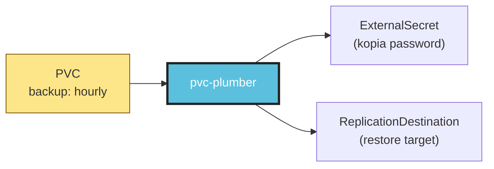

*Both land on the first reconcile. The ExternalSecret renders the per-PVC kopia password Secret (via your ClusterSecretStore + ESO). The ReplicationDestination is created up-front because a future re-create of this PVC needs it as a `dataSourceRef` target — that's the killer feature down in § D.*

And then the third — the actual backup schedule — lands later:

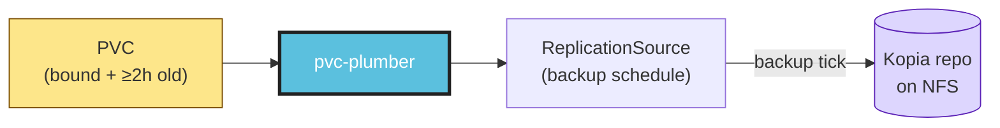

*The 2-hour wait is on purpose — see [§ F](#f-the-pvc-reconciler-loop) for the "don't back up a half-restored volume" story. After this, every backup tick produces a Kopia snapshot you can restore from.*

Two opt-out escape hatches if you need them, both with required audit-trail annotations:

- **`volsync.backup/skip-restore: "true"`** + **`volsync.backup/skip-restore-reason: "<text>"`** — admit the PVC fresh even if a backup exists. The reason annotation is *required* — silent opt-out is the actual foot-gun.
- **`backup-exempt: "true"`** (label) + **`storage.vanillax.dev/backup-exempt-reason: "<one of cache, scratch, external-source, media-on-nas, database-native, test>"`** — never back up this PVC, ever.

The validating webhook denies either escape hatch if the reason is missing or empty. We learned the hard way that "I'll add the reason later" turns into "the reason is lost to git history forever".

> *If you're presenting this section, lead with: "There is exactly one label a user needs to know. Everything else is the operator's job."*

---

## B. The four-part binary

The operator pod runs **one Go process** that does four things at once. Putting them in separate pods would mean separate Kopia connections, separate caches, and separate sources of truth. We don't want any of those.

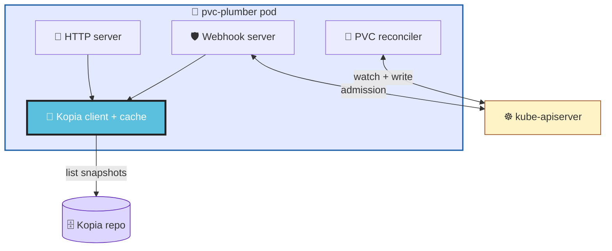

*Four subsystems, one process. Only the Kopia client touches the NFS repo, and the cache layer in front of it is shared. The HTTP server's `/exists/` and the webhook handlers ask the same `kopiaClient` interface, so they always agree.*

Why one binary instead of three Deployments?

1. **One Kopia connection, not three.** `kopia repository connect filesystem --path /repository` is process-level state. Three Deployments would mean three connections to the same NFS export — pointless duplication, three times the NFS handshake cost on startup.
2. **One cache.** The cache layer (`internal/cache/cache.go`) is a TTL map sitting in front of every backup-existence query. When the mutator and validator *both* call `CheckBackupExists` for the same admission request, the second call is a cache hit. Separate processes? Two cache misses, two `kopia` subprocess spawns.
3. **One source of truth at admission time.** If the webhook said "no backup" and the HTTP `/exists/` said "backup found" three seconds later, that would be a *very* annoying bug to debug. Sharing the cache makes the answer consistent across surfaces by construction.
4. **One thing to operate.** Two replicas, leader election, one Service, one Deployment, one set of probes. The HTTP service stays available even when `OPERATOR_MODE=false` — same image, same lifecycle.

The four subsystems coordinate through a single shutdown context:

```go
// cmd/operator/main.go (abridged — the actual file is ~380 lines)
rootCtx, stop := signal.NotifyContext(context.Background(), syscall.SIGINT, syscall.SIGTERM)
defer stop()

bundle, _ := buildBackend(rootCtx, cfg, slogger)        // 1. backend + cache
httpSrv := newHTTPServer(cfg, bundle, slogger)          // 2. HTTP server

g, gctx := errgroup.WithContext(rootCtx)
g.Go(func() error { return httpSrv.ListenAndServe() })  // serve
g.Go(func() error { <-gctx.Done(); return httpSrv.Shutdown(...) }) // graceful stop

if bundle.kopia != nil && cfg.ReWarmInterval > 0 {
    g.Go(func() error { runCacheReWarmLoop(gctx, ...); return nil })
}

if operatorMode {                                       // 3 + 4. manager + webhooks
    g.Go(func() error { return runManager(gctx, ...) })
}

g.Wait()
```

*One root context driving everything. SIGTERM cancels the root, the errgroup cancels each goroutine, every subsystem stops cleanly. Whichever subsystem returns first cancels the rest.*

> *If you're presenting this section, lead with: "We could have written this as three microservices. We deliberately didn't, and I'll show you why."*

---

## C. What happens when you create a backup-labeled PVC

You run `kubectl apply` (or ArgoCD syncs) on a PVC with `backup: hourly`. Three things happen in sequence: admission, persistence, reconciliation. We'll show each as its own diagram so the flow stays readable.

### Step 1 — admission. Both webhooks ask Kopia "does a backup exist?"

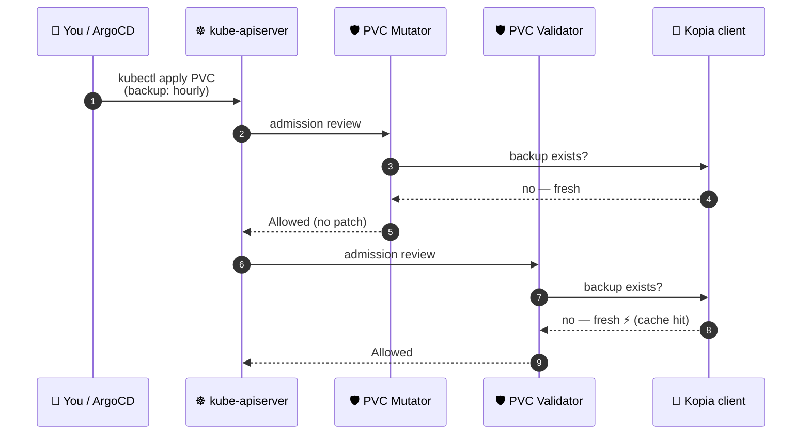

*First-time PVC create: both webhooks run, both call Kopia, both get "no backup found" back. The mutator admits unchanged (nothing to restore from); the validator admits because there's no `unknown` to fail-close on. The validator's Kopia call is a cache hit (the mutator's call populated it microseconds earlier).*

### Step 2 — persistence. The PVC lands in etcd; reconciler wakes up.

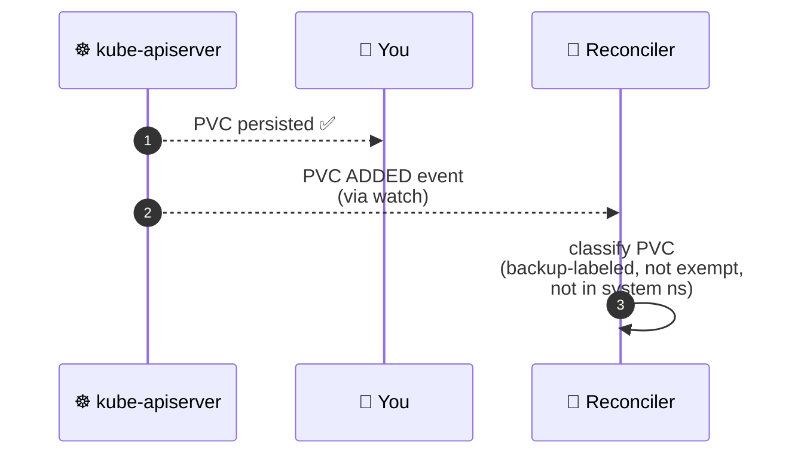

*Once both webhooks admit, the API server commits the PVC to etcd and answers the user. The reconciler is watching every PVC; the new object generates an event into its work queue.*

### Step 3 — reconciliation. The three companion resources land.

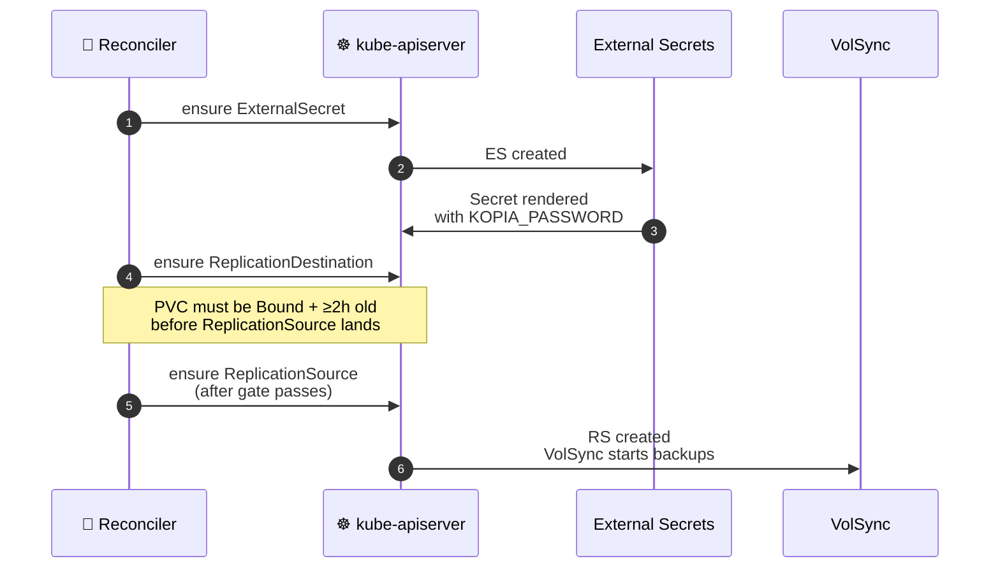

*Three Kubernetes objects, one reconcile. The `ExternalSecret` triggers ESO to render the per-PVC kopia password Secret. The `ReplicationDestination` lands eagerly because a future PVC re-create needs it. The `ReplicationSource` waits — see § F for why.*

### Step 4 — backup ticks. Each one is itself admission-gated.

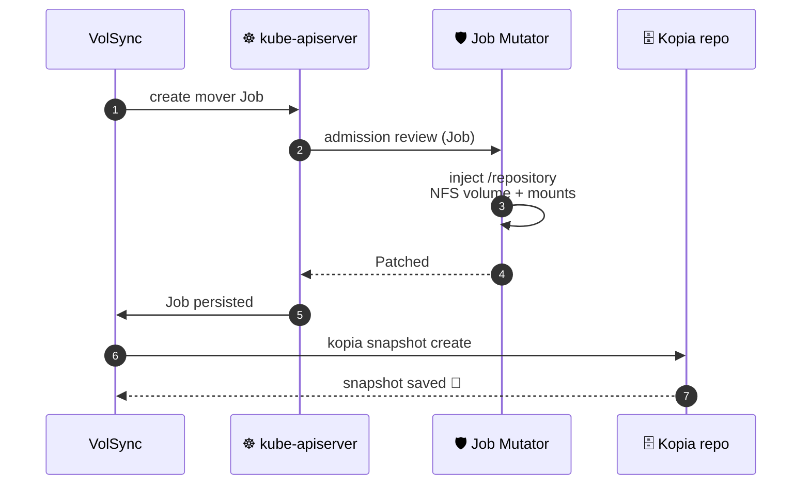

*Every time the backup schedule fires, VolSync creates a mover Job. The `JobMutator` admission webhook adds the NFS volume so Kopia inside the Job can reach the repository. Without that injection, every backup would fail with "no `/repository`".*

Three things worth noticing across all four steps:

1. **Both PVC webhooks call Kopia.** The mutator's call is a cache miss (first time we've seen this PVC); the validator's call is a cache hit on the same answer. The redundancy is on purpose — see [§ E](#e-the-three-admission-webhooks) for the cross-check it enables.
2. **`ReplicationDestination` lands BEFORE the PVC binds.** Why so eager? Because a *future* re-create of this same PVC needs the RD as a `dataSourceRef` target. Creating it now means the restore-on-create path always works, even on the first reboot after this PVC was just installed.
3. **`ReplicationSource` waits 2h after creation.** A freshly-restored PVC is being populated by VolSync's restore mover. If we started backups immediately, we'd back up the half-populated state and overwrite the real backup. Two hours is empirically enough; the gate is in `Reconcile()`.

---

## D. What happens when you re-create a PVC (the killer feature)

This is the path users care about most. A PVC is gone — cluster wipe, namespace rebuild, `kubectl delete` — and then it's recreated. With pvc-plumber, the new PV comes up *populated from the last backup, automatically*. No manual restore command. No copy-paste from a runbook.

We'll walk through the same kind of split: admission → persistence → populate.

### Step 1 — the magic moment. Mutator detects the snapshot, injects `dataSourceRef`.

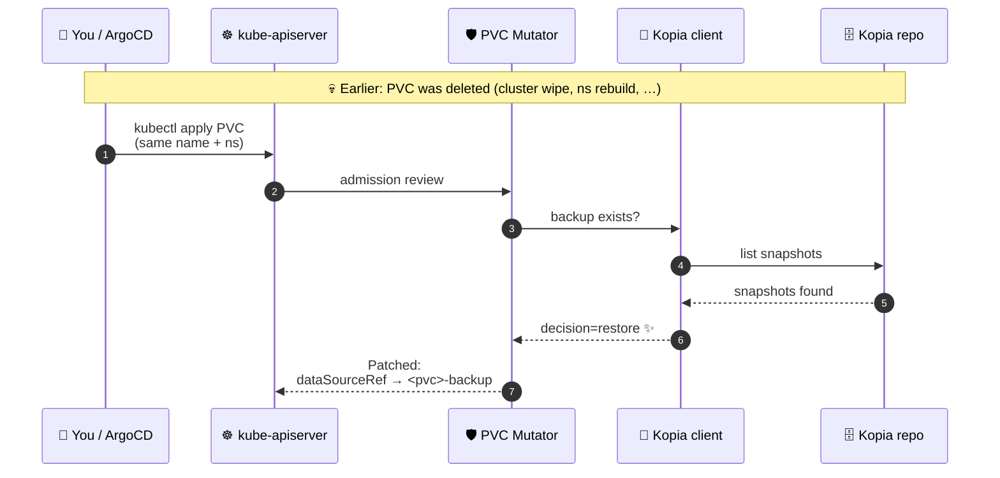

*Same PVC name as before, but the Kopia repository still has the old snapshots. The mutator returns a JSON Patch that adds `spec.dataSourceRef` pointing at the `ReplicationDestination` named `<pvc>-backup`. That patch is the magic moment — everything else flows from it.*

### Step 2 — validator double-checks the patch shape (rule 3).

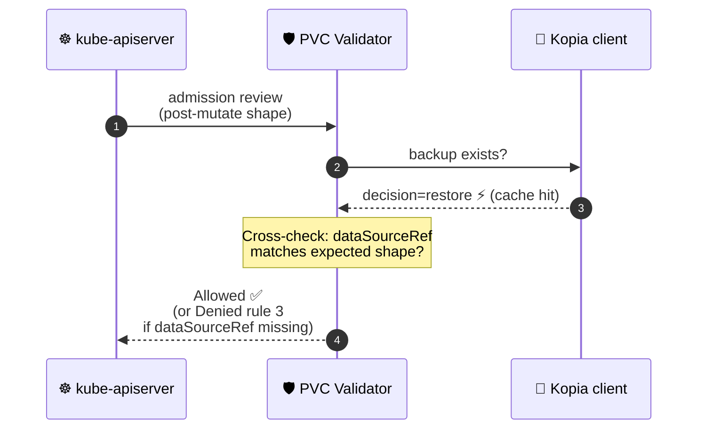

*The validator runs a second independent Kopia call (cache hit). If the answer is "restore needed" but the admitted PVC is missing `dataSourceRef`, rule 3 fires and denies — that's the cross-check that catches mutator-flake-but-validator-succeeded races.*

### Step 3 — Longhorn waits, VolSync restores, PV binds.

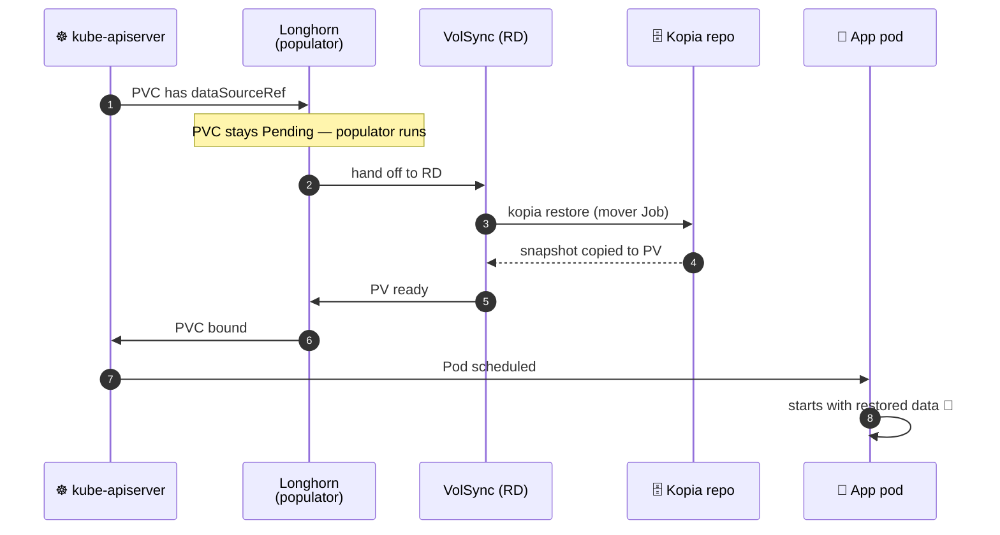

*The PVC stays Pending while Longhorn's CSI populator hands off to VolSync. VolSync runs a mover Job (which the JobMutator from § C step 4 already knows to wire `/repository` into) and copies snapshot data into the new PV. Once the PV is populated, it binds and the app pod starts with the data already there.*

This whole flow only works because three things are pre-arranged before you ever need them:

1. **The `ReplicationDestination` `<pvc>-backup` is already in the namespace.** The reconciler created it on the original PVC's first reconcile, and the operator [intentionally doesn't own the children via owner references](#i-key-design-decisions-and-why) — the RD survives a delete-and-recreate cycle.
2. **The Kopia repository on NFS is shared across the cluster's lifetime.** It survives ArgoCD re-syncs and cluster rebuilds; only loss of the NFS volume itself loses backups.
3. **The mutator's webhook is `failurePolicy: Fail`** — if the operator pod were down, the PVC create would be *denied* rather than admitted without `dataSourceRef`. (See [§ I](#i-key-design-decisions-and-why) on the namespaceSelector exclusion list that makes Fail safe.)

> *If you're presenting this section, lead with: "Watch what happens when I delete this PVC and apply it again." Then do the demo. The audience will get it instantly.*

---

## E. The three admission webhooks

Three handlers, three jobs, three different failure modes:

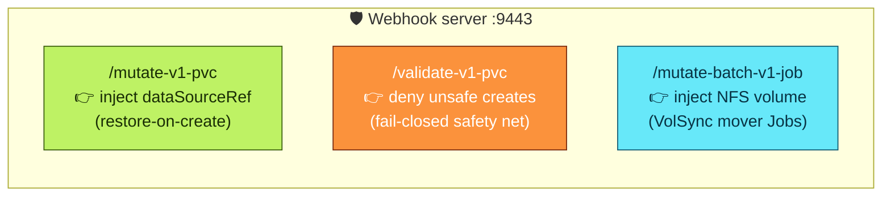

*Each handler has its own admission path; they share one TLS server, one decoder, one cache.*

| Path | Resource | Cluster-side `failurePolicy` | Handler-level mode | Why |
|---|---|---|---|---|
| `/mutate-v1-pvc` | PVC | `Fail` | fail-OPEN | Don't deny on a mutate flake — the validator is the safety gate |
| `/validate-v1-pvc` | PVC | `Fail` | fail-CLOSED | Don't admit empty volumes over restorable data |
| `/mutate-batch-v1-job` | Job | `Ignore` | never denies | A webhook outage shouldn't wedge VolSync entirely |

For the full handler-by-handler walkthrough see [`docs/admission-webhooks.md`](admission-webhooks-v2.md). The architectural summary:

### `/mutate-v1-pvc` — PVCMutator

The mutator decides one thing: should I add `dataSourceRef` to this PVC? It's split into two halves you can read separately — first a series of "is this even our problem?" gates, then the Kopia query.

**The gates first.** Each one short-circuits to "Allowed (no patch)":

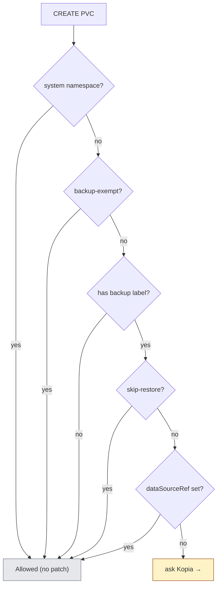

*Five "no, not our problem" exits, all admitting unchanged. Only PVCs that survive every gate get a Kopia call.*

**Then the Kopia query.** This is the only branch that produces a patch:

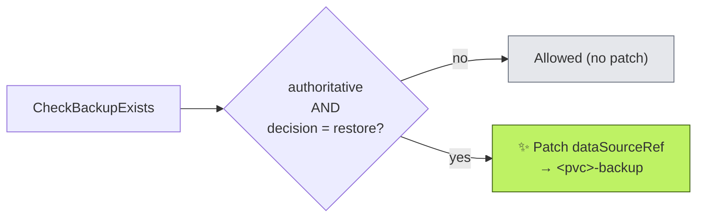

*Two terminal paths. Anything short of an authoritative restore decision admits unchanged. Only "yes there's a backup" produces the patch — and that patch is the killer feature.*

**Why fail-OPEN at the handler level**: a transient Kopia error here would otherwise admit the PVC unchanged AND skip the `dataSourceRef`. That sounds bad — but the validator (with its own independent Kopia call) is the fail-CLOSED net underneath. If Kopia comes back online between the mutate call and the validate call, the validator's "decision=restore but no dataSourceRef" denial fires (rule 3 below). Two checks, one safety net.

### `/validate-v1-pvc` — PVCValidator

The validator is the fail-CLOSED safety gate. It has four denial branches, but they fire in a strict order. We'll show them as three smaller diagrams, in the order the code checks them.

**First: opt-out audit-trail (rule 4).** If a PVC declares `backup-exempt` or `skip-restore`, it must explain why.

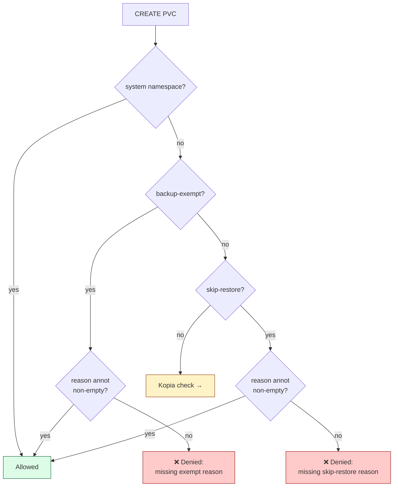

*Two opt-out paths, both denied if the reason annotation is missing. Silent opt-out is the actual foot-gun the audit trail exists to prevent.*

**Second: rule 1 (the whole point of fail-closed).** When Kopia can't tell us anything authoritative, deny.

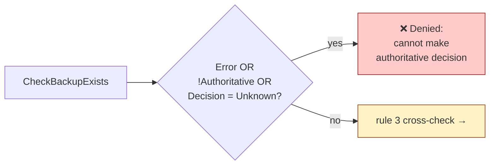

*Three converging signals (`Error != ""`, `!Authoritative`, `Decision == Unknown`) all map to the same denial. Backends can populate any subset of those fields — the triple-check ensures every failure mode lands here.*

**Third: rule 3 cross-check.** If Kopia says "restore", the admitted PVC must already carry the right `dataSourceRef`.

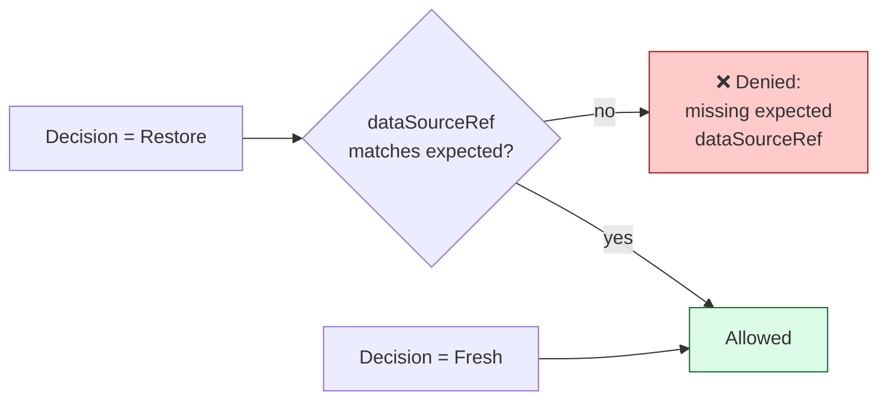

*Belt-and-suspenders. Catches the race where the mutator's Kopia call returned non-authoritative (so it didn't inject `dataSourceRef`) but the validator's call now succeeds with `restore`. Without this, the PVC would be admitted without `dataSourceRef`, and Longhorn would provision empty over a real backup.*

**Why fail-CLOSED at both levels**: admitting an empty PV when a real backup exists is the worst outcome — it overwrites recoverable data on the next backup tick. Both the cluster's `failurePolicy: Fail` (operator unreachable → deny) and the handler's denial logic (Kopia uncertain → deny) converge on the same conservative behaviour. The cost of false denials is a one-minute ArgoCD retry; the cost of false admits is silent data loss. Easy trade-off.

### `/mutate-batch-v1-job` — JobMutator

VolSync mover Jobs need `/repository` mounted from NFS to talk to the Kopia repo. We inject the volume + per-container mount transparently, only on Jobs labeled `app.kubernetes.io/created-by=volsync`.

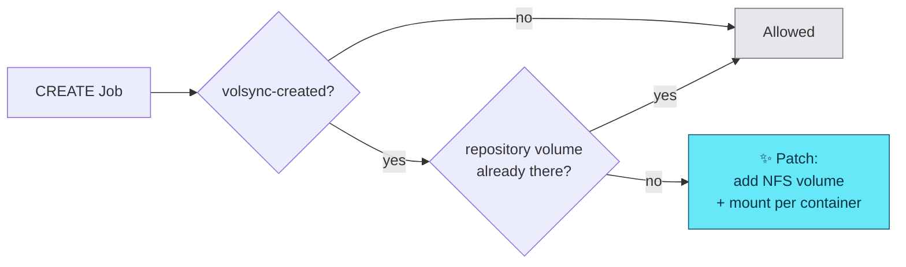

*Append-and-patch in five nodes. The idempotency check matters because admission can re-fire on retry, and we don't want duplicate volumes piling up.*

**Why fail-IGNORE**: this webhook degrading just means VolSync mover Jobs lack the NFS mount and individual backup runs fail. That's recoverable — VolSync logs the failure visibly, and the next backup tick retries. Denying every Job in the cluster because pvc-plumber is down would be much worse.

---

## F. The PVC reconciler loop

The reconciler watches every `PersistentVolumeClaim` in the cluster. Every PVC change — create, update, status transition, delete — produces an event the loop processes.

There's no per-PVC state machine. Every reconcile call answers a single question: *given the PVC's current shape, what should the companion resources look like?*

**The classification step decides whether we ensure or cleanup.** This is the top of the loop:

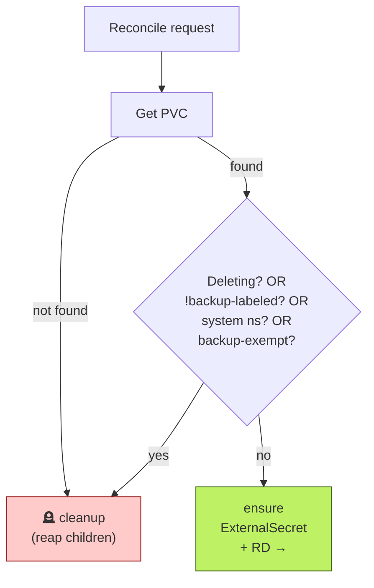

*Two outcomes from the classification: either reap (red) or ensure (green). Both happen often — every PVC delete, every label drop, every system-namespace move goes through cleanup; every steady-state PVC goes through ensure.*

**The ensure path then gates the backup schedule on bind state and age:**

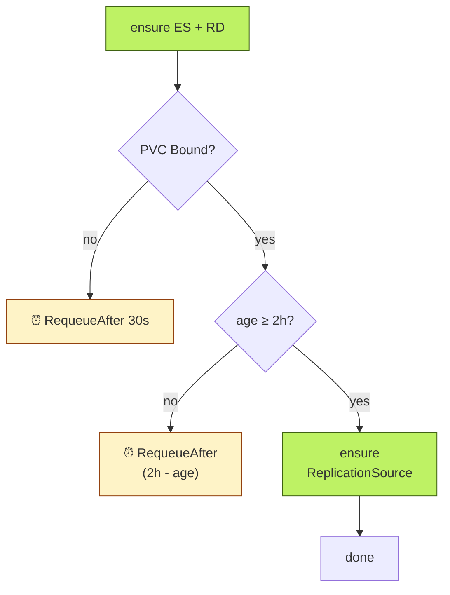

*Three exits: requeue in 30s if Longhorn is still binding, requeue at the 2h mark if the PVC is too young to start backups, or land the `ReplicationSource` and stop. controller-runtime collapses overlapping `RequeueAfter` requests so we don't accumulate timers.*

Source: [`internal/controller/pvc_controller.go::Reconcile`](../../../internal/controller/pvc_controller.go).

The three "ensure" helpers are all the same shape — Get-or-Create, never Update:

```go
// internal/controller/pvc_controller.go::ensureReplicationSource (abridged)
func (r *PVCReconciler) ensureReplicationSource(ctx context.Context, pvc *corev1.PersistentVolumeClaim) error {
    name := pvc.Name + "-backup"
    if exists, err := r.exists(ctx, rsGVK, pvc.Namespace, name); err != nil || exists {
        return err  // existing? leave it alone (no drift reconciliation)
    }
    rs := newUnstructured(rsGVK, pvc.Namespace, name, pvc.Name)
    rs.Object["spec"] = map[string]interface{}{ /* ... ported from Kyverno rule 6 ... */ }
    return r.Create(ctx, rs)
}
```

*If the resource is already there, the reconciler considers its job done. If not, it creates the resource with the operator's preferred shape. No diff, no merge, no drift correction.*

This is on purpose — operators can hand-tweak retention counts or schedule offsets without the controller stomping on them. The trade-offs are spelled out in [`docs/reconciler.md`](reconciler-v2.md#get-or-create-idempotency-rationale).

**The schedule formula**:

```go
sum := sha256.Sum256([]byte(namespace + "/" + pvcName))
minute := int(binary.BigEndian.Uint32(sum[:4]) % 60)
```

*Picks a minute in `[0, 60)` for the `ReplicationSource` cron. SHA256-based instead of length-modulo to avoid clustering — under the v1 length-mod formula, same-length PVC names all landed on the same minute, hammering Kopia simultaneously.*

---

## G. The cleanup() reaper

When a PVC is deleted, unlabeled, exempted, or moved into a system namespace, its companion `ExternalSecret` / `ReplicationSource` / `ReplicationDestination` need to follow. The reaper does that, by label.

**The happy path is just a label-driven loop.** Three child kinds, list-and-delete each:

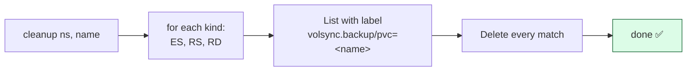

*Five nodes. Iterate the three child kinds, list everything labeled with this PVC's name, delete each. That's the loop in plain English.*

**The error tolerance is what makes it bootstrap-safe.** Two error classes are intentionally swallowed:

| Error | What it means | Why we ignore it |
|---|---|---|
| `apierrors.IsNotFound` | Object already deleted | A concurrent reaper, finalizer, or earlier reconcile already cleaned it up. Nothing more to do. |
| `meta.IsNoMatchError` | CRD isn't installed in the cluster | First-boot state before VolSync / external-secrets CRDs land. Without this branch, the reconciler would infinite-requeue every backup-labeled PVC during bootstrap. |

*Both errors mean "the thing you're trying to delete doesn't exist, and that's fine". Anything else propagates as a real error.*

Source: [`internal/controller/pvc_controller.go::cleanup`](../../../internal/controller/pvc_controller.go).

**Why label-based reaping** (not owner references):

Owner references would make Kubernetes' garbage collector do the work for free. We deliberately don't use them, because the killer feature breaks if you do:

> 1. `kubectl delete pvc data` triggers garbage collection.
> 2. The GC finds `ReplicationDestination data-backup` owned by the PVC and deletes it too.
> 3. `kubectl apply -f pvc.yaml` (a few hundred ms later) sends the create through the admission webhook.
> 4. The mutator says "decision=restore" (the Kopia snapshot is still there).
> 5. The mutator injects `dataSourceRef` pointing at `data-backup`.
> 6. **Longhorn's CSI populator can't find the `ReplicationDestination`** because the GC already deleted it.
> 7. PVC stays Pending. Restore-on-create silently fails.

Label-based reaping in the reconciler runs only when the reconciler reaches the cleanup branch — i.e., the PVC is actually gone, not just being recreated.

**What this replaces**:

- A bash CronJob (`orphan-reaper`) that ran `kubectl get` + `kubectl delete` in a loop. Lived in the cluster's manifests, not in this repo. Failures showed up as Pod crash loops, not as alerts on actual orphan accumulation.
- A Kyverno `ClusterCleanupPolicy` that was supposed to do the same job inside Kyverno, *and was silently broken on Kyverno 1.17.x and 1.18.x*. We discovered this during drill #4 on 2026-04-30. The policy was running, no errors logged, doing nothing.

Both were brittle. The reconciler-driven reaper runs on every reconcile event the watch produces. No extra schedulers, no extra moving parts.

---

## H. The Kopia integration

Backend type: `kopia-fs`. The Kopia repository lives on an NFS export (Synology in our reference cluster), mounted into the operator pod at `/repository`. Everything Kopia-related goes through `internal/kopia/client.go`.

**Phase 1 — boot. Connect once, pre-warm the cache once.**

```mermaid
sequenceDiagram
    autonumber
    participant Pod as 🐳 Operator pod
    participant K as kopia.Client
    participant NFS as 🗄️ /repository
    participant Cache as 💾 Cache

    Pod->>K: Connect()
    K->>NFS: kopia repository connect
    NFS-->>K: connected ✅
    Pod->>K: ListAllSources()
    K->>NFS: kopia snapshot list --all
    NFS-->>K: every source in the repo
    Pod->>Cache: PreWarm(sources)
    Cache-->>Pod: ready 🔥
```

*One Kopia connection. One repo-wide listing. One cache populate. After this, the pod is ready to serve `/exists` and admission requests.*

**Phase 2 — re-warm loop. Replace the cache contents periodically.**

```mermaid
sequenceDiagram
    autonumber
    participant ReWarm as ⏰ Re-warm goroutine
    participant K as kopia.Client
    participant NFS as 🗄️ /repository
    participant Cache as 💾 Cache

    loop every ReWarmInterval (~90s)
        ReWarm->>K: ListAllSources()
        K->>NFS: kopia snapshot list --all
        NFS-->>K: fresh list
        ReWarm->>Cache: Refresh(sources)
        Note right of Cache: REPLACE (not merge)<br/>deleted snapshots evicted
    end
```

*Crucial detail: `Refresh()` replaces the entire cache, it doesn't merge. That way, if you prune a snapshot from Kopia, its `exists=true` entry stops getting returned within one re-warm cycle. Without that, a pruned backup could silently get restored from on a PVC re-create.*

**Phase 3 — admission request. Cache hit common, miss falls through to Kopia.**

```mermaid
sequenceDiagram
    autonumber
    participant H as 🛡️ Webhook handler
    participant Cache as 💾 Cache
    participant K as kopia.Client
    participant NFS as 🗄️ /repository

    H->>Cache: CheckBackupExists(ns, pvc)
    alt cache hit (common)
        Cache-->>H: result ⚡
    else cache miss
        Cache->>K: passthrough
        K->>NFS: kopia snapshot list <source>
        NFS-->>K: snapshots
        K-->>Cache: result
        Cache-->>H: result
    end
```

*The cache hit path is the fast majority. On miss, we spawn one `kopia` subprocess for the specific source — still much cheaper than per-admission re-listing the whole repo.*

**Why an in-process cache**: a `kopia snapshot list` for a single source typically takes 100–500 ms over NFS. Spawning a `kopia` subprocess per admission request adds CPU and latency that compounds at scale (10 PVCs being applied concurrently = 10 simultaneous `kopia` subprocesses). The cache TTL is short enough (60 seconds by default) that a real new backup shows up within a minute. The periodic `Refresh()` call replaces the cache contents (not merges) so *deleted* backups stop returning stale `exists=true` within one re-warm cycle — important if you're pruning Kopia snapshots and re-creating PVCs, because we don't want to silently restore from a pruned snapshot.

**Why filesystem mode (not S3)**: the reference homelab cluster runs VolSync's Kopia mover against a Kopia repository on a Synology NFS export. S3 backend code still exists in `internal/s3/` and powers the legacy v1 HTTP path, but the v2 webhooks are wired to the kopia-fs client.

---

## I. Key design decisions and why

### Why one binary

Covered in [§ B](#b-the-four-part-binary). One Kopia connection, one cache, one source of truth at admission time, simpler ops. The `OPERATOR_MODE=true|false` feature flag lets the same binary serve in HTTP-only mode (drop-in v1 replacement) or full-operator mode.

### Why webhooks (not just a controller)

A controller could detect a "PVC was admitted without `dataSourceRef` but should have had one" violation *after* the fact — but by then, the StorageClass has already provisioned an empty volume, and on the next backup tick that empty volume becomes the new "backup". The data is gone.

The admission webhook is the only place this can be enforced, because it's the only point in the lifecycle where the API server hasn't yet committed the PVC.

### Why fail-CLOSED on validate but fail-OPEN on mutate

Different invariants protect different things:

- **Validate fail-CLOSED**: don't admit empty volumes over restorable data. False positives (admitting unsafely when validate is uncertain) are catastrophic — silent data loss. False negatives (denying when we shouldn't) just retry — ArgoCD will re-sync.
- **Mutate fail-OPEN**: don't *deny* on a mutate-side flake. The mutator only adds `dataSourceRef`; if its Kopia call fails, the validator's independent call is the safety net. Denying every PVC create the moment Kopia hiccups would unnecessarily wedge unrelated namespaces.

The redundancy — both webhooks call `CheckBackupExists` independently — is the whole point. They guard against the case where the mutator's call returns non-authoritative (transient failure) and the validator's call succeeds: rule 3 ("decision=restore but `dataSourceRef` missing") catches that.

### Why namespaceSelector with 9 exclusions

`failurePolicy: Fail` denies PVC creation if the operator pod is unreachable. **For the operator pod itself, and for every controller it depends on at startup, that's a deadlock**: cert-manager can't create its leader-election PVCs, external-secrets can't create its store PVCs, etc. The operator never comes up because the controllers it depends on can't bring themselves up.

The fix: a `namespaceSelector` on the webhook configuration that excludes every namespace whose controllers might create PVCs at startup:

```
kube-system, volsync-system, kyverno, argocd, longhorn-system,
snapshot-controller, cert-manager, external-secrets, 1passwordconnect
```

This list is hardcoded in `cmd/operator/main.go::defaultSystemNamespaces` AND must be mirrored into the cluster's `webhooks.yaml` `namespaceSelector.NotIn` clause. Drift between the two is the actual cluster-safety bug.

**Origin**: a 2026-04-08 incident. Kyverno crashed mid-PVC-create with `failurePolicy: Fail` set on a generate policy webhook. Cluster recovery required scaling Kyverno's webhook deployment via `kubectl --kubeconfig` from a host that had a kubeconfig predating the deadlock. Tuesday morning. Not a great Tuesday morning. The 9-entry list reflects the controllers that were affected during recovery.

### Why per-PVC ExternalSecret (not one shared)

VolSync's `ReplicationSource`/`ReplicationDestination` references a Kopia password Secret in its own namespace. Kubernetes doesn't let you share a Secret across namespaces. We could ship the password material into every namespace via a SealedSecret, but rotating the password would mean touching every namespace's git history. Per-PVC `ExternalSecret` (rendered by ESO from a `ClusterSecretStore`) keeps the password material in one place — rotating it propagates automatically.

**Known v3 quirk**: the operator hardcodes `secretStoreRef.name=1password` and `remoteRef.key=rustfs property=kopia_password` in `ensureExternalSecret`. v3 will make these configurable. Documented in [`MIGRATION-v1-to-v2.md`](../old-prds/MIGRATION-v1-to-v2.md#5-known-v2-quirks-fixed-in-v3).

### Why sidecar injection on VolSync mover Jobs

VolSync's Kopia mover runs a Job that needs `/repository` mounted to read/write snapshots. The repository is on NFS — we don't want to mount NFS on every node by default (security, performance, ops complexity), and we don't want to require every PVC creator to know about the NFS share.

Job-time admission injection gives the mover the mount only on the Jobs that need it, transparently. The `JobMutator` matches on `app.kubernetes.io/created-by=volsync` (set by the VolSync controller on every mover Job) and adds the volume + per-container mount. Replaces the v1 Kyverno `volsync-nfs-inject` ClusterPolicy verbatim.

### Why no owner references on the children

Covered in [§ G](#g-the-cleanup-reaper). Owner-ref-driven garbage collection would race with `kubectl delete pvc && kubectl apply pvc` and lose the `ReplicationDestination` between delete and apply. Label-based reaping in the reconciler runs only when the PVC is genuinely gone — not when it's being recreated.

---

## J. What pvc-plumber does NOT do

Honest list of what's out of scope. If a viewer asks "does it also…", these are the answers.

- **Does NOT restore a live PVC in place.** Restore-on-create is the only restore path. To restore live data into an existing PVC, you delete the PVC and apply it again — the mutator injects `dataSourceRef` on the recreate.
- **Does NOT manage Kopia repository maintenance (`kopia maintenance`).** The Kopia repository's compaction, expiry, and retention are owned by a separate cron schedule outside this operator. v2.2 may bring this in-process; for now it's external.
- **Does NOT replace database-native backup.** Postgres (CNPG with Barman), MySQL (`mysqldump`), MongoDB (`mongodump`) — those have their own backup paths that produce consistent dumps. pvc-plumber backs up the *underlying PVC* via Longhorn snapshots, which is fine for filesystem-level data but not for active databases.
- **Does NOT handle multi-cluster restore.** Backups taken in cluster A can be restored to cluster B by mounting the same Kopia repository, but pvc-plumber doesn't orchestrate that — it assumes one cluster, one repository.
- **Does NOT manage backup retention policies per-PVC.** The retention values (`hourly: 24, daily: 7, weekly: 4, monthly: 2`) are baked into `ensureReplicationSource`. Per-PVC retention is a v3 followup.
- **Does NOT speak any backend other than Kopia in operator mode.** The legacy v1 S3 backend code still ships in the binary for HTTP-only mode, but the admission webhooks and reconciler are wired to the Kopia client. Cross-backend operator support isn't on the v3 roadmap.
- **Does NOT write Kubernetes resources outside the PVC's namespace.** Every ES/RS/RD is created in the PVC's own namespace. Cluster-scoped resources are not generated by the operator.

---

## See also

- [`README.md`](../README.md) — start here for orientation, image tags, basic usage.
- [`docs/admission-webhooks.md`](admission-webhooks-v2.md) — handler-by-handler code walkthrough.
- [`docs/reconciler.md`](reconciler-v2.md) — reconcile loop deep dive.
- [`docs/restore-decision-flow.md`](restore-decision-flow-v1-v2.md) — the original v1 tri-state decision model. The webhook handlers in v2 implement the same `restore` / `fresh` / `unknown` decisions; this doc explains the underlying contract.
- [`MIGRATION-v1-to-v2.md`](../old-prds/MIGRATION-v1-to-v2.md) — operational steps to move from v1 (HTTP service + Kyverno policies) to v2 (operator).
- [`CHANGELOG.md`](../../../CHANGELOG.md) — version-by-version change list.
