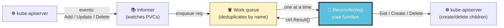
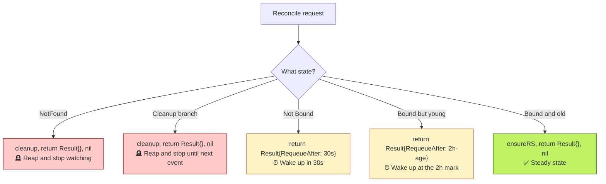
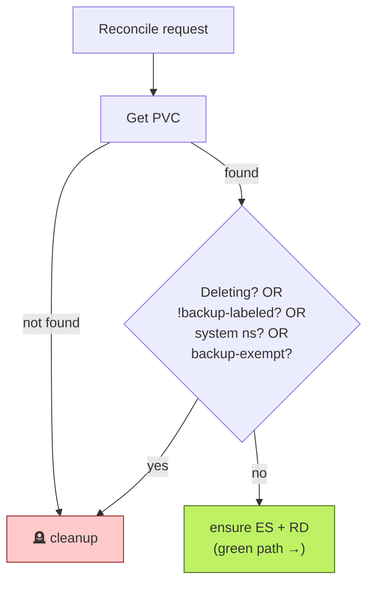
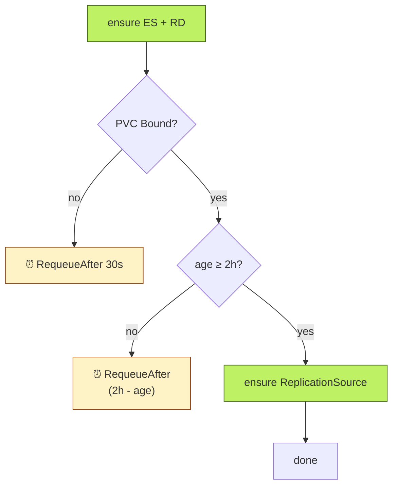
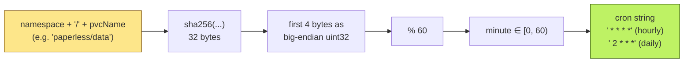
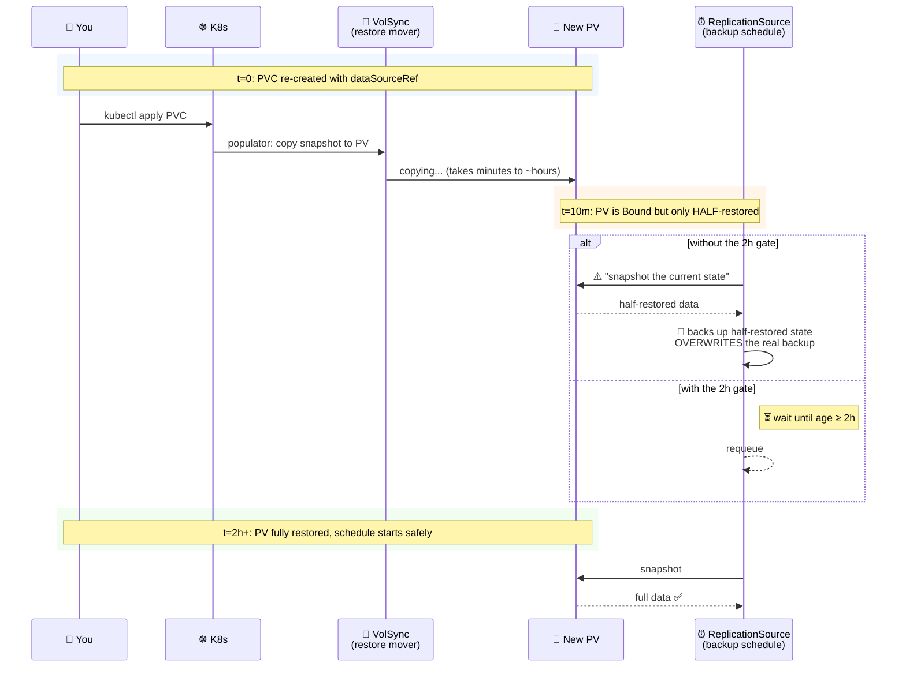
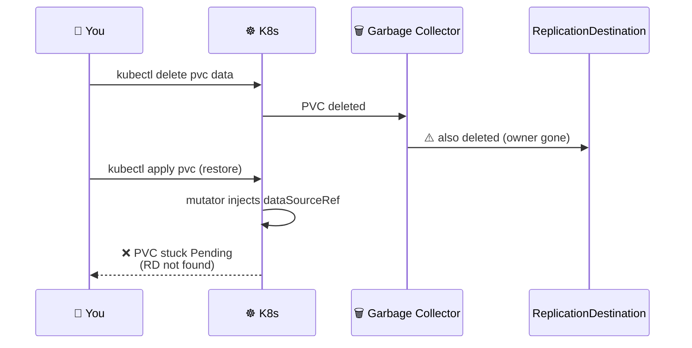
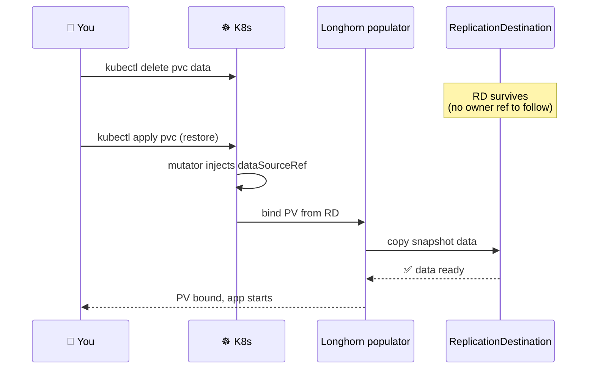

> [!WARNING]
> Historical document.
> This file is preserved for context only and is not the current runbook.
> Start with: [project README](../../../README.md) and [v4 vs v5](../../v4-vs-v5.md).

# PVC Reconciler Deep Dive

> **TL;DR for presenters** *(grab any of these if asked "what does the controller actually do?")*
>
> 1. **One reconcile loop, one PVC, every event.** controller-runtime hands the loop an event for every PVC change in the cluster. The loop's job is to make the PVC's companion `ExternalSecret` / `ReplicationSource` / `ReplicationDestination` match the PVC's *current* shape. There's no per-PVC state machine, no remembered history.
> 2. **Get-or-Create, never reconcile drift.** If a child resource already exists, the reconciler leaves it alone. Operators can hand-tune retention or schedule offsets without the controller stomping on them.
> 3. **`ReplicationDestination` lands BEFORE the PVC binds; `ReplicationSource` waits 2h.** The RD has to be there for restore-on-create. The RS waits 2h to avoid backing up an empty volume mid-restore — yes, this matters in practice.
> 4. **The schedule formula is SHA256-based.** PVCs with same-length names previously all clustered on the same minute. SHA256 spreads them uniformly. The formula is anchored in tests so it can't silently regress.
> 5. **`cleanup()` is the orphan reaper.** Replaces a v1 bash CronJob *and* a Kyverno `ClusterCleanupPolicy` (which was silently broken on Kyverno 1.17.x/1.18.x). Label-based deletion runs on every reconcile event the watch produces.

## Contents

- [How controller-runtime works (very brief)](#how-controller-runtime-works-very-brief)
- [`Reconcile()` step by step](#reconcile-step-by-step)
- [The decision tree](#the-decision-tree)
- [Get-or-Create idempotency rationale](#get-or-create-idempotency-rationale)
- [The schedule formula](#the-schedule-formula)
- [The 2h Bound-and-aged grace period](#the-2h-bound-and-aged-grace-period)
- [The `cleanup()` reaper](#the-cleanup-reaper)
- [Why no owner references](#why-no-owner-references)

---

## How controller-runtime works (very brief)

`sigs.k8s.io/controller-runtime` is the framework Kubebuilder generates code on top of. It wraps the loop every Kubernetes operator needs:



*The framework runs the work queue and informer; you write the `Reconcile` function. Each PVC change ends up calling `Reconcile(req)` with that PVC's namespace/name. The function returns either "I'm done" or "wake me up in N seconds" — the queue handles the rest.*

For pvc-plumber, only `PersistentVolumeClaim` is watched. The reconciler's job is *not* to drive PVCs themselves — Longhorn does that — but to mirror PVC state into companion resources: `ExternalSecret` (per-PVC kopia password), `ReplicationSource` (backup schedule), `ReplicationDestination` (restore target).

If you want to dig deeper into the framework, [The Kubebuilder Book](https://book.kubebuilder.io/) is the canonical reference. The "Reconciliation Loop" chapter in particular is where the level-triggered model is explained.

---

## `Reconcile()` step by step

**Source**: [`internal/controller/pvc_controller.go::Reconcile`](../../../internal/controller/pvc_controller.go).

```go
func (r *PVCReconciler) Reconcile(ctx context.Context, req ctrl.Request) (ctrl.Result, error) {
    logger := log.FromContext(ctx).WithValues("pvc", req.NamespacedName)

    // (1) Resolve the PVC.
    var pvc corev1.PersistentVolumeClaim
    if err := r.Get(ctx, req.NamespacedName, &pvc); err != nil {
        if apierrors.IsNotFound(err) {
            // (2) PVC fully deleted → orphan reap.
            if cerr := r.cleanup(ctx, req.Namespace, req.Name); cerr != nil {
                return ctrl.Result{}, cerr
            }
            return ctrl.Result{}, nil
        }
        return ctrl.Result{}, err
    }

    // (3) Classify the PVC.
    label := pvc.Labels[backupLabelKey]
    isBackupLabeled := label == backupHourly || label == backupDaily
    _, inSystemNS := r.SystemNamespaces[pvc.Namespace]
    isExempt := pvc.Labels[backupExemptLabel] == "true"

    // (4) Cleanup paths converge.
    if !pvc.DeletionTimestamp.IsZero() || !isBackupLabeled || inSystemNS || isExempt {
        if err := r.cleanup(ctx, pvc.Namespace, pvc.Name); err != nil {
            return ctrl.Result{}, err
        }
        return ctrl.Result{}, nil
    }

    // (5) Idempotent ensure of the always-needed children.
    if err := r.ensureExternalSecret(ctx, &pvc); err != nil {
        return ctrl.Result{}, err
    }
    if err := r.ensureReplicationDestination(ctx, &pvc); err != nil {
        return ctrl.Result{}, err
    }

    // (6) Bind/age gate for the backup schedule.
    if pvc.Status.Phase != corev1.ClaimBound {
        logger.V(1).Info("pvc not bound yet, requeueing", "phase", pvc.Status.Phase)
        return ctrl.Result{RequeueAfter: 30 * time.Second}, nil
    }
    age := time.Since(pvc.CreationTimestamp.Time)
    if age < 2*time.Hour {
        return ctrl.Result{RequeueAfter: 2*time.Hour - age}, nil
    }
    if err := r.ensureReplicationSource(ctx, &pvc); err != nil {
        return ctrl.Result{}, err
    }
    return ctrl.Result{}, nil
}
```

*Read this top-to-bottom: get, classify, decide, ensure. There is no "if this happened last time" logic — every reconcile call is independent.*

Walking through the numbered comments:

1. **`r.Get`** uses the manager's cache — these are watch-driven reads that hit the in-memory informer, not the API server, so they're cheap.
2. **NotFound → cleanup.** The PVC is gone; reap any companion resources still hanging around. This is the only entry point that calls `cleanup` from a *non-existent* PVC perspective; the rest of `Reconcile` handles the "PVC exists but should not have children" cases.
3. **Three classification booleans** — backup-labeled, in-system-namespace, exempt-labeled — drive the cleanup decision.
4. **Four cleanup triggers converge on one branch**: deletion in progress, label dropped, namespace is system, or `backup-exempt: "true"`. They all want the same outcome (reap children), so the branches are flattened.
5. **ES + RD ensured FIRST**, regardless of bind state. The RD has to exist before a future PVC re-create's `dataSourceRef` can target it. The ES is needed by VolSync's mover regardless of which direction (backup or restore) the PVC is going.
6. **The bind/age gate** for the RS:
   - **Not Bound → 30s requeue.** Longhorn is still provisioning the volume. `RequeueAfter: 30s` is short enough to feel responsive, long enough not to spin.
   - **Bound but young → requeue until 2h old.** `RequeueAfter: (2h - age)` schedules a single requeue at the exact moment the gate flips. controller-runtime collapses overlapping requeue requests, so this doesn't accumulate timers.
   - **Bound and old → ensure RS.** The schedule starts from this point.

### The five terminal paths



*Every reconcile call exits via one of these five paths. Three of them (`P1`, `P2`, `P5`) return `Result{}` and let the watch take over. Two (`P3`, `P4`) ask the framework to re-fire the reconcile after a delay.*

> *If you're presenting this section, lead with: "There's no per-PVC state machine. Every reconcile call answers a single question: given the PVC's current shape, what should the companion resources look like?"*

## The decision tree

The tree splits naturally into two halves: **classify-then-cleanup-or-ensure** at the top, then **bind-and-age gate** at the bottom. Two diagrams keep each half readable.

**Top half — classification routes to cleanup or to the ensure path:**



*Three classification booleans (backup-labeled, system-ns, exempt) plus the deletion timestamp drive the cleanup decision. Anything else falls through to the green ensure path below.*

**Bottom half — the ensure path is gated on Bound + age:**



*The `ReplicationSource` (the actual backup schedule) is the only resource that waits. ES and RD land immediately so a future restore has its target. The 30s requeue handles "Longhorn still binding"; the 2h-age requeue handles "freshly-restored PVC, don't back up half-restored data".*

## Get-or-Create idempotency rationale

Every `ensure*` helper is the same shape:

```go
// internal/controller/pvc_controller.go::ensureReplicationSource (abridged)
func (r *PVCReconciler) ensureReplicationSource(ctx context.Context, pvc *corev1.PersistentVolumeClaim) error {
    name := pvc.Name + "-backup"
    if exists, err := r.exists(ctx, rsGVK, pvc.Namespace, name); err != nil || exists {
        return err  // (1) exists? leave it alone — no drift reconciliation
    }
    rs := newUnstructured(rsGVK, pvc.Namespace, name, pvc.Name)
    rs.Object["spec"] = map[string]interface{}{ /* ... */ }
    return r.Create(ctx, rs)  // (2) doesn't exist? create with the operator's preferred shape
}
```

*If the resource is already there, the reconciler considers its job done. If not, it creates the resource with the operator's preferred shape. No diff, no merge, no drift correction.*

1. **`exists` returns early.** No `Update` call, no field-by-field comparison, no merge. If the resource is there, the operator considers its job done.
2. **`Create` only on absence.** Race-tolerant: if two reconciler replicas try to create the same RS concurrently, one wins, the other gets `AlreadyExists` (which is `IsNotFound`'s opposite — propagated as an error this iteration, but the next reconcile finds it and short-circuits via `exists`).

### The trade-off

| ✅ What we gain | ⚠️ What we lose |
|---|---|
| **Hand-edit any child without the operator stomping on it.** Bumping retention from `hourly: 24` to `hourly: 48` is just `kubectl edit`. | **Drift correction** — if a child's spec gets mangled, we don't fix it. VolSync will surface the issue, but pvc-plumber won't restore the preferred shape. |
| **Simpler code.** No diff logic, no merge logic, no race against other actors that also touch the spec. | **Stale specs after schema migration.** If pvc-plumber starts emitting a new field in `ensureReplicationSource`, existing RSes don't get the new field — only newly-created ones. v3 may grow a one-time migration mode for this. |
| **Survives ArgoCD churn.** A re-sync that delete-and-recreates the PVC doesn't churn the RS — exists check passes, the RS keeps its existing schedule. | |

*For homelab / single-operator-prod use the left column dominates. For a multi-tenant SaaS, drift reconciliation would matter more — but that's not what this operator is built for.*

For pvc-plumber's actual deployment surface (a homelab running ~30 backup-labeled PVCs across one cluster), the trade-off is sound. An operator who wants to bump retention from `hourly: 24` to `hourly: 48` can `kubectl edit replicationsource <pvc>-backup` and the reconciler won't revert it. That matches the way humans actually iterate on backup policies.

For a multi-tenant SaaS, drift reconciliation would matter more — but that's not the workload this operator is built for.

> *If you're presenting this section, lead with: "The operator deliberately doesn't fight you. If you edit a child resource, your edit sticks."*

## The schedule formula

`backupSchedule(namespace, pvcName, label)` returns a deterministic crontab string for the `ReplicationSource.spec.trigger.schedule` field.

```go
// internal/controller/pvc_controller.go::backupSchedule
func backupSchedule(namespace, pvcName, label string) string {
    sum := sha256.Sum256([]byte(namespace + "/" + pvcName))
    minute := int(binary.BigEndian.Uint32(sum[:4]) % 60)
    if label == backupHourly {
        return fmt.Sprintf("%d * * * *", minute)   // every hour at <minute>
    }
    return fmt.Sprintf("%d 2 * * *", minute)       // every day at 02:<minute>
}
```

*SHA256 the `namespace/pvc` string, take the first 4 bytes as a big-endian uint32, mod 60. Stable per `(namespace, pvcName)` pair. Stable across operator restarts. Stable across replica leadership changes.*



*The formula. Sub-microsecond per call. Spreads PVC backup ticks evenly across the minute field regardless of name length.*

**Why SHA256 and not the obvious hash**: the v1 (Kyverno-era) formula was `len(namespace+"-"+pvcName) % 60`. That worked for spreading <50 PVCs across the minute field but **clustered** as PVC inventory grew — names of the same length all landed on the same minute. With ~30 backup-labeled PVCs in the reference homelab, several pairs already collide.

SHA256 of the namespace+name string, taking the first 4 bytes as a big-endian uint32, gives a uniform distribution over `[0, 60)` regardless of name length. The cost is negligible (sha256 of <100 bytes is sub-microsecond) and the result is stable per `(namespace, pvcName)` pair.

**Why `"/"` as separator** (not `"-"`): `"/"` is illegal in DNS-1123 namespace and PVC names, so `namespace + "/" + pvcName` is unambiguous — `(ns="data", pvc="backup")` and `(ns="data-backup", pvc="")` produce different hashes. With a `"-"` separator, the two would collide.

**Existing schedules don't migrate**. `ensureReplicationSource` is `Get-or-Create` — RSes that were created under the v1 length-mod formula keep their old minute. Only newly-created backup-labeled PVCs get the SHA256-derived minute. To migrate, an operator can `kubectl delete replicationsource <pvc>-backup` and let the reconciler re-create it on the next reconcile event. No data is lost — the Kopia repository is unchanged.

### Test pin

`internal/controller/pvc_controller_test.go::TestBackupSchedule_*` tests pin the formula on three concrete inputs. If a future change accidentally swaps the `"/"` separator for `"-"`, or drops the SHA256 in favour of a different hash, those tests fail loudly.

## The 2h Bound-and-aged grace period

```go
if age < 2*time.Hour {
    return ctrl.Result{RequeueAfter: 2*time.Hour - age}, nil
}
```

The `ReplicationSource` (i.e., the actual backup schedule) does NOT get created until the PVC is `Bound` AND at least 2 hours old.

### Why this matters



*Without the gate: a half-restored PV gets snapshotted and overwrites the real backup. With the gate: we wait until restore is definitely done before scheduling backups. The 2h figure is empirically enough for any reasonable restore over the homelab NFS link.*

A PVC that was just created with `dataSourceRef` is being populated by VolSync's restore mover. While the restore is in progress:

- The PV's filesystem may be partially populated.
- VolSync's mover is actively writing to it.
- Reading the volume's "current state" would capture a half-restored snapshot.

If pvc-plumber created the `ReplicationSource` immediately, VolSync would happily start *backing up* the half-populated PV on the next backup tick. That backup would land in the Kopia repository as the new "latest snapshot" — and the next time the same PVC name is restored (e.g., next ArgoCD sync), it would restore from this half-populated snapshot instead of the original good one.

**This isn't a guess at a guard**. It's a real failure mode the original Kyverno generate rule already accounted for — `precondition: { ... age > 2h ... }` was the v1 equivalent. The Go reconciler ports the gate verbatim.

For testing: `internal/controller/pvc_controller_test.go::TestReconcile_BoundYoung_RequeuesUntilOld` passes a PVC with `CreationTimestamp = now - 30m` and asserts the requeue is approximately 90 minutes (`2h - 30m`).

## The `cleanup()` reaper

**Source**: [`internal/controller/pvc_controller.go::cleanup`](../../../internal/controller/pvc_controller.go).

```go
func (r *PVCReconciler) cleanup(ctx context.Context, namespace, name string) error {
    for _, gvk := range childGVKs {
        list := &unstructured.UnstructuredList{}
        list.SetGroupVersionKind(gvk)
        if err := r.List(ctx, list,
            client.InNamespace(namespace),
            client.MatchingLabels{pvcLabel: name},   // (1) volsync.backup/pvc=<name>
        ); err != nil {
            if e := ignoreNotFoundOrNoMatch(err); e != nil {
                return e
            }
            continue                                  // (2) CRD missing or ns gone — next GVK
        }
        for i := range list.Items {
            item := list.Items[i]
            if err := r.Delete(ctx, &item); err != nil {
                if e := ignoreNotFoundOrNoMatch(err); e != nil {
                    return e
                }
            }
        }
    }
    return nil
}
```

*For each child kind, list children carrying the `volsync.backup/pvc=<name>` label, delete them. Both `IsNotFound` (already gone) and `NoMatchError` (CRD not installed) are tolerated — the reaper has to work during cluster bootstrap before VolSync / external-secrets CRDs land.*

**The happy path is just a label-driven loop:**


*Five nodes. Iterate the three child kinds, list everything labeled with this PVC, delete each.*

**Two error classes are intentionally swallowed** so the reaper works during bootstrap:

| Error | What it means | Why we ignore it |
|---|---|---|
| `apierrors.IsNotFound` | Object already deleted | A concurrent reaper, finalizer, or earlier reconcile already cleaned it up. Nothing more to do. |
| `meta.IsNoMatchError` | CRD isn't installed in the cluster | First-boot state before VolSync / external-secrets CRDs land. Without this branch, the reconciler would infinite-requeue every backup-labeled PVC during bootstrap. |

*Both errors mean "the thing you're trying to delete doesn't exist, and that's fine". Anything else propagates as a real error and the reconcile retries.*

Why label-based reaping (not direct name lookup):

1. **Label selector is the primary key.** Every child resource the operator creates carries `volsync.backup/pvc=<pvcName>`. This is what `cleanup` selects on — never the resource's name. Resources with the same name owned by something else (unlikely but possible) are not touched.
2. **`ignoreNotFoundOrNoMatch`** swallows two specific error classes:
   - `apierrors.IsNotFound` — HTTP 404. Object already deleted (concurrent reaper, finalizer already ran, etc.).
   - `meta.IsNoMatchError` — REST mapper can't find the GVK. **The CRD itself isn't installed in this cluster.** That's normal during cluster bootstrap, before VolSync / external-secrets CRDs land. Without this branch the reconciler would infinite-requeue every backup-labeled PVC during bootstrap, hammering the API server.

### What this replaces

The v1 (Kyverno-era) homelab cluster ran two separate cleanup mechanisms:

- **A bash CronJob** (`orphan-reaper`) that ran `kubectl get` + `kubectl delete` in a loop every hour. The CronJob lived in the consuming cluster's manifests, not in the pvc-plumber repo, and had to be maintained out-of-band. Failures showed up as Pod crash loops, not as alerts on the actual problem (orphans accumulating).
- **A Kyverno `ClusterCleanupPolicy`** that was supposed to do the same thing inside Kyverno. **Confirmed silently broken on Kyverno 1.17.x and 1.18.x** — the policy ran without errors but didn't actually delete anything. We discovered this during drill #4 on 2026-04-30.

Reconciler-driven cleanup runs on every reconcile event the watch produces — no separate CronJob, no Kyverno policy, no out-of-band scheduler. The reaper triggers on the four classification conditions in `Reconcile` (PVC delete, label drop, system-namespace move, exempt-labeled).

> *If you're presenting this section, lead with: "We had a bash CronJob that ran kubectl in a loop, AND a Kyverno policy that was supposed to do the same job and was silently broken. Both of those go away in v2 — the reconciler does it itself."*

### What `cleanup` does NOT delete

- **Resources without the `volsync.backup/pvc=<name>` label.** If an operator hand-created an `ExternalSecret` named `volsync-foo` without the label, it's not pvc-plumber's to reap.
- **Resources in other namespaces.** The `client.InNamespace(namespace)` clause scopes the list per-namespace — moving a backup-labeled PVC to a different namespace would orphan the original namespace's children, which is a known limitation (PVCs can't actually be moved across namespaces; this is theoretical).
- **The Kopia snapshots themselves.** `cleanup` only touches Kubernetes resources. The Kopia repository is the durable backup; deleting an RS doesn't delete its snapshots. To prune Kopia snapshots, an operator runs `kopia snapshot delete` directly, or relies on the retention policy on the RS spec to expire them on schedule.

## Why no owner references

Every "ensure" helper goes through `newUnstructured`:

```go
// internal/controller/pvc_controller.go::newUnstructured
func newUnstructured(gvk schema.GroupVersionKind, namespace, name, pvcName string) *unstructured.Unstructured {
    u := &unstructured.Unstructured{}
    u.SetGroupVersionKind(gvk)
    u.SetNamespace(namespace)
    u.SetName(name)
    u.SetLabels(map[string]string{
        managedByLabel: managedByValue,
        pvcLabel:       pvcName,
    })
    return u  // ← no SetOwnerReferences call
}
```

*Builds the child resource with the standard managed-by labels — but no owner reference back to the PVC. That's deliberate.*

Owner references would let Kubernetes' garbage collector delete the children automatically when the PVC is deleted. Many operators do that. We deliberately don't — and the reason is the killer feature.

**With owner references — the GC eats the RD and restore-on-create silently fails:**



*Step 3 is the silent failure: garbage collection reaps the `ReplicationDestination` between the delete and the re-apply. By the time the new PVC needs the RD as a `dataSourceRef` target, it's gone, and the new PV stays Pending forever.*

**Without owner references — the RD survives the delete; restore-on-create works:**



*Same delete and re-apply, but the RD outlives the PVC. The mutator's `dataSourceRef` injection still points at a real resource, Longhorn's populator finds it, copy happens, PV binds populated.*

The operator handles the rare delete-and-reaper-fires-first race gracefully:
- The PVC stays Pending. (Same as if the RD didn't exist for any other reason.)
- The reconciler runs on the new PVC, hits `ensureReplicationDestination`, finds it missing, creates it.
- Longhorn's CSI populator picks up the now-existing RD and starts the restore.

The window is typically <1s. The operator's `Get-or-Create` idempotency means recovery is automatic.

**Trade-off summary**: we accept a sub-second delay on the rare delete-and-immediately-recreate path in exchange for the much-more-common ArgoCD-resync path working cleanly.

## See also

- [`docs/architecture.md`](architecture-v2.md) — the wider operator architecture this loop fits into.
- [`docs/admission-webhooks.md`](admission-webhooks-v2.md) — the admission side of the operator (the `dataSourceRef` injection that depends on the RD this reconciler creates).
- [`docs/restore-decision-flow.md`](restore-decision-flow-v1-v2.md) — the underlying tri-state restore/fresh/unknown contract.
- Source: [`internal/controller/pvc_controller.go`](../../../internal/controller/pvc_controller.go).
- Tests: [`internal/controller/pvc_controller_test.go`](../../../internal/controller/pvc_controller_test.go).
