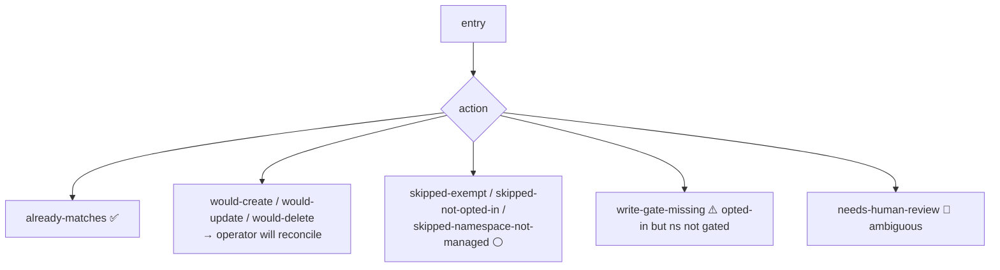

# The `/audit` endpoint 🔎

> `/audit` is the operator's "tell me the truth about every PVC" endpoint. It is **read-only** and
> the safest way to understand backup/ownership state without touching anything. It is the
> primary observability surface (there is no admission path to inspect).

## Where it is

- Served on the operator's HTTP port (container port **`8080`**, name `audit-http`), via the
  `pvc-plumber-metrics` Service in the operator namespace.
- Reach it with a port-forward:
  ```
  kubectl -n <pvc-plumber-ns> port-forward svc/pvc-plumber-metrics 18080:8080
  curl -s localhost:18080/audit | jq .
  ```

## Top-level shape

```jsonc
{
  "generated_at": "2026-06-01T...Z",
  "operator_mode": "permissive",
  "naming_strategy": "bare-dst",          // RS=<pvc>, RD=<pvc>-dst
  "default_repo_secret": "volsync-kopia-repository",
  "summary": {
    "total_pvcs": 91,
    "by_action": { "already-matches": 24, "skipped-exempt": 27, "skipped-not-opted-in": 40, ... },
    "by_owner_classification": { "managed-by-pvc-plumber": 24, "inline-argo": 1, "none": 66 },
    "by_label_source": { "v4": 24, "legacy": 0, "both": 0, "none": 67 }
  },
  "entries": [ { /* one per PVC, see below */ } ]
}
```

## Per-PVC entry

```jsonc
{
  "namespace": "copyparty",
  "pvc": "copyparty-data",
  "mode": "permissive",
  "tier": "daily",
  "label_source": "v4",                    // label schema generation: v4 | legacy | both | none
  "backup_identity": "copyparty/copyparty-data",
  "expected": { "rs_name": "...", "rd_name": "...-dst", "repository_secret": "...", ... },
  "owner_classification": "managed-by-pvc-plumber",
  "action": "already-matches",
  "evaluated_at": "...Z",
  "age_seconds": 12,
  "stale": false
}
```

### Tier semantics

| tier | RS trigger | meaning |
|---|---|---|
| `hourly` / `daily` / `weekly` | `spec.trigger.schedule` (deterministic per-PVC minute) | automatic cadence |
| `manual` | `spec.trigger.manual: backup-on-demand` (no cron) | human fires a backup by patching the manual string; pvc-plumber resets the string to `backup-on-demand` if it ever rewrites the RS for other drift |
| *(absent)* | daily cron + `/audit` note | defaulted — set the label explicitly |
| `disabled` | no RS/RD (operator deletes its own) | explicit opt-out with fuse labels kept |

The entry's `current.rs_schedule` carries the live
`spec.trigger.schedule`, and schedule drift on operator-owned RS (including
a leftover cron after a flip to `manual`) is detected and repaired.

### Inert-annotation disclosures

PVCs carrying `pvc-plumber.io/min-backup-age`, `pvc-plumber.io/skip-restore`,
`pvc-plumber.io/mode`, or `pvc-plumber.io/restore-mode` get a note per key:
`<key> is recognized but not enforced in permissive mode`. These keys parse
cleanly (no `needs-human-review`) but currently have no runtime effect.

## `action` — the verdict



| `action` | Meaning |
|---|---|
| `already-matches` | live RS/RD == desired and operator-owned — steady state |
| `would-create` / `would-update` / `would-delete` | operator intends to reconcile (permissive: it does) |
| `skipped-exempt` | PVC has `backup-exempt: "true"` |
| `skipped-not-opted-in` | namespace gated, PVC not fuse-labeled |
| `skipped-namespace-not-managed` | namespace lacks `managed-namespace=true` |
| `write-gate-missing` | PVC opted in but namespace not gated → fix the namespace label |
| `needs-human-review` | ambiguous (partial ownership / invalid tier) → stop |

## `owner_classification`

| Value | Meaning | Operator behavior |
|---|---|---|
| `managed-by-pvc-plumber` | RS/RD carry `app.kubernetes.io/managed-by: pvc-plumber` | reconcile/own |
| `inline-argo` | RS/RD carry an `argocd.argoproj.io/instance` label (Git-owned) | **audit-only — never patch** |
| `none` | no RS/RD exist | create if opted in |

## `stale`

`stale` is the **operator's evaluation freshness** for that entry, not a backup-health field. On a
managed PVC, expect `stale=false`. `stale=true` is common (and benign) on `owner=none` not-opted-in
PVCs the operator deprioritizes — it just means the cached evaluation is older than the refresh window.

## How to read it (quick triage)

1. `summary.by_action.needs-human-review` should be **0**. If not, investigate those entries.
2. Every PVC you expect managed should be `already-matches` / `managed-by-pvc-plumber` / `label_source=v4` / `stale=false`.
3. `write-gate-missing > 0` means an opted-in PVC is in an ungated namespace — add the namespace label.
4. `inline-argo` entries are historical Git-owned resources — leave them for explicit review.

Redis and PostHog are backup-exempt disposable data. CNPG uses native
Barman/S3 and must not be generic-migrated.
