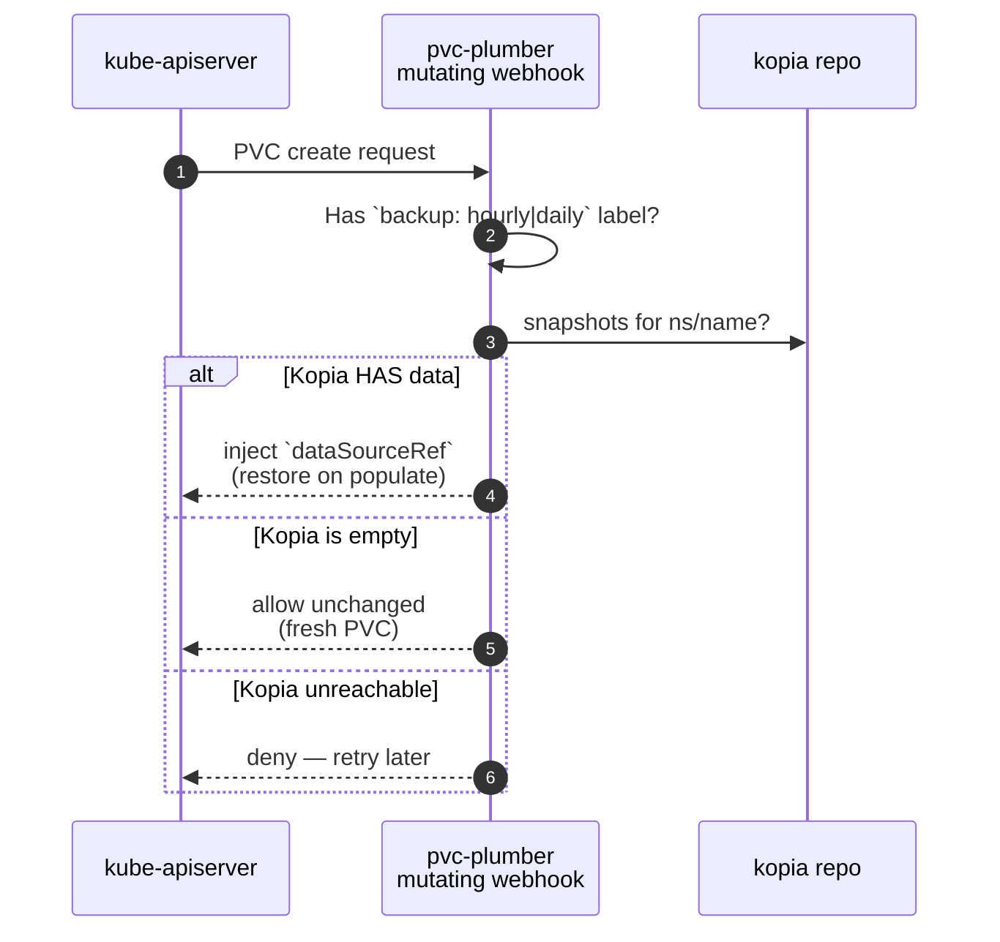
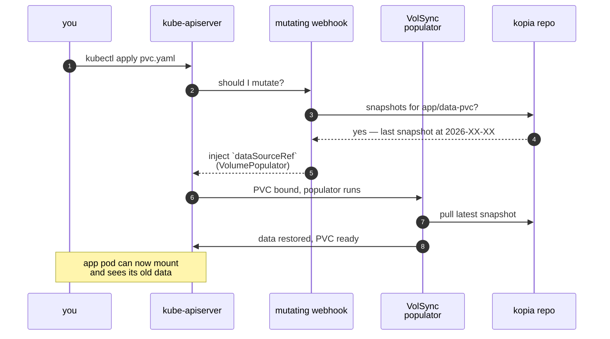
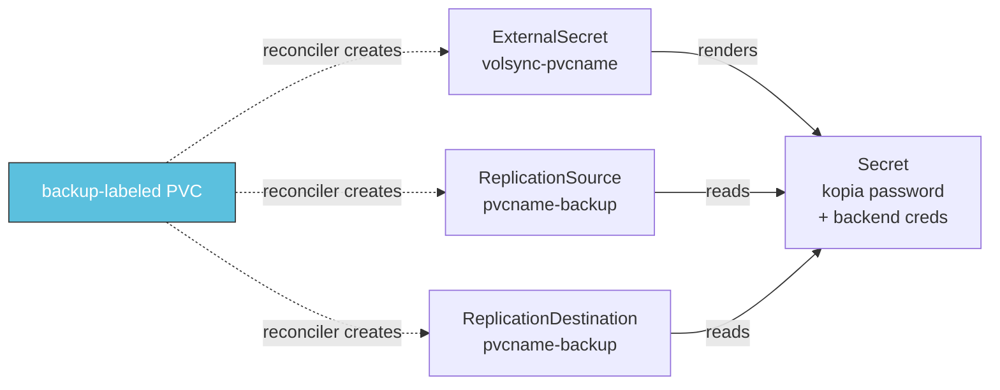
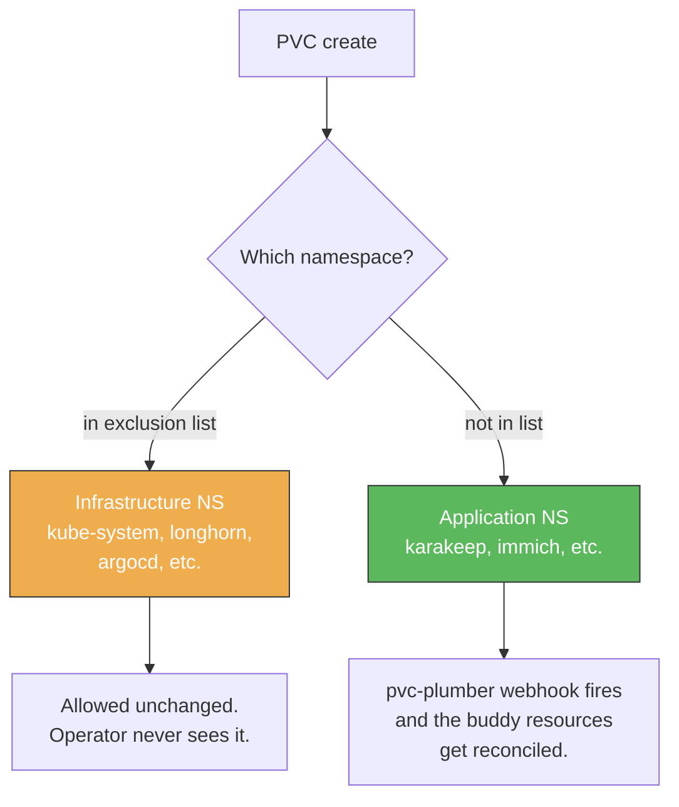

# pvc-plumber, explained for homelabbers

The conversational-explainer companion to the technical docs in this folder
([architecture.md](architecture.md), [admission-webhooks.md](admission-webhooks.md),
[reconciler.md](reconciler.md)). If you're new to the project, start here. The
deeper docs assume you've already mapped the pieces this one walks through.

This is the "what is pvc-plumber, how does it actually work, and why does it
exist" version. No prior controller-runtime knowledge needed.

---

## TL;DR

You add **one label** to a PVC.

```yaml
metadata:
  labels:
    backup: hourly      # or "daily"
```

The cluster takes care of the rest:

- Snapshotting the volume on schedule
- Encrypting and uploading to your kopia repo (any backend kopia supports —
  S3, filesystem, B2, etc.)
- **Restoring the data automatically the next time the PVC is recreated**,
  even after a full cluster rebuild. This is the killer feature.

If you don't want a PVC backed up (cache, scratch space, media on NAS), leave
the label off OR explicitly opt out with `backup-exempt: "true"` plus a reason
annotation so future-you knows why.

---

## The pieces in plain English

```
┌──────────────────────────────────────────────────────────┐
│ YOU (or ArgoCD, or a Helm chart, or kubectl apply)       │
│                                                          │
│   apiVersion: v1                                         │
│   kind: PersistentVolumeClaim                            │
│   metadata:                                              │
│     name: my-app-data                                    │
│     namespace: my-app                                    │
│     labels:                                              │
│       backup: hourly        ← the entire interface       │
│   spec:                                                  │
│     storageClassName: longhorn                           │
│     ...                                                  │
└──────────────────────────────────────────────────────────┘
                       │
                       │ kubectl apply / argocd sync
                       ▼
┌──────────────────────────────────────────────────────────┐
│ kube-apiserver                                           │
│  "should I let this PVC be created?"                     │
│  "should I add anything to it?"                          │
└──────────────────────────────────────────────────────────┘
                       │
            ┌──────────┴──────────┐
            ▼                     ▼
   ┌─────────────────┐   ┌─────────────────┐
   │ pvc-plumber     │   │ pvc-plumber     │
   │ MUTATING webhook│   │ VALIDATING wh   │
   │  "is there      │   │  "is the intent │
   │   already kopia │   │   coherent?"    │
   │   data for this │   │                 │
   │   PVC?"         │   │                 │
   └─────────────────┘   └─────────────────┘
            │                     │
            └──────────┬──────────┘
                       ▼
                PVC is created
                       │
                       │ a moment later, asynchronously
                       ▼
┌──────────────────────────────────────────────────────────┐
│ pvc-plumber RECONCILER                                   │
│  "I see a new backup-labeled PVC. I need to set up the   │
│   ExternalSecret + ReplicationSource + ReplicationDest"  │
└──────────────────────────────────────────────────────────┘
                       │
                       ▼
              VolSync takes over
              and runs scheduled backups
```

That's the whole architecture. Four pieces:

1. **The mutating admission webhook** — decides whether a new PVC's data
   should be restored from a kopia snapshot.
2. **The validating admission webhook** — enforces the audit-trail contract
   on backup intent.
3. **The reconciler** — creates the long-lived buddy resources (ES, RS, RD)
   that VolSync needs to manage backups going forward.
4. **The HTTP `/exists` API** — same query the mutating webhook uses,
   exposed for ad-hoc tooling and the legacy v1.x deployment shape.

Let's walk through each.

---

## What happens when a PVC is created

When you `kubectl apply -f pvc.yaml`, the kube-apiserver asks pvc-plumber two
questions before letting the create through.

### Question 1: the mutating webhook (`mutate-pvc.pvc-plumber.io`)

> Hey pvc-plumber, **should I add anything to this PVC?**



The third branch is the **safety contract**: if pvc-plumber can't decide, it
refuses to let the PVC be created. Better to make the caller retry than to
silently create an empty volume on top of a real backup. That's the worst-
possible failure mode and we choose to not make it possible.

### Question 2: the validating webhook (`validate-pvc.pvc-plumber.io`)

> Hey pvc-plumber, **is the intent coherent?**

This one's the audit-trail check. Mostly fires on `backup-exempt: "true"`
PVCs to require a `storage.vanillax.dev/backup-exempt-reason` annotation
from a fixed list (`cache`, `scratch`, `external-source`, `media-on-nas`,
`database-native`, `test`). Silent exemption is exactly the foot-gun this
exists to prevent.

If both webhooks pass, the PVC is created. The webhook chain ends there —
kube-apiserver moves on.

---

## The killer feature: re-create after delete

This is the part you cannot do with a simple CronJob. When a PVC with
backup data in kopia is **re-created** (because of a cluster rebuild,
app re-deploy, or just `kubectl delete pvc && kubectl apply`),
pvc-plumber tells Kubernetes to populate the volume from the existing
kopia snapshot **before any pod can mount it**.



In plain English: you delete a PVC, you re-apply it, the data shows up like
nothing happened. No manual restore step. No "oh wait I forgot to restore
the database" the morning after a cluster rebuild.

This pattern is verified end-to-end on real production data — the
delete-and-redeploy drill on a cluster running pvc-plumber has been
demonstrated to bring a backed-up application back with byte-for-byte
identical data in under two minutes.

---

## What happens after the PVC is created (the reconciler)

The webhooks run synchronously — they answer the apiserver's question and
they're done. Everything else happens asynchronously through the
**reconciler**, which is a separate controller loop watching PVCs.

When the reconciler sees a backup-labeled PVC become Bound, it ensures three
buddy resources exist alongside it:



- **ExternalSecret `volsync-<pvcname>`** — pulls the kopia password and
  whatever backend credentials your repo uses (S3 keys, B2 keys, etc.) from
  your secret store, materializes them as a Kubernetes Secret. The
  External Secrets Operator (ESO) does the actual fetch.
- **ReplicationSource `<pvcname>-backup`** — VolSync's "back this up on
  schedule" CR. Has a cron, the kopia config, points at the source PVC.
- **ReplicationDestination `<pvcname>-backup`** — VolSync's "ready to
  populate from kopia if asked" CR. The mutating webhook above injects a
  `dataSourceRef` that points at this on restore.

Once these exist, **VolSync's controllers own the lifecycle.** Every hour
(or day), VolSync spawns a Job that snapshots the PVC, runs kopia, uploads
chunks to your repo backend.

pvc-plumber's reconciler also does **cleanup** — when a backup-labeled PVC
is deleted (or its label is removed, or it moves into a system namespace),
the three buddy resources get reaped.

---

## The supporting cast

| Component | What it does |
|---|---|
| **pvc-plumber** | Decides whether to inject `dataSourceRef`. Creates ES/RS/RD per backup-labeled PVC. |
| **VolSync** | Runs the actual backup Jobs on schedule. Handles populate-from-kopia on restore. The fork at `ghcr.io/perfectra1n/volsync` provides the Kopia mover; upstream `backube/volsync` does not have one. |
| **kopia** | The backup format itself. Content-addressed, deduplicated, encrypted client-side. |
| **Your kopia backend** | Where the snapshots actually live. Recommended: S3-compatible storage (RustFS, MinIO, AWS S3, Backblaze B2 with S3 API, etc.) — kopia mover Jobs need no shared volume in S3 mode, so admission-time mutation isn't required. |
| **External Secrets Operator** | Pulls the kopia password and backend creds from your secret store (1Password Connect, Vault, AWS Secrets Manager, etc.) into the per-PVC Secret VolSync mover Jobs read. |
| **cert-manager** | Issues TLS certs for pvc-plumber's webhooks (port 9443). |
| **Your storage class** | Whatever provisions the actual PVCs (Longhorn, Rook-Ceph, OpenEBS, NFS-Subdir, etc.). pvc-plumber doesn't care which — it just needs CSI VolumeSnapshot support for VolSync's `Snapshot` copyMethod. |

---

## How a fresh cluster boots (sync waves)

When you bring up a cluster from nothing, Kubernetes itself doesn't know
that pvc-plumber needs to be up before any backup-labeled PVC. ArgoCD (or
Flux, or whatever your GitOps tool is) orchestrates the order with **sync
waves** — a number annotation on each resource. Sync wave 0 first, wait for
Healthy, then wave 1, and so on.

A typical layout:

```
wave 0 ┃ Cilium / Calico / your CNI of choice
       ┃ ArgoCD itself (bootstrap)
       ┃ External Secrets Operator + your secret store frontend
       ┃ AppProjects / RBAC

wave 1 ┃ Storage class provisioner (Longhorn, Rook, etc.)
       ┃ Volume Snapshot Controller
       ┃ VolSync                  ← backup machinery

wave 2 ┃ pvc-plumber operator     ← from here on, backup-labeled
       ┃ pvc-plumber webhooks       PVCs in app namespaces work
       ┃ pvc-plumber RBAC + ES + Cert

wave 3 ┃ Database operators (CNPG, etc.)

wave 4 ┃ Other infrastructure controllers + databases

wave 5 ┃ Monitoring (kube-prometheus-stack)

wave 6 ┃ Apps                     ← real workloads finally
```

If pvc-plumber wasn't there in wave 2, every backup-labeled PVC in wave 6
would be **denied at admission** because the webhook is `failurePolicy:
Fail`. That's intentional: it's the same "if I can't tell whether a backup
exists, I refuse" safety contract from earlier, applied at the cluster
scale.

---

## Why the bootstrap doesn't deadlock itself

Here's a riddle: pvc-plumber's webhook says "deny PVC creation if I'm
down." But pvc-plumber itself runs in some `volsync-system` (or wherever
you put it) namespace, which has its own PVCs and might one day need its
own ExternalSecret. If pvc-plumber's webhook fired on its own PVC, the
cluster would deadlock during bootstrap.

The fix is **infrastructure namespace exclusion**. Both the webhook's
`namespaceSelector` and the operator's `SYSTEM_NAMESPACES` env var carry
the same list of namespaces that should bypass pvc-plumber entirely. A
typical list:

```
kube-system
volsync-system
argocd
longhorn-system
snapshot-controller
cert-manager
external-secrets
1passwordconnect (or wherever your secret store frontend lives)
```

PVCs created in any of those namespaces **bypass pvc-plumber entirely**.
The webhook never fires for them. The reconciler skips them. The
bootstrap can come up cleanly because the bootstrap itself is invisible
to pvc-plumber.



The list **must stay in sync** between the webhook config (the
`namespaceSelector`) and the operator's `SYSTEM_NAMESPACES` env var.
Drift between the two is the actual cluster-safety bug — if a namespace
appears in the operator's env but not in the webhook config, the webhook
will fire for that namespace's PVCs and the operator will deny them, and
you'll wonder why your `kube-system/registry` PVC won't bind. If a
namespace appears in the webhook config but not the operator env, the
operator will try to reconcile its PVCs and the webhook won't gate them
— mostly harmless, but inconsistent.

---

## The fail-closed contract, in one paragraph

pvc-plumber's mutating + validating webhooks both have **`failurePolicy:
Fail`** on the PVC path. If pvc-plumber is down, new backup-labeled PVC
creates are denied. That sounds scary but it's the right call: silently
creating an empty volume on top of a real kopia backup IS data loss.
Denial is recoverable — your GitOps tool retries on backoff and the
problem self-resolves once pvc-plumber is back. Silent overwrite is
permanent. Infrastructure namespaces bypass this gate (per above), so
the cluster stays bootable when pvc-plumber is down. Application
namespaces accept the temporary deny-and-retry as a feature, not a bug.

---

## FAQ for homelabbers

### How do I add a new app to backups?

Slap `backup: hourly` (or `daily`) on the PVC label. Push. Done. The
reconciler will create the ExternalSecret + ReplicationSource +
ReplicationDestination on its own.

### How do I restore?

Delete the PVC. Re-apply the manifest. Data restores automatically
(mutating webhook detects existing kopia snapshots and injects
`dataSourceRef`). No manual `kopia restore` command needed for the
common case.

### What if I want a PVC that's NOT backed up?

Either:

- Don't add the `backup` label (the simplest opt-out — the operator
  doesn't see it at all)
- Add `backup-exempt: "true"` AND the annotation
  `storage.vanillax.dev/backup-exempt-reason: cache` (or `scratch`,
  `external-source`, `media-on-nas`, `database-native`, `test`). This
  makes the intent explicit and audit-trail-visible.

### What if pvc-plumber is down when I try to create a PVC?

The webhook is `failurePolicy: Fail`. New backup-labeled PVCs will be
denied at admission. ArgoCD (or Flux, etc.) will retry on backoff.
**This is intentional** — see fail-closed contract above. PVCs in
infrastructure namespaces bypass the webhook entirely and keep working
even if pvc-plumber is down.

### What about CNPG databases (Postgres) — should I add the label?

**No.** CNPG uses Barman Cloud (built into CloudNativePG) to back up
Postgres directly to your S3 endpoint. Don't add the `backup` label to
CNPG PVCs — they're already protected via Barman, and labeling them
would create duplicate (and broken) backup machinery.

### How do I see what kopia has?

```bash
# the operator pod has the kopia binary; ad-hoc queries work like:
kubectl exec -n volsync-system deploy/pvc-plumber -- \
  kopia snapshot list --all 2>/dev/null | grep -i myapp
```

Or use `kopia-ui` if you've deployed it (most clusters running
pvc-plumber co-deploy `kopia-ui` for browser-based snapshot inspection).

### Where do I look if a backup is broken?

1. `kubectl get replicationsource -A` — check `LAST SYNC` column.
   Recent (today) = good. Stale = suspect.
2. `kubectl logs -n volsync-system deploy/pvc-plumber` — operator
   decisions live here.
3. `kubectl logs -n volsync-system deploy/volsync` — VolSync's mover
   Job orchestration lives here.
4. `kubectl get jobs -A -l app.kubernetes.io/created-by=volsync` —
   active mover Jobs. If a backup is in progress, you'll see one.

---

## Where to go deeper

- [architecture.md](architecture.md) — sequence diagrams, design
  decisions, the four-part binary in detail.
- [admission-webhooks.md](admission-webhooks.md) — handler walkthroughs
  for each webhook.
- [reconciler.md](reconciler.md) — the controller-side deep dive.
- [../README.md](../README.md) — env vars, deployment YAML,
  troubleshooting recipes.
- [../CHANGELOG.md](../CHANGELOG.md) — what changed in each release.
- [../MIGRATION-v1-to-v2.md](../MIGRATION-v1-to-v2.md) — upgrade guide
  from the legacy HTTP-only v1 deployment shape.
