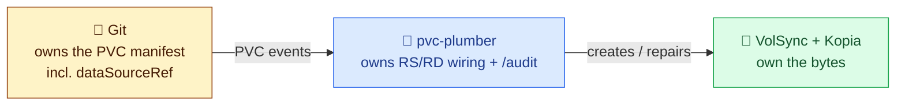
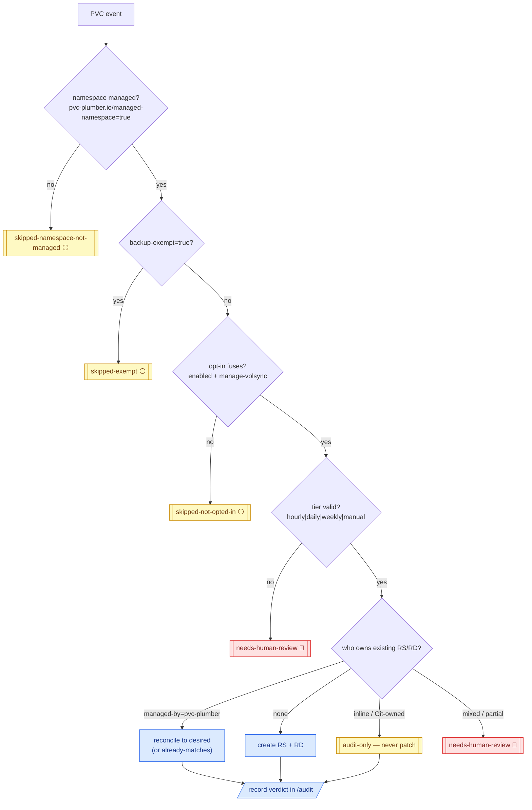
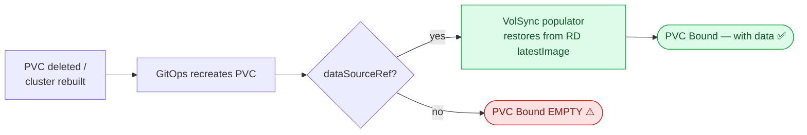

# Operator Workflow 🧠

How pvc-plumber thinks, per PVC event. It is a permissive reconciler — see
the [safety model](safety-model.md) for what bounds its writes.

## Responsibility boundary



pvc-plumber never moves data and never mutates your PVC spec. It reconciles
the VolSync objects that *describe* the data movement, and reports truth.

## The reconcile flow

For each PVC event, in order:



## What it creates

| Resource | Name | Purpose |
|---|---|---|
| `ReplicationSource` | `<pvc>` | the backup schedule (minute derived from `hash(ns/pvc)` — no thundering herd) |
| `ReplicationDestination` | `<pvc>-dst` | the restore capability (`trigger.manual: restore-once`) |

Both carry `app.kubernetes.io/managed-by: pvc-plumber`. The operator writes
**only** resources with that label; anything else is audit-only.

## Restore-on-recreate

The operator does **not** inject `dataSourceRef`. Git must carry it:

```yaml
spec:
  dataSourceRef:
    apiGroup: volsync.backube
    kind: ReplicationDestination
    name: <pvc-name>-dst
```



Without that reference, a recreated PVC comes back empty even if a backup
exists. `/audit` and the reference deployment's CI both watch for the gap.

## Exclusions

- CNPG database PVCs use native Barman/S3 — never generic-migrated.
- Disposable data (caches, brokers, rebuildable analytics) is
  `backup-exempt: "true"` + a mandatory reason annotation.

## Related docs

- [Safety model](safety-model.md)
- [`/audit` API](audit-api.md)
