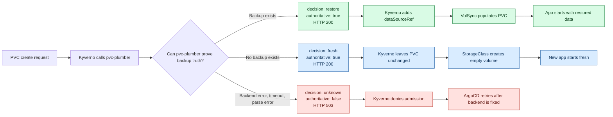
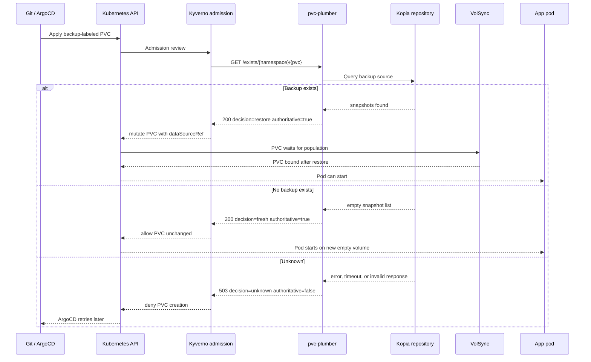

# PVC Restore Decision Flow

This service answers one admission-time question:

> Should this PVC restore from backup, start fresh, or wait because backup truth is unknown?

The answer is intentionally tri-state. `exists: false` no longer means "safe" by itself. A safe fresh create must also be `authoritative: true` with `decision: fresh`.

## One Screen Model



## Swimlane Flow



## API Contract

| Decision | HTTP | `exists` | `authoritative` | Admission behavior |
|---|---:|---:|---:|---|
| `restore` | 200 | `true` | `true` | Add `dataSourceRef` and restore with VolSync |
| `fresh` | 200 | `false` | `true` | Create a normal empty PVC |
| `unknown` | 503 | `false` | `false` | Deny PVC creation and retry later |

## Example Responses

Restore:

```json
{
  "exists": true,
  "decision": "restore",
  "authoritative": true,
  "namespace": "karakeep",
  "pvc": "data-pvc",
  "backend": "kopia-fs",
  "source": "data-pvc-backup@karakeep:/data"
}
```

Fresh:

```json
{
  "exists": false,
  "decision": "fresh",
  "authoritative": true,
  "namespace": "new-app",
  "pvc": "data",
  "backend": "kopia-fs",
  "source": "data-backup@new-app:/data"
}
```

Unknown:

```json
{
  "exists": false,
  "decision": "unknown",
  "authoritative": false,
  "namespace": "paperless-ngx",
  "pvc": "media",
  "backend": "kopia-fs",
  "source": "media-backup@paperless-ngx:/data",
  "error": "failed to list snapshots: exit status 1"
}
```

## Operator Signals

| Signal | Meaning |
|---|---|
| `pvc_plumber_backup_check_total{decision="restore"}` | PVCs that found backups |
| `pvc_plumber_backup_check_total{decision="fresh"}` | PVCs that were proven new |
| `pvc_plumber_backup_check_total{decision="unknown"}` | PVCs that were blocked for safety |
| `pvc_plumber_requests_errors_total` | Backend or request errors |
| HTTP 503 from `/exists` | Kyverno should deny PVC creation |

