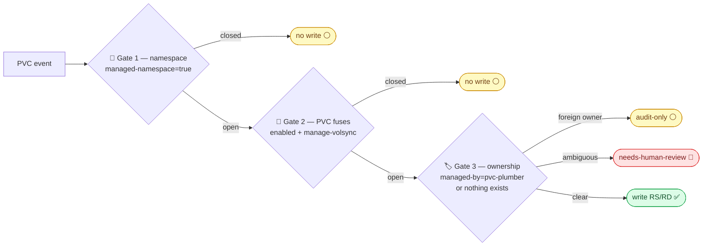

# Safety Model 🛡️

What bounds the blast radius of pvc-plumber.

## Permissive, on purpose

pvc-plumber registers **no admission webhook**. If pvc-plumber is down, PVC creation
works normally — RS/RD reconciliation pauses until the controller returns.
The worst case of an operator outage is *a backup is late*, never *a
workload can't deploy*.

> **Why not fail-closed admission?** An earlier generation of this project ran
> mutating + validating webhooks on every PVC create with
> `failurePolicy: Fail` — a beautiful guarantee, and a platform-wide single
> point of failure (a webhook deadlock once took an entire cluster down).
> The current design deliberately relocates each guarantee to the layer whose failure
> domain you can sleep through:
>
> | Guarantee | earlier webhook design | current design |
> |---|---|---|
> | backup objects exist | admission-time mutation | permissive reconciler (worst case: late) |
> | restore-on-recreate | webhook injects dataSourceRef | **Git carries it** — reviewable, diffable, audited |
> | no garbage backups | webhook denies PVCs | fail-closed gate on **mover Jobs only** (deployed by the platform, e.g. a MutatingAdmissionPolicy probing the backup backend) |
> | truth | webhook logs | read-only `/audit` ledger |

## The write gates

Defense in depth, all of which must pass before a write:

1. **Namespace software gate** — `pvc-plumber.io/managed-namespace: "true"`.
   A whole namespace must opt in before any of its PVCs can.
2. **PVC fuse labels** — `enabled` + `manage-volsync`, both required.
3. **RS/RD-only RBAC** — the ServiceAccount cannot write anything else.
4. **Ownership checks** — never update or delete a resource it doesn't own;
   ambiguity halts with `needs-human-review` instead of guessing.

## Explicit non-dependencies

- No Kyverno policies, CRDs, or webhooks.
- No Prometheus Operator CRDs in core — observability is the deploying
  platform's concern, added later.
- No admission path — by design, per the note above.

## Related docs

- [Operator workflow](operator-workflow.md)
- [`/audit` API](audit-api.md)
