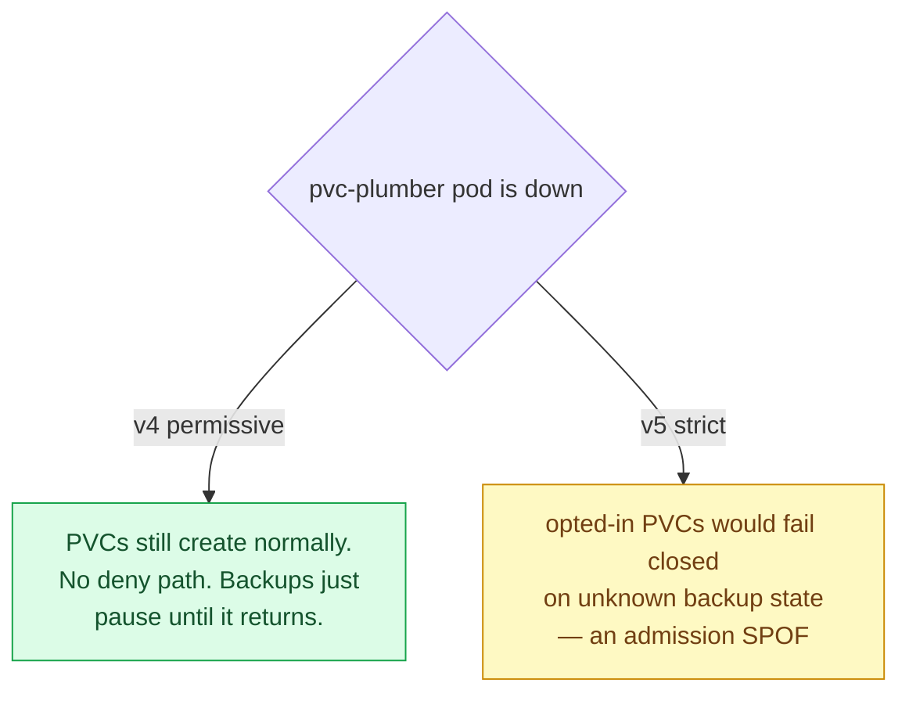

# v4 (shipped) vs v5 (design only) 🧭

> **Read this before the other design docs.** Several docs in this repo
> (`admission-webhooks.md`, `restore-decision-flow.md`) describe the **full design**, which
> includes admission webhooks and a fail-closed decision engine. **Those are the v5 vision.**
> What is actually **shipped and running in production (v4.0.1)** is a narrower, safer subset.
> Do not assume a feature is live just because it has a design doc.

---

## TL;DR

```mermaid
flowchart LR
    subgraph V4["✅ v4.0.1 — SHIPPED (permissive reconciler)"]
        a[watches PVCs]
        b[namespace software gate +\nPVC fuse labels]
        c[creates/owns RS + RD]
        d[forces mover 568]
        e[/audit endpoint/]
        f[cluster-wide VolSync-writer CRB]
    end
    subgraph V5["🔮 v5 — DESIGN ONLY (not built)"]
        g[admission webhooks\nmutate + validate]
        h[cache-first backup truth]
        i[enforce / strict modes\nfail-closed on unknown]
        j[source gating / minBackupAge]
        k[duplicate-identity enforcement]
        l[full metrics + events]
    end
    V4 -.->|requires a v5 PRD + failure-matrix drills| V5
```

---

## What v4.0.1 actually does (and only this)

| Capability | v4.0.1 | Notes |
|---|---|---|
| Watch `PersistentVolumeClaim` events | ✅ | controller-runtime reconciler |
| **Namespace software write-gate** | ✅ | `pvc-plumber.io/managed-namespace: "true"` required before any write |
| **PVC fuse labels** | ✅ | `pvc-plumber.io/enabled`, `manage-volsync`, `tier` |
| Create / own `ReplicationSource` (`<pvc>`) + `ReplicationDestination` (`<pvc>-dst`) | ✅ | labeled `app.kubernetes.io/managed-by: pvc-plumber` |
| Force mover security context **568/568/568** | ✅ | `PVC_PLUMBER_DEFAULT_{UID,GID,FSGROUP}` |
| Reference shared repo Secret (`volsync-kopia-repository`) | ✅ | does **not** generate per-PVC `ExternalSecret` |
| `/audit` endpoint (parity/ownership truth) | ✅ | see [audit-api.md](audit-api.md) |
| **Cluster-wide** `ClusterRoleBinding pvc-plumber:volsync-writer` | ✅ | one binding, RS/RD verbs; no per-namespace RoleBindings |
| Permissive mode (warn, never deny) | ✅ | the only mode used in prod |
| No Prometheus dependency in core | ✅ | observability is optional and belongs outside core bootstrap |
| Admission **webhooks** (mutate/validate) | ❌ | **not deployed** in v4 |
| Inject `dataSourceRef` at admission | ❌ | the *PVC manifest in Git* carries the dsr; the operator does not inject it |
| Backup-truth **cache** (strict stale detection) | ❌ | design only |
| `enforce` / `strict` **fail-closed** | ❌ | design only |
| Source gating / `minBackupAge` | ❌ | labels are parsed; enforcement is design only |
| Whole-cluster-nuke restore protection | ❌ | design only |

> 🔑 **Key correction vs older docs:** in v4 the **`dataSourceRef` lives in the Git PVC manifest**,
> not injected by a webhook. Restore-on-recreate happens because Argo recreates the PVC *with* its
> `dataSourceRef → <pvc>-dst`, and VolSync's volume populator restores from the RD. The operator's job
> is to keep the RS/RD that the RD depends on healthy — it is **not** in the PVC admission path.

---

## The safety consequence

v4 is deliberately **not** a single point of failure for PVC creation. v5's strict/fail-closed mode
re-introduces an admission SPOF — which is exactly the class of risk (a `failurePolicy: Fail` webhook
deadlocking the cluster) that motivated moving off Kyverno in the first place. That's why v5 is gated
behind a written PRD amendment + a passing failure-matrix drill, and is **not** shipped.

---

## What "v5" would add (if it's ever built)

- **Admission webhooks** — mutate (inject `dataSourceRef`) + validate (deny on unknown).
- **Cache-first backup truth** — pre-warmed kopia snapshot index, stale detection per repository.
- **`enforce` / `strict` modes** — deny PVC create when backup state is unknown (fail closed).
- **Source gating / `minBackupAge`** — don't start a `ReplicationSource` before restore completes / a min age elapses, so a fresh empty volume can't overwrite a good restore point.
- **Duplicate backup-identity** enforcement.
- **Full metrics + events** for every decision.

None of these are live. Treat the other design docs as **the destination**, this doc as **the map of where we actually are**.

## Current Exclusions

- CNPG uses native Barman/S3 and must not be generic-migrated.
- Redis is backup-exempt and disposable.
- PostHog is backup-exempt and disposable.

## Related Docs

- [Operator workflow](operator-workflow.md)
- [Safety model](safety-model.md)
- [`/audit` API](audit-api.md)
- [Historical archive](archive/README.md)
